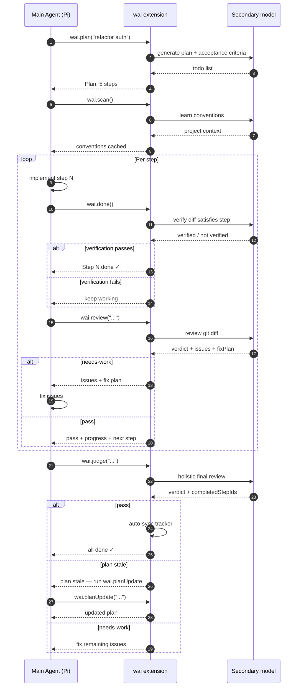

# pi-yoowai

Pair-programmer extension for [Pi](https://github.com/earendil-works/pi). A secondary model reviews, plans, suggests, recommends, and judges your work — catching bugs, missing error handling, and blind spots.

Built by [whatley.xyz](https://whatley.xyz).

## Install

```bash
pi install git:github.com/whatley95/pi-yoowai-dev
```

Or from local path:

```bash
pi install ./pi-yoowai
```

Try without installing:

```bash
pi -e git:github.com/whatley95/pi-yoowai-dev
```

## Configuration

Add to your Pi agent settings file (usually `~/.pi/agent/settings.json`):

```json
{
  "pi-yoowai": {
    "secondary": {
      "provider": "opencode-go",
      "id": "deepseek-v4-pro",
      "thinking": "xhigh",
      "backend": "sdk",
      "cacheRetention": "auto",
      "transport": "auto",
      "maxRetries": 3,
      "maxRetryDelayMs": 8000,
      "timeoutMs": 120000,
      "contextWindow": 64000,
      "maxOutputTokens": 8192
    },
    "autoJudge": true,
    "preReviewCommands": ["npm run typecheck", "npm run lint"],
    "costBudgetUsd": 0.5,
    "reviewFullFileThresholdLines": 300,
    "reviewMaxInputTokens": 50000,
    "reviewStrategy": "auto",
    "modelInfo": {
      "qwen3.7-max": { "contextWindow": 128000, "maxOutputTokens": 8192 }
    },
    "taskModels": {
      "review": { "provider": "anthropic", "id": "claude-sonnet-4-5", "thinking": "high" },
      "scan": { "provider": "deepseek", "id": "deepseek-chat", "thinking": "off" }
    }
  }
}
```

**Recommended:** Use a DIFFERENT model family than your main agent. If main is DeepSeek, set secondary to Claude or GPT. This catches blind spots your main model shares.

If no secondary model is configured, `wai` returns an error. Configure `pi-yoowai.secondary` in settings.json or use `/wai-model` to pick one interactively. You can also set a different model per wai tool with `taskModels` or `/wai-model`.

**Legacy config key.** The pre-rebrand `pi-heyyoo` key is still merged with `pi-yoowai` as a fallback, with `pi-yoowai` taking precedence and a deprecation warning logged. Runtime state from `.pi/heyyoo` is automatically migrated to `.pi/yoowai` on session start.

**Cost tip:** high-frequency, low-stakes calls do not need a flagship model. Reserve the strong model for `wai.plan`, `wai.review`, and `wai.judge`, and route routine work like `wai.done` (step verification) and `wai.scan` (convention extraction) to a cheap model with thinking off:

```json
"taskModels": {
  "done": { "provider": "deepseek", "id": "deepseek-chat", "thinking": "off" },
  "scan": { "provider": "deepseek", "id": "deepseek-chat", "thinking": "off" }
}
```

Check `/wai-index cost` (or `.pi/yoowai/cost.json`) first to see where your spend actually goes, then tune.

Structured tools let the secondary model write brief Markdown analysis, but the final machine-readable result must be a fenced JSON block under `## Result`. The configured `thinking` level is passed through unchanged for each tool, including per-tool `taskModels` overrides; wai does not silently cap or turn off thinking after parse failures.

### Options

| Option                         | Type                                    | Description                                                                                                                         |
| ------------------------------ | --------------------------------------- | ----------------------------------------------------------------------------------------------------------------------------------- |
| `secondary`                    | object                                  | `{ provider, id, thinking? }` for the base secondary model                                                                          |
| `taskModels`                   | object                                  | Per-tool model overrides keyed by action (`plan`, `review`, `suggest`, `recommend`, `judge`, `scan`, `test`, `security`, `done`, `planUpdate`, `explain`) |
| `autoJudge`                    | boolean                                 | Run `wai.judge` automatically when the last plan step passes review, is marked done via `/wai-done`, or when the agent settles after all steps are complete |
| `autoInjectContext`            | boolean                                 | Inject the active wai plan and conventions into the main agent's context before each LLM call (default: `true`)                   |
| `contextInjectMaxTokens`       | number                                  | Token budget for the injected plan/conventions context (default: `800`)                                                             |
| `entryRenderer`                | boolean                                 | Render wai audit entries with a custom TUI entry renderer (default: `true`)                                                         |
| `shortcuts`                    | boolean                                 | Register keyboard shortcuts for common wai actions (default: `true`)                                                                |
| `planWidget`                   | boolean                                 | Show a compact plan-progress widget above the editor (default: `true`)                                                              |
| `registerProvider`             | boolean                                 | Register the configured secondary model as a Pi provider named `wai` (default: `false`)                                             |
| `preReviewCommands`            | string[]                                | Commands to run before each review; output is included in the review prompt                                                         |
| `testCommand`                  | string                                  | Command to run for `/wai test` analysis (e.g. `npm test`). Auto-detected from `package.json` if omitted                             |
| `costBudgetUsd`                | number                                  | Maximum estimated session spend before wai stops with an error. Negative values are treated as unset; `0` means no spend is allowed |
| `reviewMaxDiffChars`           | number                                  | Legacy cap on diff characters; prefer `reviewMaxInputTokens`                                                                        |
| `reviewFullFileThresholdLines` | number                                  | Include full content for changed files under this line count (default: 300)                                                         |
| `reviewMaxInputTokens`         | number                                  | Hard cap on review input tokens                                                                                                     |
| `reviewMaxConventionsTokens`   | number                                  | Max tokens of project conventions included in review prompts (default: 1000)                                                        |
| `reviewMaxMemoryTokens`        | number                                  | Max tokens of past review issues included in review prompts (default: 800)                                                          |
| `reviewStrategy`               | `"auto" \| "diff-only" \| "full-files"` | How to include changed file contents (default: `"auto"`)                                                                            |
| `verifyByDefault`              | boolean                                 | If true, every wai result asks the main agent to confirm the finding with evidence                                                  |
| `selfVerify`                   | boolean                                 | Run a second verification pass on `wai.review` and `wai.judge` results (costs extra tokens)                                         |
| `toolUseLoop`                  | boolean \| number                       | Let the secondary model use `read_file` and allowlisted `run_command` in a loop; number sets the max iterations                     |
| `parallelReview`               | boolean \| number                       | Review multiple changed files in parallel; number sets concurrency (default: 3 when enabled)                                        |
| `deepScan`                     | boolean \| number                       | Include code samples and build a symbol index during `wai.scan`; number caps sample files                                           |
| `secondary.contextWindow`      | number                                  | Override the model's context window                                                                                                 |
| `secondary.maxOutputTokens`    | number                                  | Override the model's max output tokens                                                                                              |
| `secondary.backend`            | `"sdk" \| "pi" \| "http"`              | Backend for model calls. `"sdk"` uses Pi's `pi-ai` provider layer (default); `"pi"` spawns the Pi CLI; `"http"` uses direct provider HTTP |
| `secondary.cacheRetention`     | `"none" \| "short" \| "long"`          | SDK cache retention hint (SDK backend only, default: `"short"` to match the main Pi agent)                                         |
| `secondary.transport`          | `"sse" \| "websocket" \| "websocket-cached" \| "auto"` | SDK HTTP transport hint (SDK backend only)                                                                            |
| `secondary.maxRetries`         | number                                  | Maximum SDK request retries (SDK backend only, default: 3)                                                                          |
| `secondary.maxRetryDelayMs`    | number                                  | Maximum delay between SDK retries in ms (SDK backend only, default: 60000)                                                          |
| `secondary.timeoutMs`          | number                                  | SDK request timeout in ms (SDK backend only, default: 300000 = 5 min)                                                               |
| `secondary.apiKey`             | string                                  | Inline API key (prefer `auth.json` or env vars)                                                                                     |
| `secondary.style`              | `"openai-compatible" \| "anthropic"`    | API style when using `baseUrl` (default: `"openai-compatible"`)                                                                     |
| `secondary.authHeader`         | `string \| boolean`                     | Custom auth header name when using `baseUrl`; set to `false` to omit the auth header when registering the provider with Pi          |
| `secondary.authPrefix`         | string                                  | Custom auth prefix when using `baseUrl`                                                                                             |
| `modelInfo`                    | object                                  | Per-model token budget overrides, keyed by model id                                                                                 |
| `processTimeoutMs`             | number                                  | Timeout in ms for child pi process calls (default: 300000 = 5 min)                                                                  |
| `testTimeoutMs`                | number                                  | Timeout in ms per model in `/wai test` (default: 120000 = 2 min)                                                                   |
| `docs`                         | object                                  | Documentation sources and DuckDuckGo web-search settings for `wai.suggest`, `wai.recommend`, and `wai_explain`                       |

When `registerProvider` is enabled, `/wai-config`, `/wai-model`, and `/wai-backend` automatically refresh the `wai` provider registration in Pi so settings changes take effect without a manual `/reload`.

### Context injection and lifecycle hooks

When `autoInjectContext` is enabled, pi-yoowai prepends the active plan summary, current step, and recently scanned conventions to the main agent's context before every LLM call. This keeps the main agent aligned with the plan without requiring explicit `/wai-index` lookups. The injected context is truncated to `contextInjectMaxTokens` and skipped while a `wai` tool call is already executing.

pi-yoowai also listens to Pi lifecycle events:

- **`tool_result`** — successful file-mutating tool calls increment the internal edit counter and refresh the footer status; failed calls do not.
- **`turn_end`** — if unreviewed edits exist, a steer reminds the main agent to call `wai.review` before continuing. The reminder respects a cooldown so it does not spam.
- **`agent_settled`** — when `autoJudge` is enabled and the active plan is complete, `wai.judge` runs automatically.
- **`model_select`** — the prompt cache is cleared so prompts are rebuilt for the new model.
- **`session_before_compact`** — if a plan is active, its summary, progress, and current step are added to the compaction custom instructions so they survive context compression.
- **`session_before_switch`** / **`session_before_fork`** — volatile counters and plan progress are flushed to disk so they survive session navigation.

### Footer status and session audit trail

When running in Pi's TUI, pi-yoowai keeps the footer/status bar up to date:

- **`wai-plan`** — active plan progress and current step (e.g. `wai 2/5 · add tests`).
- **`wai-cost`** — session cost and pending-review edit count when over the threshold (e.g. `wai $0.04 · 1 call · review pending (3 edits)`).

In addition, every plan creation, step completion, review/judge verdict, and scan completion is recorded as a custom session entry. These entries appear in Pi's session timeline as an audit trail of wai decisions.

### Documentation sources and web search

You can give `wai.suggest`, `wai.recommend`, and `wai_explain` access to configured documentation pages. This is useful when the secondary model needs up-to-date library docs. For ad-hoc web search, use the `/wai-search` command.

```json
{
  "pi-yoowai": {
    "docs": {
      "sources": {
        "react": "https://react.dev/reference/react",
        "pi": "https://pi.dev/docs/latest"
      },
      "maxCharsPerSource": 8000,
      "webSearch": {
        "enabled": true,
        "provider": "brave",
        "maxResults": 3,
        "maxCharsPerResult": 3000
      }
    }
  }
}
```

| Option                             | Type                    | Description                                                                 |
| ---------------------------------- | ----------------------- | --------------------------------------------------------------------------- |
| `docs.sources`                     | object                  | Named URL map. Only URLs listed here can be fetched.                        |
| `docs.maxCharsPerSource`           | number                  | Characters of each source page to include in the prompt (default: 8000)     |
| `docs.webSearch.enabled`           | boolean                 | Whether `/wai-search` is allowed (default: false)                           |
| `docs.webSearch.provider`          | `"duckduckgo" \| "brave"` | Search provider. Defaults to "brave" when a Brave API key is available, else "duckduckgo" |
| `docs.webSearch.apiKey`            | string                  | Inline Brave API key (prefer auth.json or `BRAVE_API_KEY` env var)          |
| `docs.webSearch.maxResults`        | number                  | Search results to include (default: 3)                                      |
| `docs.webSearch.maxCharsPerResult` | number                  | Characters of each search snippet to include (default: 3000)                |

Use it from the `wai` tool:

```js
wai({ suggest: "useEffect vs useLayoutEffect", docs: ["react"] });
wai({ recommend: "what next", docs: ["pi"] });
```

Or from `wai_explain`:

```js
wai_explain({ target: "what is MCP", docs: ["pi"] });
```

For ad-hoc web search, use the terminal command:

```text
/wai-search Next.js app router caching
```

**Brave Search.** If you have a Brave Search API key, pi-yoowai will use Brave automatically. Configure it via TUI with `/wai-search-config` (interactive provider picker) or inline:

```text
/wai-search-config brave <your-api-key>
/wai-search-config duckduckgo
```

API key resolution order: `docs.webSearch.apiKey` → `~/.pi/agent/auth.json` `brave` entry → `BRAVE_API_KEY` env var. If Brave is selected but no key is found, pi-yoowai falls back to DuckDuckGo.

Fetched source pages and search results are cached in `.pi/yoowai/docs/` for 24 hours. Cache files are written with mode `0o600`. Only URLs declared in `docs.sources` are fetched; web search never fetches arbitrary result pages. Fetches time out after 10 seconds and responses larger than 500 KB are rejected. No credentials are sent.

## Tools

The `wai` tool is called by the main agent during development:

| Action                                                                | When                           | What it does                                                        |
| --------------------------------------------------------------------- | ------------------------------ | ------------------------------------------------------------------- |
| `wai({ plan: "refactor auth" })`                                      | Before starting                | Creates structured todo + acceptance criteria                       |
| `wai({ review: "wrote middleware" })`                                 | After each step                | Reviews git diff, returns verdict + issues                          |
| `wai({ review: "wrote middleware", files: ["src/auth.ts"] })`         | After each step                | Reviews only the listed files                                       |
| `wai({ review: "wrote middleware", exclude: ["package-lock.json"] })` | After each step                | Reviews diff excluding listed files                                 |
| `wai({ review: "wrote middleware", revision: "HEAD~1" })`             | After each step                | Reviews changes against a specific revision                         |
| `wai({ review: "wrote middleware", untracked: true })`                | After each step                | Includes untracked (new) files in the review                        |
| `wai({ suggest: "how to..." })`                                       | When stuck or asked a question | Returns alternative approaches with pros/cons                       |
| `wai({ suggest: "...", docs: ["react"] })`                            | When stuck or asked a question | Includes configured docs in the suggestion prompt                   |

> **Diff scope:** by default `review`, `judge`, and `done` diff against `HEAD` and include untracked files, so they see staged, unstaged, and new files without you running `git add` first. Pass `revision`/`since` to scope to a commit range, or `untracked: false` to limit to tracked changes.

| `wai({ recommend: "what next" })`                                     | When unsure                    | Recommends next concrete step                                       |
| `wai({ recommend: "...", docs: ["pi"] })`                             | When unsure                    | Includes configured docs in the recommendation prompt               |
| `wai({ judge: "all done" })`                                          | Final review                   | Holistic review against original plan                               |
| `wai({ scan: true })`                                                 | Once per project               | Learns project conventions and architecture                         |
| `wai({ test: "added payment service" })`                              | After code changes             | Checks for failing tests, missing tests, and test-quality issues    |
| `wai({ security: "auth changes" })`                                   | Security-sensitive changes     | Audits diff for secrets, injection, auth, and other vulnerabilities |
| `wai({ done: true })`                                                 | After completing a step        | Mark the current plan step complete; use a number or `"all"` to mark multiple steps |
| `wai({ planUpdate: "new task description" })`                         | When plan becomes stale        | Regenerate the active plan; already-completed progress is preserved |
| `wai({ review: "...", verify: true })`                                | Any high-stakes result         | Asks the main agent to confirm or refute the finding with evidence  |

Plan steps can include `priority` (`high`, `medium`, `low`) and `dependsOn` (1-based list of earlier steps). Plain-string steps still work for backward compatibility.

**Plan tracker.** wai tracks file edits and sends a workflow reminder after 3+ edits without a `wai.review` or `wai.done` call, so the plan tracker stays in sync. Review automatically advances the plan by the number of steps the model reports as completed (`completedSteps`).

### `wai_index` tool

The `wai_index` tool is a fast, read-only lookup for stored wai context. It does not call a model.

| Call | What it returns |
| --- | --- |
| `wai_index({})` or `wai_index({ topic: "all" })` | Conventions, active plan, review memory, cost, and recent logs |
| `wai_index({ topic: "conventions" })` | Project conventions from `wai scan` |
| `wai_index({ topic: "plan" })` | Active todo list and progress |
| `wai_index({ topic: "memory" })` | Past review issues for all files |
| `wai_index({ topic: "memory", files: ["src/auth.ts"] })` | Past review issues for specific files |
| `wai_index({ topic: "memory", query: "race condition" })` | Memory entries matching a keyword |
| `wai_index({ topic: "cost" })` | Estimated session spend |
| `wai_index({ topic: "logs" })` | Recent wai log entries |
| `wai_index({ topic: "index" })` | Project symbol index (built by `wai scan --deep` or `wai_index({ update: true })`) |
| `wai_index({ topic: "learned" })` | Facts recorded with `wai_learn` |
| `wai_index({ update: true })` | Rebuild the symbol index before returning results |

Use `wai_index` before editing to quickly learn the project's rules, current task, known issues, symbols, and recorded facts.

### `wai_explain` tool

Explain a code snippet, error message, diff, or file with the secondary model.

| Call | What it does |
| --- | --- |
| `wai_explain({ target: "TypeError: Cannot read..." })` | Explains an error and the likely fix |
| `wai_explain({ target: "src/auth.ts" })` | Explains the purpose and structure of a file |
| `wai_explain({ target: "function verifySession", files: ["src/auth.ts"] })` | Explains a specific function with full file context |
| `wai_explain({ target: "what is MCP", docs: ["pi"] })` | Explains a concept using configured docs |
| `wai_explain({ target: "MCP", docs: ["pi"] })` | Explains a concept using configured docs |

`wai_explain` is read-only — it does not edit files. If you pass a merge conflict, it explains the conflicting versions and suggests resolutions, but it does not claim the files are resolved.

### `wai_learn` tool

Record a persistent project fact that wai will remember across sessions.

| Call | What it does |
| --- | --- |
| `wai_learn({ fact: "Auth is handled by Clerk" })` | Stores a fact |
| `wai_learn({ fact: "Use camelCase for functions", category: "conventions" })` | Stores a categorized fact |
| `wai_learn({ verify: true })` | Check all stored facts against the current codebase (heuristic, no model call) |
| `wai_learn({ verify: true, query: "auth" })` | Verify only facts matching a keyword |
| `wai_learn({ verify: true, deep: true })` | Verify facts with the secondary model for higher accuracy |
| `wai_learn({ verify: true, deep: true, query: "auth" })` | Deep verify only facts matching a keyword |

Recorded facts appear in `wai_index({ topic: "learned" })`.

`verify` checks referenced files, source files, and symbols from the project index. It returns each fact as `valid`, `questionable`, or `outdated` — no model call, so it is fast and safe to run manually.

`verify` + `deep` calls the secondary model for each fact, including the source file and project conventions in the prompt. It is more accurate but costs tokens per fact.

## Commands

### Core workflow

| Command                                       | What it does                                                              |
| --------------------------------------------- | ------------------------------------------------------------------------- |
| `/wai`                                        | Compact status card: version, model, plan, VCS, cost, conventions         |
| `/wai plan refactor auth middleware`          | Create a plan from the terminal                                           |
| `/wai review "wrote verifySession"`           | Review current changes                                                    |
| `/wai suggest "redis vs in-memory sessions?"` | Get alternative approaches with pros/cons                                 |
| `/wai recommend`                              | Get one concrete next step based on your current situation/plan           |
| `/wai judge "auth refactor complete"`         | Final holistic review                                                     |
| `/wai scan`                                   | Scan project conventions                                                  |
| `/wai scan --deep`                            | Deep scan with code samples and symbol index build                        |
| `/wai-next`                                   | Recommend the next step based on the active plan                          |
| `/wai-done [description]`                     | Mark the current plan step complete and recommend the next step           |
| `/wai-done 3`                                 | Mark steps 1–3 complete                                                   |
| `/wai-done all`                               | Mark all steps complete                                                   |
| `/wai-plan-update <new task description>`     | Regenerate the active plan; already-completed progress is preserved       |

### Utilities and diagnostics

| Command                                        | What it does                                                                           |
| ---------------------------------------------- | -------------------------------------------------------------------------------------- |
| `/wai test [description] [--command <cmd>]`    | Analyze test coverage and failures for current changes                                 |
| `/wai security [description] [--full-project]` | Security audit of current diff or sampled project files                                |
| `/wai-status`                                  | Detailed diagnostics: base + per-tool models, config, plan, VCS, conventions, cost     |
| `/wai-index [topic] [--update]`                | Read stored wai context (plan, memory, conventions, cost, logs, index, learned)        |
| `/wai-explain <target> [--files ...]`          | Explain code, error, or file with the secondary model                                  |
| `/wai-search <query>`                          | Search the web via DuckDuckGo (requires `docs.webSearch.enabled`)                      |
| `/wai-learn <fact> [--category <cat>]`         | Record a persistent project fact                                                       |
| `/wai-learn --verify [--query <keyword>]`      | Check stored facts against the current codebase                                        |
| `/wai-learn --verify --deep [--query <keyword>]` | Check stored facts with the secondary model                                          |
| `/wai-model`                                   | Interactively pick the base or per-tool model; shows current provider/model/thinking   |
| `/wai-model <provider> [filter]`               | Pre-select provider and optionally filter the model list                               |
| `/wai-config`                                  | Show current `pi-yoowai` settings                                                      |
| `/wai-config get <key>`                        | Read a dotted setting (e.g. `/wai-config get secondary.thinking`)                      |
| `/wai-config set <key> <value>`                | Write a dotted setting (e.g. `/wai-config set taskModels.review.id claude-sonnet-4-5`) |
| `/wai-config <provider.model>`                 | Set the base secondary model directly (e.g. `/wai-config openai.gpt-4o`)               |
| `/wai-test`                                    | Test connectivity; prints a per-model summary with latency, tokens, cost, and totals   |
| `/wai-backend <sdk\|pi\|http>`                 | Switch secondary model backend (default: `sdk`)                                        |
| `/wai-clear`                                   | Clear the current session's plan, state, cost, memory, and conventions                 |
| `/wai-logs`                                    | Show recent error/event log entries for this project                                   |
| `/wai-clear-logs`                              | Clear the wai error/event log for this project                                         |

### Deprecated aliases

The old `yoo` names still work but print a deprecation warning and will be removed in a future release:

| Command          | Use instead        |
| ---------------- | ------------------ |
| `/yoo`           | `/wai`             |
| `/yoo-status`    | `/wai-status`      |
| `/yoo-info`      | `/wai-status`      |
| `/yoo-index`     | `/wai-index`       |
| `/yoo-explain`   | `/wai-explain`     |
| `/yoo-learn`     | `/wai-learn`       |
| `/yoo-search`    | `/wai-search`      |
| `/yoo-search-config` | `/wai-search-config` |
| `/yoo-next`      | `/wai-next`        |
| `/yoo-done`      | `/wai-done`        |
| `/yoo-plan-update` | `/wai-plan-update` |
| `/yoo-test`      | `/wai-test`        |
| `/yoo-backend`   | `/wai-backend`     |
| `/yoo-model`     | `/wai-model`       |
| `/yoo-config`    | `/wai-config`      |
| `/yoo-clear`     | `/wai-clear`       |
| `/yoo-logs`      | `/wai-logs`        |
| `/yoo-clear-logs`| `/wai-clear-logs`  |
| `/yoo-scan`      | `/wai scan`        |
| `/yoo-scan-deep` | `/wai scan --deep` |

The old tool names `yoo`, `yoo_index`, `yoo_explain`, and `yoo_learn` are also deprecated aliases for `wai`, `wai_index`, `wai_explain`, and `wai_learn`.

### Review command options

`/wai review` accepts flags to scope the diff:

```text
/wai review upload component --revision HEAD~1
/wai review check r1234 changes --since 1230 --vcs svn
/wai review look at these files --files src/app.ts,src/lib.ts
/wai review exclude generated --exclude dist/,package-lock.json
/wai review include new files --untracked
```

| Flag                | Description                                                     |
| ------------------- | --------------------------------------------------------------- |
| `--revision` / `-r` | Compare against a revision (e.g. `HEAD~1`, `1234`, `1234:HEAD`) |
| `--since` / `-s`    | Include changes since a revision or commit ID                   |
| `--files` / `-f`    | Comma-separated list of files to review                         |
| `--exclude` / `-x`  | Comma-separated list of files/patterns to exclude               |
| `--vcs git\|svn`    | Force Git or SVN diff mode                                      |
| `--untracked`       | Include untracked (new) files                                   |

`/wai test` and `/wai security` accept the same diff-scoping flags as `/wai review` (`--files`, `--exclude`, `--revision`, `--since`, `--vcs`, `--untracked`). `/wai-test` (with a hyphen) is a separate command that tests model connectivity.

## Caching and optimization

pi-yoowai uses several caches to avoid redundant work and cost:

| Cache | File | Purpose |
| ----- | ---- | ------- |
| Review result cache | `.pi/yoowai/review-cache.json` | Skip duplicate `wai.review` calls for the same diff (1-hour TTL) |
| OAuth API-key cache | `.pi/yoowai/oauth-cache.json` | Avoid re-authenticating OAuth providers across Pi sessions (55-min TTL) |
| Project symbol index | `.pi/yoowai/index.json` | Reuses unchanged files on incremental updates |
| Review memory | `.pi/yoowai/memory.json` | Deduplicated, capped at 20 issues per file / 100 files, 7-day TTL |

Context compression is applied automatically in reviews: conventions and past issues are truncated to their configured token budgets (`reviewMaxConventionsTokens`, `reviewMaxMemoryTokens`).

**Incremental diff review:** When the working tree is clean, `wai.review` diffs against the last reviewed commit instead of the full working tree, so committed changes are reviewed incrementally. The last reviewed commit is stored in session state and reset when a new plan is created.

**Smart context retrieval:** `wai.review` follows relative imports in changed files and includes compact outlines of referenced files (up to 5 files, 1000 tokens) so the model sees related APIs without loading the entire codebase.

**Deep AST context retrieval:** When a `tsconfig.json` is present, `wai.review` uses the TypeScript compiler API to resolve imported symbols to their actual declarations and includes only those precise signatures (up to 1000 tokens). Falls back to regex-based import following if no `tsconfig.json` is found.

## Logging

wai writes error and event entries to `.pi/yoowai/wai.log` in the current project. Use these commands to inspect or clear it:

```text
/wai-logs        # show last 50 entries
/wai-clear-logs  # empty the log
```

Logged events include secondary model errors, parse failures (with a raw response snippet), command failures, and diagnostic context like provider/model/thinking level.

## Process flow



Typical tool sequence:

```
wai.plan("refactor auth")
  → Plan: 5 steps, 4 acceptance criteria

wai.scan()
  → learns project conventions and architecture

[implement step 1]

wai.done()                                        # verified against diff
wai.review("wrote verifySession middleware")
  → git diff → secondary model
  → verdict: "needs-work" — 2 issues found
  → Suggested fix plan generated
  → Progress: 1/5 steps done

  [fix issues...]

wai.review("fixed error handling")
  → verdict: "pass" — consensus ✓
  → Progress: 2/5 steps done
  → Next: migrate login route

  [implement steps 2–5 in one edit]

wai.done("all")                                   # verified against diff
wai.review("migrated all routes")
  → verdict: "pass" — consensus ✓
  → Progress: 5/5 steps done
  → autoJudge: final review triggered

wai.judge("auth refactor complete")
  → final review against plan + review history
  → verdict: "pass" — all work complete ✓
  → Tracker auto-synced to 5/5
```

If the implementation diverges from the original plan, wai flags the plan as stale in review/judge output and you can regenerate it with `wai({ planUpdate: "..." })` or `/wai-plan-update`. The tracker resets cleanly when a new plan is created.

### Review escalation

If a single plan step fails review 3 times, wai marks the review as escalated. The main agent should ask the user for guidance or consider a different approach instead of looping.

### Loop detection

wai watches for repetitive patterns and sends a steering message if:

- `wai` tools are called 3+ times in a row without real code edits
- The same `wai` call is repeated with the same description

This prevents the main agent from spinning in review-fix-review cycles.

## How it works

- **Auto-detect backend** — known providers use direct HTTP; Pi-routed providers (e.g. `opencode-go`) default to the `sdk` backend using Pi's `pi-ai` provider layer; override with `secondary.backend` or `/wai-backend`
- **Automatic diff collection** — `wai.review` auto-runs `git diff HEAD` (or `svn diff`)
- **Adaptive context** — automatically includes full contents of small changed files, outlines for large ones, and respects the model's token budget
- **Diff scope control** — limit reviews with `files`, `exclude`, `revision`, `since`, or `untracked`
- **Session-scoped state** — plan, review memory, and cost are scoped to the current Pi session, so old plans and issues do not leak into unrelated work; conventions persist per project
- **Deep project scan** — `wai.scan` reads `package.json`, `AGENTS.md`, detects frameworks, tests, ORM, UI, build tools, CI, package manager, entry points, scripts, and samples code style
- **Project symbol index** — `wai scan --deep` parses TypeScript/JavaScript source files and stores exported functions, classes, interfaces, types, and more; surfaced by `wai_index`
- **Project conventions** — scan results feed into plan, suggest, recommend, review, and judge prompts
- **Learned facts** — `wai_learn` persists project-specific facts across sessions; surfaced by `wai_index`
- **Review memory** — previous issues per file are included so the model knows what was already fixed. When a review description is provided, issues are ranked by semantic similarity to the current change. Memory is reset for each new Pi session
- **Pre-review commands** — configured lint/test/typecheck output is included in the review prompt
- **Cost tracking + budget** — estimated spend per call, session total, optional hard budget, and wall-clock elapsed time in result headers
- **Robust JSON parsing** — accepts Markdown analysis followed by a `## Result` fenced JSON block, unwraps wrapper objects like `{ "response": "..." }`, and falls back to markdown salvage without changing the configured thinking level
- **One round-trip** — secondary model has no tools, pure judgment
- **Supports OpenAI-compatible and Anthropic APIs** — 26 providers pre-configured for direct HTTP, plus any custom endpoint via `baseUrl`

## Consensus protocol

Both agents agree when:

1. `wai.review` returns `{ verdict: "pass", consensus: true }` for each step
2. `wai.judge` returns `{ verdict: "pass", consensus: true }` for the full task

The secondary model checks:

- Error handling (missing try/catch, null checks)
- Imports and references
- Project conventions
- Logic errors
- Plan completeness

## Verification

When a wai finding is surprising, high-stakes, or unclear, add `verify: true` to the tool call:

```js
wai({ review: "refactored payment service", verify: true });
```

The tool result then asks the main agent to confirm or refute the finding and provide evidence (specific files, lines, facts, or reasoning). Use this to catch model hallucinations or over-eager approvals before acting.

Set `verifyByDefault: true` in `pi-yoowai` settings to request verification on every wai result.

## Questions and decisions

wai is not only for code changes. Use it for questions and decisions too:

- `wai({ suggest: "should I use callbacks or async/await here?" })` — compare 2–3 alternative approaches with pros/cons when you are unsure which path to take.
- `wai({ recommend: "what should I investigate next?" })` — get one decisive next step, with reasoning and rejected alternatives, based on your current situation and plan.

When the user asks a technical or architectural question, call `wai.suggest` or `wai.recommend` before answering from your own knowledge.

**Suggest vs Recommend:** `suggest` is for exploring options; `recommend` is for deciding what to do next.

## Supported providers

**Direct HTTP (26 providers)** — fast, no child process overhead:

| Provider                                                                        | API style         |
| ------------------------------------------------------------------------------- | ----------------- |
| anthropic                                                                       | Anthropic native  |
| openai, deepseek, openrouter, groq, mistral, xai, together, fireworks, cerebras | OpenAI-compatible |
| google                                                                          | Google Gemini (OpenAI-compatible endpoint) |
| ant-ling, nvidia, huggingface, moonshotai, moonshotai-cn                        | OpenAI-compatible |
| xiaomi, xiaomi-token-plan-ams/cn/sgp, zai, zai-coding-cn                        | OpenAI-compatible |
| kimi-coding, minimax, minimax-cn, vercel-ai-gateway                             | Anthropic native  |

**SDK backend (default)** — all providers default to the `sdk` backend, which uses Pi's `pi-ai` provider layer and catalog metadata for token budgets, caching, retries, and thinking-level mapping. This is the same provider layer the main Pi agent uses, so new models added to Pi are automatically supported. Set `secondary.backend` to `"pi"` or `"http"` to override:

| Provider       | Reason                                                                                     |
| -------------- | ------------------------------------------------------------------------------------------ |
| opencode-go    | Mixed API styles + complex thinking formats per model                                      |
| opencode       | Same — mixed openai-completions, anthropic-messages, google-generative-ai, openai-responses |
| deepseek, etc. | Use the SDK for built-in retry/cache behavior and future-proof model support               |

SDK backend defaults mirror the main Pi agent: `cacheRetention: "short"`, `maxRetries: 3`, and `timeoutMs: 300000`. For `opencode`/`opencode-go` calls, pi-yoowai also sends the `x-opencode-session` and `x-opencode-client: pi` attribution headers when a session id is available.

**Credential resolution:** The SDK backend first uses pi-yoowai's own key lookup (`secondary.apiKey` → `~/.pi/agent/auth.json` → environment variables → `!command` execution). OAuth credentials stored by Pi's `/login` command (e.g. OpenAI Codex, GitHub Copilot, Anthropic Claude Pro/Max) are detected by their `type: "oauth"` entry and resolved/refreshed via the `pi-ai` SDK's `getOAuthApiKey`. If no explicit credential is found, it falls back to the SDK's own credential resolution. This means wai often works without any extra key configuration if the main Pi agent is already set up.

**Extension-registered providers.** Providers added by Pi extensions (e.g. [`pi-provider-kimi-code`](https://github.com/Leechael/pi-provider-kimi-code) for `kimi-coding`) may not be resolvable by the SDK backend even though they appear in Pi's catalog. If the SDK fails with "No API key for provider", pi-yoowai now automatically falls back to the `pi` backend so the extension can supply its credentials. You can also force the `pi` backend for these providers by setting `backend: "pi"`.

**Transient-failure fallback:** If the SDK backend fails with a retryable provider error (5xx, rate limit, network timeout, or missing API key), pi-yoowai automatically falls back to the `pi` backend once before giving up.

**Streaming progress:** For SDK backend calls, generated text is streamed to the TUI so long `suggest`, `plan`, `review`, and other operations show live progress instead of waiting silently.

**Auto-detect:** When no `backend` is explicitly set, pi-yoowai uses the `sdk` backend for all providers. If the requested model is not in Pi's built-in SDK catalog (e.g. extension-registered providers like `pi-cursor-provider`), it automatically falls back to the `pi` backend. Direct HTTP is used only when `secondary.baseUrl` is set or when `secondary.backend` is explicitly `"http"`. Set `secondary.backend` to `"sdk"`, `"pi"`, or `"http"` to override.

You can also use **any OpenAI-compatible or Anthropic-compatible endpoint** by setting `secondary.baseUrl`. Set `secondary.style` to `"anthropic"` for Anthropic-style endpoints.

```json
{
  "pi-yoowai": {
    "secondary": {
      "provider": "opencode-custom",
      "id": "qwen3.7-max",
      "baseUrl": "https://your.opencode.endpoint/v1",
      "apiKey": "sk-..."
    }
  }
}
```

Credentials are resolved in order: `secondary.apiKey` → `~/.pi/agent/auth.json` (API-key or OAuth entries) → environment variables → `!command` execution. For Anthropic, `ANTHROPIC_OAUTH_TOKEN` is checked before `ANTHROPIC_API_KEY` (matching Pi's precedence).

## Development scripts

```bash
npm run typecheck      # TypeScript type check
npm run lint           # ESLint
npm run test           # Node test runner (src/**/*.test.ts)
npm run format         # Prettier format
npm run format:check   # Prettier check
```

## Version bumping

```bash
npm run bump:patch   # 0.2.x → 0.2.x+1
npm run bump:minor   # 0.2.x → 0.3.0
npm run bump:major   # 0.2.x → 1.0.0
```

The version shown in `/wai` is read automatically from `package.json`.
