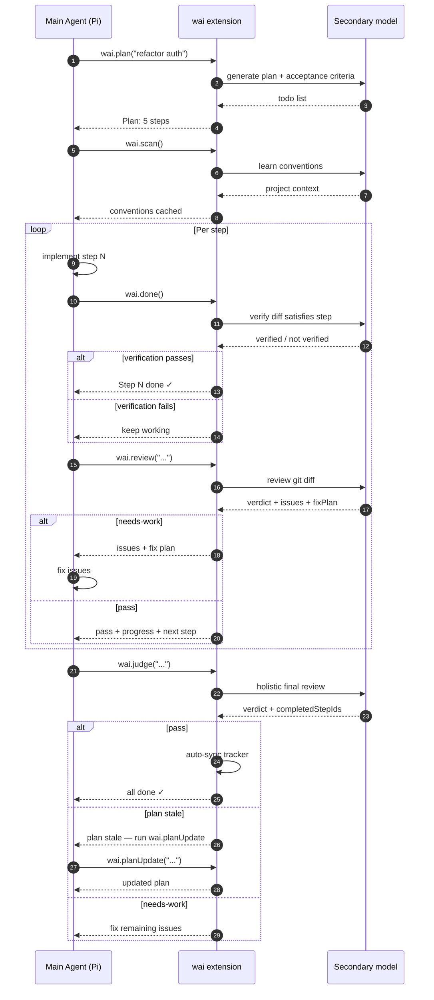

# pi-yoowai

Pair-programmer extension for [Pi](https://github.com/earendil-works/pi). An independent secondary model reviews, plans, suggests, recommends, and judges your work — catching bugs, missing error handling, and blind spots. Optional enforcement layers make sure reviews actually happen, and a judge council can fan final verdicts out to several models at once.

Built by [whatley.xyz](https://whatley.xyz).

## Quick Start

```bash
npx pi-yoowai@latest setup
```

The setup installer writes a secondary model into `~/.pi/agent/settings.json` under `pi-yoowai.secondary`, preserving everything else in the file. It offers four choices: `opencode-go-free` (DeepSeek via opencode-go), `openai` (`gpt-5-mini`), `anthropic` (`claude-sonnet-4-6`), or `custom` (any provider/model id). Non-interactive use:

```bash
npx pi-yoowai@latest setup --preset=openai
```

Then make sure credentials for the chosen provider are available (`~/.pi/agent/auth.json`, an environment variable such as `OPENAI_API_KEY`/`ANTHROPIC_API_KEY`, or Pi's `/login`), restart Pi, and run `/wai-test` to verify connectivity. From a local clone, `npm run setup` runs the same installer (exposed as the `pi-yoowai` bin entry).

After configuring the model, the interactive installer optionally asks "Install design reference skills into Pi? (y/n)". Answering `y` copies the 9 vendored design-reference topics (Emil Kowalski's skills, MIT) from the package's `design-refs/` into `~/.pi/agent/skills/` — only those topic directories are touched, and re-running setup after an upgrade refreshes them. Installed this way, Pi can auto-trigger them as **native Pi skills** during relevant UI work; independently, the built-in `wai_design_ref` tool always lets the main agent read the same guidance on demand (and distilled rules are injected automatically), so skipping this step loses nothing essential.

## Install

```bash
pi install git:github.com/whatley95/pi-yoowai-dev
```

Or from local path:

```bash
pi install ./pi-yoowai
```

Try without installing:

```bash
pi -e git:github.com/whatley95/pi-yoowai-dev
```

## Configuration

Add to your Pi agent settings file (usually `~/.pi/agent/settings.json`):

```json
{
  "pi-yoowai": {
    "secondary": {
      "provider": "opencode-go",
      "id": "deepseek-v4-pro",
      "thinking": "xhigh",
      "backend": "sdk",
      "cacheRetention": "short",
      "transport": "auto",
      "maxRetries": 3,
      "contextWindow": 64000,
      "maxOutputTokens": 8192
    },
    "autoJudge": true,
    "preReviewCommands": ["npm run typecheck", "npm run lint"],
    "costBudgetUsd": 0.5,
    "reviewFullFileThresholdLines": 300,
    "reviewMaxInputTokens": 50000,
    "reviewStrategy": "auto",
    "modelInfo": {
      "qwen3.7-max": { "contextWindow": 128000, "maxOutputTokens": 8192 }
    },
    "taskModels": {
      "review": { "provider": "anthropic", "id": "claude-sonnet-4-5", "thinking": "high" },
      "scan": { "provider": "deepseek", "id": "deepseek-chat", "thinking": "off" }
    },
    "presets": {
      "cheap": { "secondary": { "provider": "deepseek", "id": "deepseek-chat", "thinking": "off" } },
      "careful": {
        "secondary": { "provider": "anthropic", "id": "claude-sonnet-4-6", "thinking": "high" },
        "taskModels": { "review": { "provider": "anthropic", "id": "claude-sonnet-4-6" } }
      }
    }
  }
}
```

**Recommended:** Use a DIFFERENT model family than your main agent. If main is DeepSeek, set secondary to Claude or GPT. This catches blind spots your main model shares.

If no secondary model is configured, `wai` returns an error. Configure `pi-yoowai.secondary` in settings.json or use `/wai-model` to pick one interactively. You can also set a different model per wai tool with `taskModels` or `/wai-model` — see [Model suggestions](#model-suggestions) for a recommended lineup.

**Cost tip:** high-frequency, low-stakes calls do not need a flagship model. Reserve the strong model for `wai.plan`, `wai.review`, and `wai.judge`, and route routine work like `wai.done` (step verification) and `wai.scan` (convention extraction) to a cheap model with thinking off:

```json
"taskModels": {
  "done": { "provider": "deepseek", "id": "deepseek-chat", "thinking": "off" },
  "scan": { "provider": "deepseek", "id": "deepseek-chat", "thinking": "off" }
}
```

Check `/wai-index cost` (or `.pi/yoowai/cost.json`) first to see where your spend actually goes, then tune.

**Judge council:** for high-stakes final judgments you can fan `wai.judge` out to several models at once. Configure `judgeCouncil` with two or more members — ideally from different model families, so their blind spots don't overlap:

```json
"judgeCouncil": [
  "anthropic/claude-sonnet-4-6",
  "openai/gpt-5",
  { "provider": "deepseek", "id": "deepseek-chat", "thinking": "high" }
]
```

Each entry is a `"provider/model-id"` string or a partial secondary config object (same shape as `secondary`; omitted fields fall back to `secondary`, exactly like `taskModels` overrides). With fewer than 2 valid members the council is skipped and the judge runs single-model as before.

Structured tools let the secondary model write brief Markdown analysis, but the final machine-readable result must be a fenced JSON block under `## Result`. The configured `thinking` level is passed through unchanged for each tool, including per-tool `taskModels` overrides; wai does not silently cap or turn off thinking after parse failures.

### Options

| Option                         | Type                                                   | Description                                                                                                                                                                                                                                                                                                                                                                                                                                                                                                                                 |
| ------------------------------ | ------------------------------------------------------ | ------------------------------------------------------------------------------------------------------------------------------------------------------------------------------------------------------------------------------------------------------------------------------------------------------------------------------------------------------------------------------------------------------------------------------------------------------------------------------------------------------------------------------------------- |
| `secondary`                    | object                                                 | `{ provider, id, thinking? }` for the base secondary model                                                                                                                                                                                                                                                                                                                                                                                                                                                                                  |
| `taskModels`                   | object                                                 | Per-tool model overrides keyed by action (`plan`, `review`, `suggest`, `recommend`, `judge`, `scan`, `test`, `security`, `done`, `explain`, `vision`)                                                                                                                                                                                                                                                                                                                                                                                       |
| `judgeCouncil`                 | array                                                  | Council of models that judge in parallel — entry shape in [Configuration](#configuration), behavior in [Judge council](#judge-council) (default: `[]`, single-model judge)                                                                                                                                                                                                                                                                                                                                                                  |
| `presets`                      | object                                                 | Named model presets (`{ secondary?, taskModels? }`) applied to the global settings file with `/wai-preset <name>`; preview with `/wai-preset show <name>`                                                                                                                                                                                                                                                                                                                                                                                   |
| `autoJudge`                    | boolean                                                | Run `wai.judge` automatically when the last plan step passes review, is marked done via `/wai-done`, or when the agent settles after all steps are complete                                                                                                                                                                                                                                                                                                                                                                                 |
| `autoReviewOnSettle`           | boolean                                                | Run `wai.review` automatically when the agent settles with unreviewed edits pending, before any auto-judge (default: `true`)                                                                                                                                                                                                                                                                                                                                                                                                                |
| `requireReviewBeforeDone`      | boolean                                                | Block `wai.done` / `/wai-done` from marking steps complete while unreviewed edits are pending; override with `force: true` / `--force` (default: `true`)                                                                                                                                                                                                                                                                                                                                                                                    |
| `steerEscalationThreshold`     | number                                                 | Consecutive turns ending with unreviewed edits pending before the workflow reminder escalates to a stop directive (default: `3`)                                                                                                                                                                                                                                                                                                                                                                                                            |
| `verifyDoneClaims`             | boolean                                                | Verify `wai.done` step-completion claims against the diff with the secondary model (default: `true`)                                                                                                                                                                                                                                                                                                                                                                                                                                        |
| `reviewReminderEdits`          | number                                                 | Unreviewed edit count that triggers the workflow reminder and the footer "review pending" notice (default: `3`)                                                                                                                                                                                                                                                                                                                                                                                                                             |
| `maxContinuations`             | number                                                 | Follow-up calls used to complete a length-truncated secondary-model response (default: `3`)                                                                                                                                                                                                                                                                                                                                                                                                                                                 |
| `autoInjectContext`            | boolean                                                | Inject the active wai plan and conventions into the main agent's context before each LLM call (default: `true`)                                                                                                                                                                                                                                                                                                                                                                                                                             |
| `contextInjectMaxTokens`       | number                                                 | Token budget for the injected plan/conventions context (default: `800`)                                                                                                                                                                                                                                                                                                                                                                                                                                                                     |
| `codemapMaxTokens`             | number                                                 | Token budget for the project symbol map injected into review/judge prompts (default: unset — review uses the level defaults: min 20000, med 8000, high 8000; judge keeps a 1500-token fallback since it has no review level; `0` disables)                                                                                                                                                                                                                                                                                                   |
| `designRefMaxTokens`           | number                                                 | Token budget for user-curated design rules injected into review/judge prompts when UI files change (default: `800`; `0` disables)                                                                                                                                                                                                                                                                                                                                                                                                           |
| `entryRenderer`                | boolean                                                | Render wai audit entries with a custom TUI entry renderer (default: `true`)                                                                                                                                                                                                                                                                                                                                                                                                                                                                 |
| `shortcuts`                    | boolean                                                | Register keyboard shortcuts for common wai actions (default: `true`)                                                                                                                                                                                                                                                                                                                                                                                                                                                                        |
| `planWidget`                   | boolean                                                | Show a compact plan-progress widget above the editor, including a "blocked by step N" line when the current step's `dependsOn` steps are unmet (default: `true`)                                                                                                                                                                                                                                                                                                                                                                            |
| `registerProvider`             | boolean                                                | Register the configured secondary model as a Pi provider named `wai` (default: `false`)                                                                                                                                                                                                                                                                                                                                                                                                                                                     |
| `preReviewCommands`            | string[]                                               | Commands to run before each review; output is included in the review prompt. An explicitly configured array — including `[]` — always wins and disables auto-detection; only an omitted/unset value permits auto mode (see `autoPreReviewCommands`)                                                                                                                                                                                                                                                                                           |
| `autoPreReviewCommands`        | boolean                                                | Auto-detect `typecheck`/`lint`(/`test` at high) scripts from the reviewed project's `package.json` and run them before med/high reviews (min never runs auto commands). Default `false` — runs the reviewed project's code, so only enable it for repositories you trust                                                                                                                                                                                                                                                                    |
| `relatedContextMaxTokens`      | number                                                 | Token budget for related-file/AST context injected into review prompts (level default: min 1000, med 2500, high 4000; `0` disables)                                                                                                                                                                                                                                                                                                                                                                                                         |
| `testCommand`                  | string                                                 | Command to run for `/wai test` analysis (e.g. `npm test`). Auto-detected from `package.json` if omitted                                                                                                                                                                                                                                                                                                                                                                                                                                     |
| `costBudgetUsd`                | number                                                 | Maximum estimated session spend before wai stops with an error. Negative values are treated as unset; `0` means no spend is allowed                                                                                                                                                                                                                                                                                                                                                                                                         |
| `reviewMaxDiffChars`           | number                                                 | Optional explicit cap on diff characters per review (default: unset — review levels impose no caps; the model's context-derived budget is the ceiling, see [Review levels](#review-levels))                                                                                                                                                                                                                                                                                                                                                 |
| `reviewFullFileThresholdLines` | number                                                 | Include full content for changed files under this line count (default: 300)                                                                                                                                                                                                                                                                                                                                                                                                                                                                 |
| `reviewMaxInputTokens`         | number                                                 | Optional explicit cap on review input tokens (default: unset — review levels impose no caps; the model's context-derived budget is the ceiling, see [Review levels](#review-levels))                                                                                                                                                                                                                                                                                                                                                        |
| `reviewMaxConventionsTokens`   | number                                                 | Max tokens of project conventions included in review prompts (default: 1000)                                                                                                                                                                                                                                                                                                                                                                                                                                                                |
| `reviewMaxMemoryTokens`        | number                                                 | Max tokens of past review issues included in review prompts (default: 800)                                                                                                                                                                                                                                                                                                                                                                                                                                                                  |
| `reviewStrategy`               | `"auto" \| "diff-only" \| "full-files"`                | How to include changed file contents (default: `"auto"`)                                                                                                                                                                                                                                                                                                                                                                                                                                                                                    |
| `verifyByDefault`              | boolean                                                | If true, every wai result asks the main agent to confirm the finding with evidence                                                                                                                                                                                                                                                                                                                                                                                                                                                          |
| `selfVerify`                   | boolean                                                | Run a second verification pass on `wai.review` and `wai.judge` results (costs extra tokens)                                                                                                                                                                                                                                                                                                                                                                                                                                                 |
| `toolUseLoop`                  | boolean \| number                                      | Let the secondary model use `read_file`, `search_code`, and allowlisted `run_command` in a loop; number sets the max iterations. Default is level-scaled: `off` at min (one cheap call), 3 at med, 5 at high. `read_file` supports optional `startLine`/`endLine` paging, truncated files report their line count, `search_code` finds regex matches (optional path scope, 0-5 context lines), and long command output keeps head + tail. Model-generated commands are restricted to read-only subcommands for `git`/`svn`/package managers |
| `parallelReview`               | boolean \| number                                      | Review multiple changed files in parallel; number sets concurrency (default: 3 when enabled). Works at every level — at `min` (diff-only) it runs per-file diff-only reviews concurrently, at `med`/`high` it also covers the auto-split path (see [Review levels](#review-levels))                                                                                                                                                                                                                                                         |
| `deepScan`                     | boolean \| number                                      | Include code samples and build a symbol index during `wai.scan`; number caps sample files                                                                                                                                                                                                                                                                                                                                                                                                                                                   |
| `secondary.contextWindow`      | number                                                 | Override the model's context window                                                                                                                                                                                                                                                                                                                                                                                                                                                                                                         |
| `secondary.maxOutputTokens`    | number                                                 | Override the model's max output tokens                                                                                                                                                                                                                                                                                                                                                                                                                                                                                                      |
| `secondary.backend`            | `"sdk" \| "pi" \| "http"`                              | Backend for model calls. `"sdk"` uses Pi's `pi-ai` provider layer (default); `"pi"` spawns the Pi CLI; `"http"` uses direct provider HTTP                                                                                                                                                                                                                                                                                                                                                                                                   |
| `secondary.cacheRetention`     | `"none" \| "short" \| "long"`                          | SDK cache retention hint (SDK backend only, default: `"short"` to match the main Pi agent)                                                                                                                                                                                                                                                                                                                                                                                                                                                  |
| `secondary.transport`          | `"sse" \| "websocket" \| "websocket-cached" \| "auto"` | SDK HTTP transport hint (SDK backend only)                                                                                                                                                                                                                                                                                                                                                                                                                                                                                                  |
| `secondary.maxRetries`         | number                                                 | Maximum SDK request retries (SDK backend only, default: 3)                                                                                                                                                                                                                                                                                                                                                                                                                                                                                  |
| `secondary.maxRetryDelayMs`    | number                                                 | Maximum delay between SDK retries in ms (SDK backend only, default: 60000)                                                                                                                                                                                                                                                                                                                                                                                                                                                                  |
| `secondary.timeoutMs`          | number                                                 | SDK request timeout in ms (SDK backend only, default: 300000 = 5 min)                                                                                                                                                                                                                                                                                                                                                                                                                                                                       |
| `secondary.apiKey`             | string                                                 | Inline API key (prefer `auth.json` or env vars)                                                                                                                                                                                                                                                                                                                                                                                                                                                                                             |
| `secondary.style`              | `"openai-compatible" \| "anthropic"`                   | API style when using `baseUrl` (default: `"openai-compatible"`)                                                                                                                                                                                                                                                                                                                                                                                                                                                                             |
| `secondary.authHeader`         | `string \| boolean`                                    | Custom auth header name when using `baseUrl`; set to `false` to omit the auth header when registering the provider with Pi                                                                                                                                                                                                                                                                                                                                                                                                                  |
| `secondary.authPrefix`         | string                                                 | Custom auth prefix when using `baseUrl`                                                                                                                                                                                                                                                                                                                                                                                                                                                                                                     |
| `modelInfo`                    | object                                                 | Per-model token budget overrides, keyed by model id                                                                                                                                                                                                                                                                                                                                                                                                                                                                                         |
| `processTimeoutMs`             | number                                                 | Timeout in ms for child pi process calls (default: 300000 = 5 min)                                                                                                                                                                                                                                                                                                                                                                                                                                                                          |
| `testTimeoutMs`                | number                                                 | Timeout in ms per model in `/wai test` (default: 120000 = 2 min)                                                                                                                                                                                                                                                                                                                                                                                                                                                                            |
| `docs`                         | object                                                 | Documentation sources and web-search settings — see [Documentation sources and web search](#documentation-sources-and-web-search)                                                                                                                                                                                                                                                                                                                                                                                                           |

When `registerProvider` is enabled, `/wai-config`, `/wai-model`, and `/wai-backend` automatically refresh the `wai` provider registration in Pi so settings changes take effect without a manual `/reload`.

### Custom providers via `models.json`

Providers that are not in Pi's built-in catalog (e.g. [CrofAI](https://crof.ai/docs)) can still be used as the wai secondary model — on the default `sdk` backend, with streaming, caching, and `wai_vision` support. Register the provider in `~/.pi/agent/models.json` (or install a provider extension such as [`pi-crof`](https://pi.dev/packages/pi-crof?name=crof)); pi-yoowai resolves models through Pi's runtime registry when the static catalog doesn't know them. Reference configuration:

```json
{
  "providers": {
    "crof": {
      "name": "CrofAI",
      "baseUrl": "https://crof.ai/v1",
      "api": "openai-completions",
      "models": [
        {
          "id": "deepseek-v4-pro",
          "name": "CrofAI: deepseek-v4-pro",
          "reasoning": true,
          "input": ["text"],
          "contextWindow": 1000000,
          "maxTokens": 131072,
          "cost": { "input": 0.28, "output": 0.38, "cacheRead": 0, "cacheWrite": 0 }
        },
        {
          "id": "kimi-k2.5",
          "name": "CrofAI: kimi-k2.5 (vision)",
          "reasoning": false,
          "input": ["text", "image"],
          "contextWindow": 262144,
          "maxTokens": 262144
        }
      ]
    }
  }
}
```

Notes:

- The API key goes in `~/.pi/agent/auth.json` under the same provider id: `"crof": { "type": "api_key", "key": "nahcrof_..." }` (env-var fallback only exists for built-in providers).
- `"input": ["text", "image"]` is what lets `wai_vision` use the model — set it on every vision-capable entry.
- `api` must be a wire format Pi implements (`openai-completions`, `anthropic-messages`, `openai-responses`, `google-generative-ai`, ...); most hosted providers are OpenAI- or Anthropic-compatible.
- Once registered, the models appear in the `/wai-model` picker and work for `secondary`, `taskModels`, and `judgeCouncil` like any built-in provider.

### Model suggestions

Starting points for `taskModels` and `judgeCouncil`, from a setup using three subscriptions: **Moonshot** (Kimi), **opencode-go**, and **OpenAI** (ChatGPT). These are **suggestions, not requirements** — model lineups change fast, so treat this table as a snapshot (last updated: July 2026, after the Kimi K3 release) and check what your `/wai-model` picker actually lists. After assigning, run `/wai-test <tool>` to verify the model responds with clean output.

| Tool                    | Option 1 (recommended)            | Option 2          | Option 3        |
| ----------------------- | --------------------------------- | ----------------- | --------------- |
| **plan**                | deepseek-v4-pro                   | kimi-k3           | gpt-5.6-sol     |
| **review**              | kimi-k3                           | gpt-5.3-codex     | deepseek-v4-pro |
| **judge** (synthesizer) | gpt-5.6-sol                       | deepseek-v4-pro   | kimi-k3         |
| **security**            | deepseek-v4-pro                   | kimi-k3           | gpt-5.6-sol     |
| **test**                | kimi-k3                           | qwen3.7-plus      | gpt-5-mini      |
| **scan**                | deepseek-v4-flash                 | gpt-5-mini        | mimo-v2.5       |
| **suggest**             | kimi-k3                           | glm-5.2           | gpt-5-mini      |
| **recommend**           | glm-5.2                           | kimi-k3           | qwen3.7-plus    |
| **done**                | _(uses plan model — leave unset)_ | deepseek-v4-flash | gpt-5-mini      |
| **explain**             | kimi-k3                           | deepseek-v4-flash | gpt-5-mini      |

**Main agent rule:** the reviewer and judge must not share a model family with the main agent, or the "independent second opinion" becomes self-grading. Non-verdict lanes (test, suggest, explain) are diagnostics rather than judgments — sharing the writer's family there is fine and saves quota. Three combinations depending on what writes your code (only the verdict lanes change; plan and bulk lanes stay the same):

| Lane         | A — main: kimi-k3                       | B — main: deepseek-v4-pro       | C — main: qwen3.7-plus                  |
| ------------ | --------------------------------------- | ------------------------------- | --------------------------------------- |
| **review**   | gpt-5.3-codex                           | kimi-k3                         | kimi-k3                                 |
| **security** | deepseek-v4-pro                         | gpt-5.6-sol                     | deepseek-v4-pro                         |
| **judge**    | gpt-5.6-sol                             | gpt-5.6-sol                     | gpt-5.6-sol                             |
| **council**  | kimi-k3 + deepseek-v4-pro + gpt-5.6-sol | gpt-5.6-sol + kimi-k3 + glm-5.2 | gpt-5.6-sol + kimi-k3 + deepseek-v4-pro |

Combo A gives the best token economics (flat Moonshot sub absorbs the heaviest load). Combo B keeps a deepseek main and moves K3 into the high-volume review seat — note glm-5.2 takes the council's third seat, since a deepseek councillor would share the writer's family. Combo C is the budget option: weakest writer of the three, but K3 review plus a three-family council compensates.

Example `taskModels` for combo B (main agent writes with deepseek-v4-pro; providers shown as required by the config format — check the exact ids in your `/wai-model` picker):

```json
{
  "pi-yoowai": {
    "secondary": { "provider": "opencode-go", "id": "deepseek-v4-flash" },
    "taskModels": {
      "plan": { "provider": "opencode-go", "id": "deepseek-v4-pro", "thinking": "xhigh" },
      "review": { "provider": "moonshot", "id": "kimi-k3" },
      "judge": { "provider": "openai", "id": "gpt-5.6-sol", "thinking": "high" },
      "security": { "provider": "openai", "id": "gpt-5.6-sol" },
      "test": { "provider": "moonshot", "id": "kimi-k3" },
      "suggest": { "provider": "moonshot", "id": "kimi-k3" },
      "recommend": { "provider": "opencode-go", "id": "glm-5.2" },
      "explain": { "provider": "moonshot", "id": "kimi-k3" }
    },
    "judgeCouncil": ["openai/gpt-5.6-sol", "moonshot/kimi-k3", "opencode-go/glm-5.2"]
  }
}
```

The pattern to keep when models change: cheap fast model as the base default, strong models only where judgment is the product (plan/review/judge/security), and council members from different labs — plus the main-agent rule above.

### Context injection and lifecycle hooks

When `autoInjectContext` is enabled, pi-yoowai prepends the active plan summary, current step, and recently scanned conventions to the main agent's context before every LLM call. This keeps the main agent aligned with the plan without requiring explicit `/wai-index` lookups. The injected context is truncated to `contextInjectMaxTokens` and skipped while a `wai` tool call is already executing.

pi-yoowai also listens to Pi lifecycle events:

- **`tool_result`** — successful file-mutating tool calls increment the internal edit counter and refresh the footer status; failed calls do not.
- **`turn_end`** — if unreviewed edits exist, a steer reminds the main agent to call `wai.review` before continuing. The reminder respects a cooldown so it does not spam, and escalates to a stop directive after repeated ignored turns — see [Review enforcement](#review-enforcement).
- **`agent_settled`** — auto-review on settle runs first when enabled (see [Review enforcement](#review-enforcement)); then, when `autoJudge` is enabled and the active plan is complete, `wai.judge` runs automatically.
- **`model_select`** — the prompt cache is cleared so prompts are rebuilt for the new model.
- **`session_before_compact`** — if a plan is active, its summary, progress, and current step are added to the compaction custom instructions so they survive context compression.
- **`session_before_switch`** / **`session_before_fork`** — volatile counters and plan progress are flushed to disk so they survive session navigation.

### Footer status and session audit trail

When running in Pi's TUI, pi-yoowai keeps the footer/status bar up to date:

- **`wai-plan`** — active plan progress and current step (e.g. `wai 2/5 · add tests`).
- **`wai-cost`** — session cost and pending-review edit count when over the threshold (e.g. `wai $0.04 · 1 call · review pending (3 edits)`).

In addition, every plan creation, step completion, review/judge verdict, and scan completion is recorded as a custom session entry. These entries appear in Pi's session timeline as an audit trail of wai decisions.

### Documentation sources and web search

You can give `wai.suggest`, `wai.recommend`, and `wai_explain` access to configured documentation pages. This is useful when the secondary model needs up-to-date library docs. For ad-hoc web search, use the `/wai-search` command.

```json
{
  "pi-yoowai": {
    "docs": {
      "sources": {
        "react": "https://react.dev/reference/react",
        "pi": "https://pi.dev/docs/latest"
      },
      "maxCharsPerSource": 8000,
      "webSearch": {
        "enabled": true,
        "provider": "brave",
        "maxResults": 3,
        "maxCharsPerResult": 3000
      }
    }
  }
}
```

| Option                             | Type                      | Description                                                                               |
| ---------------------------------- | ------------------------- | ----------------------------------------------------------------------------------------- |
| `docs.sources`                     | object                    | Named URL map. Only URLs listed here can be fetched.                                      |
| `docs.maxCharsPerSource`           | number                    | Characters of each source page to include in the prompt (default: 8000)                   |
| `docs.webSearch.enabled`           | boolean                   | Whether `/wai-search` is allowed (default: false)                                         |
| `docs.webSearch.provider`          | `"duckduckgo" \| "brave"` | Search provider. Defaults to "brave" when a Brave API key is available, else "duckduckgo" |
| `docs.webSearch.apiKey`            | string                    | Inline Brave API key (prefer auth.json or `BRAVE_API_KEY` env var)                        |
| `docs.webSearch.maxResults`        | number                    | Search results to include (default: 3)                                                    |
| `docs.webSearch.maxCharsPerResult` | number                    | Characters of each search snippet to include (default: 3000)                              |

Use it from the `wai` tool:

```js
wai({ suggest: "useEffect vs useLayoutEffect", docs: ["react"] });
wai({ recommend: "what next", docs: ["pi"] });
```

Or from `wai_explain`:

```js
wai_explain({ target: "what is MCP", docs: ["pi"] });
```

For ad-hoc web search, use the terminal command:

```text
/wai-search Next.js app router caching
```

**Brave Search.** If you have a Brave Search API key, pi-yoowai will use Brave automatically. Configure it via TUI with `/wai-search-config` (interactive provider picker) or inline:

```text
/wai-search-config brave <your-api-key>
/wai-search-config duckduckgo
```

API key resolution order: `docs.webSearch.apiKey` → `~/.pi/agent/auth.json` `brave` entry → `BRAVE_API_KEY` env var. If Brave is selected but no key is found, pi-yoowai falls back to DuckDuckGo.

Fetched source pages and search results are cached in `.pi/yoowai/docs/` for 24 hours. Cache files are written with mode `0o600`. Only URLs declared in `docs.sources` are fetched; web search never fetches arbitrary result pages. Fetches time out after 10 seconds and responses larger than 500 KB are rejected. No credentials are sent.

## Tools

The `wai` tool is called by the main agent during development:

| Action                                                                | When                           | What it does                                                                        |
| --------------------------------------------------------------------- | ------------------------------ | ----------------------------------------------------------------------------------- |
| `wai({ plan: "refactor auth" })`                                      | Before starting                | Creates structured todo + acceptance criteria                                       |
| `wai({ review: "wrote middleware" })`                                 | After each step                | Reviews git diff, returns verdict + issues                                          |
| `wai({ review: "wrote middleware", files: ["src/auth.ts"] })`         | After each step                | Reviews only the listed files                                                       |
| `wai({ review: "wrote middleware", exclude: ["package-lock.json"] })` | After each step                | Reviews diff excluding listed files                                                 |
| `wai({ review: "wrote middleware", revision: "HEAD~1" })`             | After each step                | Reviews changes against a specific revision                                         |
| `wai({ review: "wrote middleware", untracked: true })`                | After each step                | Includes untracked (new) files in the review                                        |
| `wai({ suggest: "how to..." })`                                       | When stuck or asked a question | Returns alternative approaches with pros/cons                                       |
| `wai({ suggest: "...", docs: ["react"] })`                            | When stuck or asked a question | Includes configured docs in the suggestion prompt                                   |
| `wai({ recommend: "what next" })`                                     | When unsure                    | Recommends next concrete step                                                       |
| `wai({ recommend: "...", docs: ["pi"] })`                             | When unsure                    | Includes configured docs in the recommendation prompt                               |
| `wai({ judge: "all done" })`                                          | Final review                   | Holistic review against original plan                                               |
| `wai({ scan: true })`                                                 | Once per project               | Learns project conventions and architecture                                         |
| `wai({ scan: true, scanDeep: true })`                                 | First scan of a project        | Also samples source files and builds the project symbol index                       |
| `wai({ test: "added payment service" })`                              | After code changes             | Checks for failing tests, missing tests, and test-quality issues                    |
| `wai({ security: "auth changes" })`                                   | Security-sensitive changes     | Audits diff for secrets, injection, auth, and other vulnerabilities                 |
| `wai({ done: true })`                                                 | After completing a step        | Mark the current plan step complete; use a number or `"all"` to mark multiple steps |
| `wai({ planUpdate: "new task description" })`                         | When plan becomes stale        | Regenerate the active plan; already-completed progress is preserved                 |
| `wai({ review: "...", verify: true })`                                | Any high-stakes result         | Asks the main agent to confirm or refute the finding with evidence                  |

> **Diff scope:** by default `review`, `judge`, and `done` diff against `HEAD` and include untracked files, so they see staged, unstaged, and new files without you running `git add` first. Pass `revision`/`since` to scope to a commit range, or `untracked: false` to limit to tracked changes.

Plan steps can include `priority` (`high`, `medium`, `low`) and `dependsOn` (1-based list of earlier steps). Plain-string steps still work for backward compatibility.

**Plan tracker.** wai tracks file edits and sends a workflow reminder after `reviewReminderEdits` (default 3) unreviewed edits without a `wai.review` or `wai.done` call, so the plan tracker stays in sync. The reminder names the current plan step when one is active ("Step 2/5 (…)"). A passing review automatically advances the plan: a consensus pass (verdict `pass` with zero issues) advances by the number of steps the model reports as completed (`completedSteps`), and a pass that explicitly sets `stepComplete: true` advances exactly the current step even when minor issues remain. Either advance records a `step-done` audit entry. Judge re-syncs the tracker in both directions: it advances from `completedStepIds` and regresses from `incompleteStepIds` (steps the tracker marks complete that the code does not actually satisfy). You can also correct the tracker manually: `wai({ done: N })` or `/wai-done N` sets progress to step N — a number below the current progress regresses it, and `0` resets it.

### `wai_index` tool

The `wai_index` tool is a fast, read-only lookup for stored wai context. It does not call a model.

| Call                                                      | What it returns                                                                    |
| --------------------------------------------------------- | ---------------------------------------------------------------------------------- |
| `wai_index({})` or `wai_index({ topic: "all" })`          | Conventions, active plan, review memory, cost, and recent logs                     |
| `wai_index({ topic: "conventions" })`                     | Project conventions from `wai scan`                                                |
| `wai_index({ topic: "plan" })`                            | Active todo list and progress                                                      |
| `wai_index({ topic: "memory" })`                          | Past review issues for all files                                                   |
| `wai_index({ topic: "memory", files: ["src/auth.ts"] })`  | Past review issues for specific files                                              |
| `wai_index({ topic: "memory", query: "race condition" })` | Memory entries matching a keyword                                                  |
| `wai_index({ topic: "cost" })`                            | Estimated session spend                                                            |
| `wai_index({ topic: "logs" })`                            | Recent wai log entries                                                             |
| `wai_index({ topic: "index" })`                           | Project symbol index (built by `wai scan --deep` or `wai_index({ update: true })`) |
| `wai_index({ topic: "learned" })`                         | Facts recorded with `wai_learn`                                                    |
| `wai_index({ update: true })`                             | Rebuild the symbol index before returning results                                  |

Use `wai_index` before editing to quickly learn the project's rules, current task, known issues, symbols, and recorded facts.

### `wai_explain` tool

Explain a code snippet, error message, diff, or file with the secondary model.

| Call                                                                        | What it does                                        |
| --------------------------------------------------------------------------- | --------------------------------------------------- |
| `wai_explain({ target: "TypeError: Cannot read..." })`                      | Explains an error and the likely fix                |
| `wai_explain({ target: "src/auth.ts" })`                                    | Explains the purpose and structure of a file        |
| `wai_explain({ target: "function verifySession", files: ["src/auth.ts"] })` | Explains a specific function with full file context |
| `wai_explain({ target: "what is MCP", docs: ["pi"] })`                      | Explains a concept using configured docs            |
| `wai_explain({ target: "MCP", docs: ["pi"] })`                              | Explains a concept using configured docs            |

`wai_explain` is read-only — it does not edit files. If you pass a merge conflict, it explains the conflicting versions and suggests resolutions, but it does not claim the files are resolved.

### `wai_learn` tool

Record a persistent project fact that wai will remember across sessions.

| Call                                                                          | What it does                                                                   |
| ----------------------------------------------------------------------------- | ------------------------------------------------------------------------------ |
| `wai_learn({ fact: "Auth is handled by Clerk" })`                             | Stores a fact                                                                  |
| `wai_learn({ fact: "Use camelCase for functions", category: "conventions" })` | Stores a categorized fact                                                      |
| `wai_learn({ verify: true })`                                                 | Check all stored facts against the current codebase (heuristic, no model call) |
| `wai_learn({ verify: true, query: "auth" })`                                  | Verify only facts matching a keyword                                           |
| `wai_learn({ verify: true, deep: true })`                                     | Verify facts with the secondary model for higher accuracy                      |
| `wai_learn({ verify: true, deep: true, query: "auth" })`                      | Deep verify only facts matching a keyword                                      |

Recorded facts appear in `wai_index({ topic: "learned" })`.

`verify` checks referenced files, source files, and symbols from the project index. It returns each fact as `valid`, `questionable`, or `outdated` — no model call, so it is fast and safe to run manually.

`verify` + `deep` calls the secondary model for each fact, including the source file and project conventions in the prompt. It is more accurate but costs tokens per fact.

### `wai_design_ref` tool

Read curated UI/animation design guidance vendored from [Emil Kowalski's skills](https://github.com/emilkowalski/skills) (MIT licensed — attribution in `design-refs/README.md`, license in `design-refs/LICENSE`). No model call; it reads local markdown.

| Call                                                               | What it does                                                                                                                                                                       |
| ------------------------------------------------------------------ | ---------------------------------------------------------------------------------------------------------------------------------------------------------------------------------- |
| `wai_design_ref({})`                                               | Lists the 9 topics (animate, animation-vocabulary, apple-design, emil-design-eng, find-animation-opportunities, improve-animations, pick-ui-library, prototype, review-animations) |
| `wai_design_ref({ topic: "animate" })`                             | Reads the topic's `SKILL.md`                                                                                                                                                       |
| `wai_design_ref({ topic: "improve-animations", doc: "AUDIT.md" })` | Reads a specific doc of a topic                                                                                                                                                    |

Call this when building, reviewing, or improving UI/animation code to get detailed design guidance beyond the distilled baseline rules that are injected automatically.

### `wai_vision` tool

Analyze an image file (screenshot, UI mockup, diagram, error capture) or a PDF document with the secondary model.

| Call                                                                                               | What it does                               |
| -------------------------------------------------------------------------------------------------- | ------------------------------------------ |
| `wai_vision({ path: "docs/settings.png" })`                                                        | Full analysis of the image                 |
| `wai_vision({ path: "docs/settings.png", question: "does this match the design rules?" })`         | Answers a focused question about the image |
| `wai_vision({ path: "tmp/error.png", question: "what caused this?", context: "after npm start" })` | Analyzes with extra background context     |
| `wai_vision({ path: "docs/invoice.pdf", question: "what is the total?" })`                         | Analyzes a PDF document                    |

The path may be project-relative or absolute (e.g. a PDF in Downloads — no manual copying needed); images are png/jpg/jpeg/webp/gif up to 5 MB, PDFs up to 20 MB. Outside-project access is limited to those whitelisted media types and every analysis is recorded in `.pi/yoowai/wai.log`. PDFs are handled two ways: when the document has a **text layer**, the text is extracted (via `mupdf`, pure WASM) and analyzed as a plain text call — cheaper, exact, and works with **any** text model. Scanned/image-only PDFs are rendered to PNG (up to 3 pages) and go through the image path below.

Image analysis (including scanned PDFs) requires the **sdk backend** and a model that accepts image input — if your base `secondary` model is text-only, assign a vision-capable model to the vision task via `/wai-model` (writes `taskModels.vision`).

## Commands

### Core workflow

| Command                                       | What it does                                                                                        |
| --------------------------------------------- | --------------------------------------------------------------------------------------------------- |
| `/wai`                                        | Compact status card: version, model, plan, VCS, cost, conventions                                   |
| `/wai plan refactor auth middleware`          | Create a plan from the terminal                                                                     |
| `/wai review "wrote verifySession"`           | Review current changes                                                                              |
| `/wai suggest "redis vs in-memory sessions?"` | Get alternative approaches with pros/cons                                                           |
| `/wai recommend`                              | Get one concrete next step based on your current situation/plan                                     |
| `/wai judge "auth refactor complete"`         | Final holistic review                                                                               |
| `/wai scan`                                   | Scan project conventions                                                                            |
| `/wai scan --deep`                            | Deep scan with code samples and symbol index build                                                  |
| `/wai-scan-deep`                              | Alias for `/wai scan --deep`                                                                        |
| `/wai-next`                                   | Recommend the next step based on the active plan                                                    |
| `/wai-done [description]`                     | Mark the current plan step complete and recommend the next step                                     |
| `/wai-done 3`                                 | Mark steps 1–3 complete (lower number regresses the tracker, `0` resets)                            |
| `/wai-done all`                               | Mark all steps complete                                                                             |
| `/wai-done --force`                           | Override the `requireReviewBeforeDone` gate; the step is recorded as manually marked (not reviewed) |
| `/wai-plan-update <new task description>`     | Regenerate the active plan; already-completed progress is preserved                                 |

**`/wai-model` selection flow.** Recent model choices are shown first so you can re-select a model in one click. For providers with a huge catalog (e.g. OpenRouter), `/wai-model` opens a real-time searchable picker with fuzzy matching (the same matcher as Pi's own search — `dsr1` finds `deepseek-r1`): type to narrow the list as you type, use ↑↓ to navigate, and press Enter to select — no Enter-to-submit query needed. If you cancel the search or it matches nothing, it falls back to a family-grouped menu. In environments without interactive terminal input (e.g. RPC/print mode), it falls back to a text prompt + list. The final selection is saved to a recent-models list scoped to the project.

### Utilities and diagnostics

| Command                                          | What it does                                                                                                                                                                                                                             |
| ------------------------------------------------ | ---------------------------------------------------------------------------------------------------------------------------------------------------------------------------------------------------------------------------------------- |
| `/wai test [description] [--command <cmd>]`      | Analyze test coverage and failures for current changes                                                                                                                                                                                   |
| `/wai security [description] [--full-project]`   | Security audit of current diff or sampled project files                                                                                                                                                                                  |
| `/wai-status`                                    | Detailed diagnostics: base + per-tool models, config, plan, VCS, conventions, cost                                                                                                                                                       |
| `/wai-index [topic] [--update]`                  | Read stored wai context (plan, memory, conventions, cost, logs, index, learned)                                                                                                                                                          |
| `/wai-explain <target> [--files ...]`            | Explain code, error, or file with the secondary model                                                                                                                                                                                    |
| `/wai-vision <path> [question...]`               | Analyze an image (screenshot, diagram, error capture) with a vision-capable model                                                                                                                                                        |
| `/wai-search <query>`                            | Search the web via DuckDuckGo or Brave (requires `docs.webSearch.enabled`)                                                                                                                                                               |
| `/wai-learn <fact> [--category <cat>]`           | Record a persistent project fact                                                                                                                                                                                                         |
| `/wai-learn --verify [--query <keyword>]`        | Check stored facts against the current codebase                                                                                                                                                                                          |
| `/wai-learn --verify --deep [--query <keyword>]` | Check stored facts with the secondary model                                                                                                                                                                                              |
| `/wai-model`                                     | Interactively pick the base or per-tool model — see the selection flow above                                                                                                                                                             |
| `/wai-model <provider> [filter]`                 | Pre-select provider and optionally filter the model list                                                                                                                                                                                 |
| `/wai-model reset [base\|<task>]`                | Clear the base secondary model or a per-tool override (e.g. `reset review`)                                                                                                                                                              |
| `/wai-council`                                   | Interactively manage the judge council: add/remove members with the `/wai-model` pickers (models already in the council are marked ✓ current, and each member gets a thinking-level pick); fewer than 2 members means single-model judge |
| `/wai-config`                                    | Show current `pi-yoowai` settings                                                                                                                                                                                                        |
| `/wai-config get <key>`                          | Read a dotted setting (e.g. `/wai-config get secondary.thinking`)                                                                                                                                                                        |
| `/wai-config set <key> <value>`                  | Write a dotted setting (e.g. `/wai-config set taskModels.review.id claude-sonnet-4-5`)                                                                                                                                                   |
| `/wai-config <provider.model>`                   | Set the base secondary model directly (e.g. `/wai-config openai.gpt-4o`)                                                                                                                                                                 |
| `/wai-test`                                      | Test connectivity (includes judge council members); prints a per-model summary with latency, tokens, cost, and totals                                                                                                                    |
| `/wai-backend <sdk\|pi\|http>`                   | Switch secondary model backend (default: `sdk`)                                                                                                                                                                                          |
| `/wai-preset`                                    | List named model presets defined in `pi-yoowai.presets`                                                                                                                                                                                  |
| `/wai-preset show <name>`                        | Preview what a preset would write                                                                                                                                                                                                        |
| `/wai-preset <name>`                             | Apply a preset: merge its `secondary`/`taskModels` into `~/.pi/agent/settings.json`                                                                                                                                                      |
| `/wai-audit [description] [review flags]`        | Run review, security, and test concurrently over the current diff; one combined report (slash command only, not a `wai` tool action)                                                                                                     |
| `/wai-reflect`                                   | Report recurring review-issue patterns per file with a suggested project convention                                                                                                                                                      |
| `/wai-reflect --learn`                           | Also save each suggestion as a learned fact (no model calls)                                                                                                                                                                             |
| `/wai-design-ref`                                | Manage UI design rules: `list`, `add <rule>`, `remove <n>`, `import <path>`, `docs [topic] [doc]`, `reset-defaults`, `clear`                                                                                                             |
| `/wai-search-config <provider> [api-key]`        | Pick the web-search provider (DuckDuckGo or Brave) and optionally save a Brave API key                                                                                                                                                   |
| `/wai-clear`                                     | Clear the current session's plan, state, cost, memory, and conventions                                                                                                                                                                   |
| `/wai-logs`                                      | Show recent error/event log entries for this project                                                                                                                                                                                     |
| `/wai-clear-logs`                                | Clear the wai error/event log for this project                                                                                                                                                                                           |

### Review command options

`/wai review` accepts flags to scope the diff:

```text
/wai review upload component --revision HEAD~1
/wai review check r1234 changes --since 1230 --vcs svn
/wai review look at these files --files src/app.ts,src/lib.ts
/wai review exclude generated --exclude dist/,package-lock.json
/wai review include new files --untracked
```

| Flag                | Description                                                     |
| ------------------- | --------------------------------------------------------------- |
| `--revision` / `-r` | Compare against a revision (e.g. `HEAD~1`, `1234`, `1234:HEAD`) |
| `--since` / `-s`    | Include changes since a revision or commit ID                   |
| `--files` / `-f`    | Comma-separated list of files to review                         |
| `--exclude` / `-x`  | Comma-separated list of files/patterns to exclude               |
| `--vcs git\|svn`    | Force Git or SVN diff mode                                      |
| `--untracked`       | Include untracked (new) files                                   |

`/wai test` and `/wai security` accept the same diff-scoping flags as `/wai review` (`--files`, `--exclude`, `--revision`, `--since`, `--vcs`, `--untracked`); `/wai security` also accepts `--full-project`. `/wai-audit` accepts the same flags plus `--command` (passed to the test analysis); if one section fails, the other results are still shown alongside the error. `/wai-test` (with a hyphen) is a separate command that tests model connectivity.

### Review levels

Reviews run at one of three levels — `min`, `med`, or `high` — chosen by (in order): an explicit tool override (`wai_review_min` / `wai_review_med` / `wai_review_high`), the `pi-yoowai.reviewLevel` config, or a model-derived default (cheap "mini"/"flash" models default to `min`, reasoning-heavy models to `high`, everything else to `med`). Each level has its own per-level task-model override (`taskModels.reviewMin` / `reviewMed` / `reviewHigh`) that wins over the generic `review` task.

Levels are **strategy-only**: they choose how much context and verification to spend, not how much of the diff to send.

| Level  | Strategy   | Self-verify | Codemap | Related ctx | Tool loop |
| ------ | ---------- | ----------- | ------- | ----------- | --------- |
| `min`  | diff-only  | off         | 20k     | 1k          | off       |
| `med`  | auto       | off         | 8k      | 2.5k        | 3 iters   |
| `high` | full-files | on          | 8k      | 4k          | 5 iters   |

Quick, cheap pass — full diff, compact symbol map, no full file contents, short conventions/memory budgets. Balanced review — full diff, small changed files included, auto-splits large changes. Deep review — full file contents, self-verification, larger conventions/memory/codemap budgets.

The single ceiling for every level is the **context-derived budget**: the resolved model's context window minus a reserved output allowance and a 10% safety margin (see `token-budget.ts`). The codemap budget deducts the _actual rendered_ symbol-map length, not the configured cap — so a high `min` cap (20k) costs nothing on typical projects (maps are usually 1–10k tokens) and only binds on very large ones, where the remaining diff budget still stays ~34k tokens on a 64k-context model. Explicit config values — `reviewMaxDiffChars`, `reviewMaxInputTokens`, `reviewStrategy`, `selfVerify`, `reviewMaxConventionsTokens`, `reviewMaxMemoryTokens`, `codemapMaxTokens` — always override the level defaults, so you can tighten or loosen any level per project.

Because levels no longer truncate the diff, a `min` (diff-only) review whose diff exceeds the model's context budget **fails loudly with guidance** instead of reviewing a fragment. With `parallelReview` configured, a multi-file change is instead split into one diff-only call per file (concurrent, capped by the configured concurrency, default 3), so for multi-file changes the aggregate-budget error only remains without explicit parallel: re-run with `wai_review_med` or `wai_review_high` (which split large diffs automatically into per-file or per-hunk reviews), enable `pi-yoowai.parallelReview` for a per-file diff-only review, or scope the review with `files:[...]`. A single file whose diff alone still exceeds the model's budget fails closed with the same guidance — it is never silently truncated. This replaces the old behavior where `min` silently capped the diff at 3,000 characters and 4,000 input tokens, producing unreliable "diff truncated · context limited" findings.

## Caching and optimization

pi-yoowai uses several caches to avoid redundant work and cost:

| Cache                | File                           | Purpose                                                                                                                                                                                                                         |
| -------------------- | ------------------------------ | ------------------------------------------------------------------------------------------------------------------------------------------------------------------------------------------------------------------------------- |
| Review result cache  | `.pi/yoowai/review-cache.json` | Skip duplicate `wai.review` calls for the same diff (24-hour TTL; keyed on every stable prompt input — diff, model, level, conventions, memory, codemap, related context, design rules, tool-loop setting, pre-review commands) |
| OAuth API-key cache  | `.pi/yoowai/oauth-cache.json`  | Avoid re-authenticating OAuth providers across Pi sessions (55-min TTL)                                                                                                                                                         |
| Project symbol index | `.pi/yoowai/index.json`        | Reuses unchanged files on incremental updates                                                                                                                                                                                   |
| Review memory        | `.pi/yoowai/memory.json`       | Deduplicated, capped at 20 issues per file / 100 files, 7-day TTL                                                                                                                                                               |

Context compression is applied automatically in reviews: conventions and past issues are truncated to their configured token budgets (`reviewMaxConventionsTokens`, `reviewMaxMemoryTokens`).

**Incremental diff review:** When the working tree is clean, `wai.review` diffs against the last reviewed commit instead of the full working tree, so committed changes are reviewed incrementally. The last reviewed commit is stored in session state and reset when a new plan is created.

**Smart context retrieval:** `wai.review` follows relative imports in changed files and includes compact outlines of referenced files (up to 5 files, 1000 tokens) so the model sees related APIs without loading the entire codebase.

**Deep AST context retrieval:** When a `tsconfig.json` is present, `wai.review` uses the TypeScript compiler API to resolve imported symbols to their actual declarations and includes only those precise signatures (up to 1000 tokens). Falls back to regex-based import following if no `tsconfig.json` is found.

## Logging

wai writes error and event entries to `.pi/yoowai/wai.log` in the current project. Use these commands to inspect or clear it:

```text
/wai-logs        # show last 50 entries
/wai-clear-logs  # empty the log
```

Logged events include secondary model errors, parse failures (with a raw response snippet), command failures, and diagnostic context like provider/model/thinking level.

## Process flow


```mermaid
sequenceDiagram
    autonumber
    participant MA as Main Agent (Pi)
    participant Wai as wai extension
    participant SM as Secondary model

    MA->>Wai: wai.plan("refactor auth")
    Wai->>SM: generate plan + acceptance criteria
    SM-->>Wai: todo list
    Wai-->>MA: Plan: 5 steps

    MA->>Wai: wai.scan()
    Wai->>SM: learn conventions
    SM-->>Wai: project context
    Wai-->>MA: conventions cached

    loop Per step
        MA->>MA: implement step N
        MA->>Wai: wai.done()
        Wai->>SM: verify diff satisfies step
        SM-->>Wai: verified / not verified
        alt verification passes
            Wai-->>MA: Step N done ✓
        else verification fails
            Wai-->>MA: keep working
        end

        MA->>Wai: wai.review("...")
        Wai->>SM: review git diff
        SM-->>Wai: verdict + issues + fixPlan
        alt needs-work
            Wai-->>MA: issues + fix plan
            MA->>MA: fix issues
        else pass
            Wai-->>MA: pass + progress + next step
        end
    end

    MA->>Wai: wai.judge("...")
    Wai->>SM: holistic final review
    SM-->>Wai: verdict + completedStepIds
    alt pass
        Wai->>Wai: auto-sync tracker
        Wai-->>MA: all done ✓
    else plan stale
        Wai-->>MA: plan stale — run wai.planUpdate
        MA->>Wai: wai.planUpdate("...")
        Wai-->>MA: updated plan
    else needs-work
        Wai-->>MA: fix remaining issues
    end
```

Typical tool sequence:

```
wai.plan("refactor auth")
  → Plan: 5 steps, 4 acceptance criteria

wai.scan()
  → learns project conventions and architecture

[implement step 1]

wai.done()                                        # verified against diff
wai.review("wrote verifySession middleware")
  → git diff → secondary model
  → verdict: "needs-work" — 2 issues found
  → Suggested fix plan generated
  → Progress: 1/5 steps done

  [fix issues...]

wai.review("fixed error handling")
  → verdict: "pass" — consensus ✓
  → Progress: 2/5 steps done
  → Next: migrate login route

  [implement steps 2–5 in one edit]

wai.done("all")                                   # verified against diff
wai.review("migrated all routes")
  → verdict: "pass" — consensus ✓
  → Progress: 5/5 steps done
  → autoJudge: final review triggered

wai.judge("auth refactor complete")
  → final review against plan + review history
  → verdict: "pass" — all work complete ✓
  → Tracker auto-synced to 5/5
```

If the implementation diverges from the original plan, wai flags the plan as stale in review/judge output and you can regenerate it with `wai({ planUpdate: "..." })` or `/wai-plan-update`. A review that flags `planStale` also surfaces a one-time suggestion to run `/wai-plan-update` (or `wai({ planUpdate: "..." })`) in its result text, throttled to once per review round (the throttle is per step, so it resets whenever the current step changes — advancing or regressing the tracker) — the plan itself is never modified automatically. The tracker resets cleanly when a new plan is created.

### Review escalation

If a single plan step fails review 3 times, wai marks the review as escalated. The main agent should ask the user for guidance or consider a different approach instead of looping.

### Review enforcement

Four layers make it hard to finish work without ever running `wai.review`. The visibility metric is always on, the escalating steer starts gentle, and the done gate and auto-review are enabled by default (set them to `false` to opt out).

1. **Visibility (always on).** wai tracks turns that end with unreviewed edits pending and the total edits left unreviewed when session state flushes. `/wai-status` shows them (`Unreviewed edits: N (M turns ended with review pending)`), and a session audit entry is appended whenever state flushes with unreviewed edits outstanding.
2. **Escalating steer.** The `turn_end` workflow reminder escalates from a gentle nudge to an explicit stop directive after `steerEscalationThreshold` (default `3`) consecutive turns end with review still pending. With an active plan the reminder names the current step and its pending edit count; without one it falls back to the plain edit-count message. The streak resets when a review runs.
3. **Done gate (default: on).** With `requireReviewBeforeDone` enabled, `wai.done` / `/wai-done` refuses to mark a step complete while unreviewed edits are pending and reports the pending count instead. Override explicitly with `wai({ done: true, force: true })` or `/wai-done --force`; the step is then recorded as manually marked (not reviewed).
4. **Auto-review on settle (default: on).** With `autoReviewOnSettle` enabled, settling the agent with unreviewed edits pending triggers `wai.review` automatically before any auto-judge. If the review would exceed `costBudgetUsd`, it is logged and skipped quietly.

### Loop detection

wai watches for repetitive patterns and sends a steering message if:

- `wai` tools are called 3+ times in a row without real code edits
- The same `wai` call is repeated with the same description

This prevents the main agent from spinning in review-fix-review cycles.

## How it works

- **Auto-detect backend** — all providers default to the `sdk` backend using Pi's `pi-ai` provider layer; direct HTTP is used only with `secondary.baseUrl` or `backend: "http"` — see [Supported providers](#supported-providers)
- **Automatic diff collection** — `wai.review` auto-runs `git diff HEAD` (or `svn diff`)
- **Adaptive context** — automatically includes full contents of small changed files, outlines for large ones, and respects the model's token budget
- **Diff scope control** — limit reviews with `files`, `exclude`, `revision`, `since`, or `untracked`
- **Session-scoped state** — plan, review memory, and cost are scoped to the current Pi session, so old plans and issues do not leak into unrelated work; conventions persist per project
- **Deep project scan** — `wai.scan` reads `package.json`, `AGENTS.md`, detects frameworks, tests, ORM, UI, build tools, CI, package manager, entry points, scripts, and samples code style
- **Project symbol index** — `wai scan --deep` parses TypeScript/JavaScript source files and stores exported functions, classes, interfaces, types, and more; surfaced by `wai_index`
- **Project conventions** — scan results feed into plan, suggest, recommend, review, and judge prompts
- **Codemap** — review and judge prompts include a compact project symbol map (one line per exported/top-level symbol, `file.ts:12 — function foo(a, b): void`) covering the changed files and their direct import neighbors, built from the TypeScript AST symbol index (with a related-file-outline fallback for non-TypeScript projects). The block is counted within the review input-token budget but yields to changed file contents; size is tuned with `codemapMaxTokens` (`0` disables)
- **Design references** — user-curated UI/design rules are injected into review and judge prompts when the changed files include UI files (`.tsx`, `.jsx`, `.css`, `.scss`, `.sass`, `.less`, `.svelte`, `.vue`, `.html`), and surfaced to the main agent when unreviewed edits touch UI files; see [Design references](#design-references)
- **Learned facts** — `wai_learn` persists project-specific facts across sessions; surfaced by `wai_index`
- **Review memory** — previous issues per file are included so the model knows what was already fixed. When a review description is provided, issues are ranked by semantic similarity to the current change. Memory is reset for each new Pi session
- **Pre-review commands** — configured lint/test/typecheck output is included in the review prompt
- **Cost tracking + budget** — estimated spend per call, session total, optional hard budget, and wall-clock elapsed time in result headers
- **Robust JSON parsing** — unwraps wrapper objects like `{ "response": "..." }` and falls back to markdown salvage when the model does not return the expected `## Result` JSON block
- **One round-trip by default** — pure judgment; an optional `toolUseLoop` lets the model request `read_file`, `search_code` (regex search across project files with path scoping and context lines — locate callers/definitions, then `read_file` the hits), and allowlisted `run_command` calls. Model-generated commands are restricted to read-only subcommands (no `git push`/`reset`, `svn revert`, `npm publish`/`install`, etc.); user-configured `preReviewCommands` stay unrestricted
- **Inconclusive reviews** — a non-pass verdict with zero issues (truncated response or a verdict contradicting its own findings) is marked **inconclusive**: not a pass, not a failed review round, and the result says to re-run rather than invent fixes
- **Supports OpenAI-compatible and Anthropic APIs** — 26 providers pre-configured for direct HTTP, plus any custom endpoint via `baseUrl`

## Design references

Design references are UI/design rules stored per project in `.pi/yoowai/design-ref.json` (up to 100 rules, deduplicated case-insensitively). On first use the store is seeded with 22 rules distilled from [Emil Kowalski's design-engineering skills](https://github.com/emilkowalski/skills) — the skills are vendored under `design-refs/` (MIT licensed; attribution in `design-refs/README.md`, license in `design-refs/LICENSE`) — so UI reviews have a sane baseline out of the box. Seeding never touches a store that already has your own rules.

When a review or judge run touches UI files (`.tsx`, `.jsx`, `.css`, `.scss`, `.sass`, `.less`, `.svelte`, `.vue`, `.html`), the rules are injected into the secondary-model prompt as a `<design_rules>` block, so UI code is judged against your design rules instead of generic taste. On the writer side, when the main agent has unreviewed edits touching UI files, the ~10 most load-bearing rules plus a pointer to the `wai_design_ref` tool are injected into its context. For depth beyond the distilled rules, the main agent can call the `wai_design_ref` tool to read the full vendored guidance per topic (see [the `wai_design_ref` tool](#wai_design_ref-tool)).

```
/wai-design-ref add Prefer spring-based motion for interactive elements
/wai-design-ref import design/SKILL.md   # extract rules from your own markdown file
/wai-design-ref list
/wai-design-ref remove 2
/wai-design-ref docs                     # list the vendored topics
/wai-design-ref docs review-animations   # read a topic's SKILL.md in the terminal
/wai-design-ref docs improve-animations AUDIT.md
/wai-design-ref reset-defaults           # replace the store with the distilled defaults
/wai-design-ref clear
```

`import` reads a project-relative markdown file and extracts bullet points, numbered items, and sentences under headings, skipping code fences, frontmatter, and checkbox markers. The prompt block is budgeted with `designRefMaxTokens` (default: `800`; `0` disables injection) and counted within the review input-token budget.

## Consensus protocol

Both agents agree when:

1. `wai.review` returns `{ verdict: "pass", consensus: true }` for each step
2. `wai.judge` returns `{ verdict: "pass", consensus: true }` for the full task

The secondary model checks:

- Error handling (missing try/catch, null checks)
- Imports and references
- Project conventions
- Logic errors
- Plan completeness

### Judge council

Run `/wai-council` to manage members interactively (it writes `judgeCouncil` to `~/.pi/agent/settings.json` for you); you can also edit the config key directly as shown in [Configuration](#configuration), or set it with `/wai-config set judgeCouncil [...]`.

When `judgeCouncil` has two or more valid members, `wai.judge` sends the same judge prompt to every member in parallel, then asks the configured judge model (`secondary` / `taskModels.judge`) to synthesize their verdicts into one final judgment. On disagreement the failure wins — a single "blocked" or "needs-work" vote beats the majority "pass" unless the synthesizer finds the dissenter clearly wrong — and issues raised by only one member are prefixed with that member's `provider:id` label so dissent stays visible. The result header shows the council tally (e.g. "3 judges — 2 pass / 1 needs-work"). A member that fails or returns unparseable output is recorded and skipped; if every member fails, or the synthesis call itself fails, wai falls back to the single-model judge or a deterministic merge (worst verdict, union of issues) respectively. All member and synthesis calls count against `costBudgetUsd`; a budget-blocked member is treated as failed.

## Verification

When a wai finding is surprising, high-stakes, or unclear, add `verify: true` to the tool call:

```js
wai({ review: "refactored payment service", verify: true });
```

The tool result then asks the main agent to confirm or refute the finding and provide evidence (specific files, lines, facts, or reasoning). Use this to catch model hallucinations or over-eager approvals before acting.

Set `verifyByDefault: true` in `pi-yoowai` settings to request verification on every wai result.

## Questions and decisions

wai is not only for code changes. Use it for questions and decisions too:

- `wai({ suggest: "should I use callbacks or async/await here?" })` — compare 2–3 alternative approaches with pros/cons when you are unsure which path to take.
- `wai({ recommend: "what should I investigate next?" })` — get one decisive next step, with reasoning and rejected alternatives, based on your current situation and plan.

When the user asks a technical or architectural question, call `wai.suggest` or `wai.recommend` before answering from your own knowledge.

**Suggest vs Recommend:** `suggest` is for exploring options; `recommend` is for deciding what to do next.

## Supported providers

**Direct HTTP (26 providers)** — used when `secondary.backend` is `"http"` or `secondary.baseUrl` is set; fast, no child process overhead:

| Provider                                                                        | API style                                  |
| ------------------------------------------------------------------------------- | ------------------------------------------ |
| anthropic                                                                       | Anthropic native                           |
| openai, deepseek, openrouter, groq, mistral, xai, together, fireworks, cerebras | OpenAI-compatible                          |
| google                                                                          | Google Gemini (OpenAI-compatible endpoint) |
| ant-ling, nvidia, huggingface, moonshotai, moonshotai-cn                        | OpenAI-compatible                          |
| xiaomi, xiaomi-token-plan-ams/cn/sgp, zai, zai-coding-cn                        | OpenAI-compatible                          |
| kimi-coding, minimax, minimax-cn, vercel-ai-gateway                             | Anthropic native                           |

**SDK backend (default)** — all providers default to the `sdk` backend, which uses Pi's `pi-ai` provider layer and catalog metadata for token budgets, caching, retries, and thinking-level mapping. This is the same provider layer the main Pi agent uses, so new models added to Pi are automatically supported. Set `secondary.backend` to `"pi"` or `"http"` to override:

| Provider       | Reason                                                                                      |
| -------------- | ------------------------------------------------------------------------------------------- |
| opencode-go    | Mixed API styles + complex thinking formats per model                                       |
| opencode       | Same — mixed openai-completions, anthropic-messages, google-generative-ai, openai-responses |
| deepseek, etc. | Use the SDK for built-in retry/cache behavior and future-proof model support                |

SDK backend defaults mirror the main Pi agent: `cacheRetention: "short"`, `maxRetries: 3`, and `timeoutMs: 300000`. For `opencode`/`opencode-go` calls, pi-yoowai also sends the `x-opencode-session` and `x-opencode-client: pi` attribution headers when a session id is available.

**Credential resolution:** The SDK backend first uses pi-yoowai's own key lookup (`secondary.apiKey` → `~/.pi/agent/auth.json` → environment variables → `!command` execution). For Anthropic, the env order is `ANTHROPIC_OAUTH_TOKEN` → `ANTHROPIC_AUTH_TOKEN` → `ANTHROPIC_API_KEY` (matching Pi's precedence, including gateway bearer auth from Pi ≥ 0.82.1). OAuth credentials stored by Pi's `/login` command (e.g. OpenAI Codex, GitHub Copilot, Anthropic Claude Pro/Max, OpenRouter, Kimi Code) are detected by their `type: "oauth"` entry and resolved/refreshed preferring Pi's own `ModelRuntime`, whose auth storage serializes token refreshes with a file lock on `auth.json` — so pi-yoowai no longer races the main Pi agent on refresh-token rotation (which used to force re-logins for rotating providers like Kimi Code). Fallbacks: pi-ai's `builtinModels().getAuth()` over an auth.json-backed credential store (refreshed tokens are written back automatically), then the legacy `getOAuthApiKey` on older pi-ai. Providers like Kimi Code return auth as request headers (`Authorization: Bearer …`) rather than an API key — those are applied as headers, not squeezed into `x-api-key`. If a provider rejects an OAuth credential mid-session (401 — e.g. a short-lived token expiring between resolution and the request; Kimi access tokens live ~15 minutes), the SDK backend evicts its cached resolution, re-resolves (refreshing under the `auth.json` lock or picking up a credential another process just refreshed), and retries once; a second rejection tells you to run `/login`. If no explicit credential is found, it falls back to the SDK's own credential resolution. This means wai often works without any extra key configuration if the main Pi agent is already set up — for OpenRouter, running `/login` in Pi is enough.

**Extension-registered providers.** Providers added by Pi extensions (e.g. [`pi-provider-kimi-code`](https://github.com/Leechael/pi-provider-kimi-code) for `kimi-coding`) may not be resolvable by the SDK backend even though they appear in Pi's catalog. If the SDK fails with "No API key for provider", pi-yoowai now automatically falls back to the `pi` backend so the extension can supply its credentials. You can also force the `pi` backend for these providers by setting `backend: "pi"`.

**Transient-failure fallback:** If the SDK backend fails with a retryable provider error (5xx, rate limit, network timeout, or missing API key), pi-yoowai automatically falls back to the `pi` backend once before giving up. The same fallback applies when the requested model is not in Pi's built-in SDK catalog (e.g. extension-registered providers like `pi-cursor-provider`).

**Streaming progress:** For SDK backend calls, generated text is streamed to the TUI so long `suggest`, `plan`, `review`, and other operations show live progress instead of waiting silently.

You can also use **any OpenAI-compatible or Anthropic-compatible endpoint** by setting `secondary.baseUrl`. Set `secondary.style` to `"anthropic"` for Anthropic-style endpoints.

```json
{
  "pi-yoowai": {
    "secondary": {
      "provider": "opencode-custom",
      "id": "qwen3.7-max",
      "baseUrl": "https://your.opencode.endpoint/v1",
      "apiKey": "sk-..."
    }
  }
}
```

## Development scripts

```bash
npm run typecheck      # TypeScript type check
npm run lint           # ESLint
npm run test           # Node test runner (src/**/*.test.ts)
npm run format         # Prettier format
npm run format:check   # Prettier check
```

## Version bumping

```bash
npm run bump:patch   # 0.2.x → 0.2.x+1
npm run bump:minor   # 0.2.x → 0.3.0
npm run bump:major   # 0.2.x → 1.0.0
```

The version shown in `/wai` is read automatically from `package.json`.
