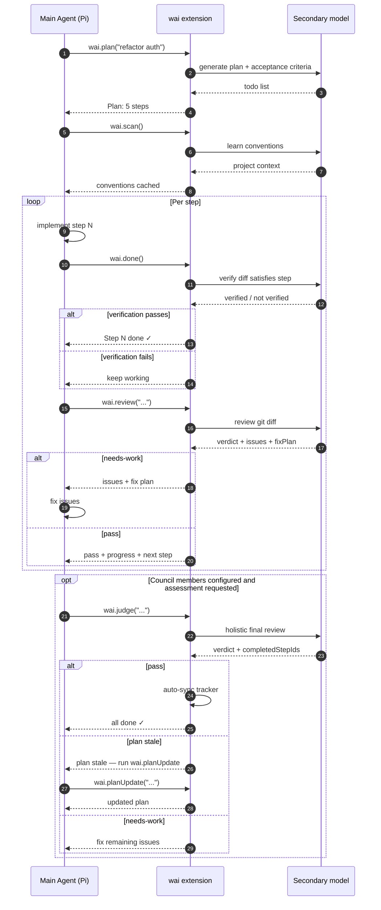

# pi-yoowai

Pair-programmer extension for [Pi](https://github.com/earendil-works/pi). An independent secondary model reviews, plans, suggests, recommends, and judges your work — catching bugs, missing error handling, and blind spots. Optional enforcement layers make sure reviews actually happen, and a judge council can fan final verdicts out to several models at once.

Built by [whatley.xyz](https://whatley.xyz).

## Quick Start

```bash
npx pi-yoowai@latest setup
```

The setup installer writes a secondary model into `~/.pi/agent/settings.json` under `pi-yoowai.secondary`, preserving everything else in the file. It offers four choices: `opencode-go-free` (DeepSeek via opencode-go), `openai` (`gpt-5-mini`), `anthropic` (`claude-sonnet-4-6`), or `custom` (any provider/model id). Non-interactive use:

```bash
npx pi-yoowai@latest setup --preset=openai
```

Then make sure credentials for the chosen provider are available (`~/.pi/agent/auth.json`, an environment variable such as `OPENAI_API_KEY`/`ANTHROPIC_API_KEY`, or Pi's `/login`), restart Pi, and run `/wai-test` to verify connectivity. From a local clone, `npm run setup` runs the same installer (exposed as the `pi-yoowai` bin entry).

Pi loads the ten Wai-owned skills directly from the package manifest: design, debugging, testing, refactoring, API contracts, delivery, Flutter, Kotlin/Android, Spring, and Node. Full guidance is read only when relevant. The installer offers an optional copy for legacy/direct-file loading; existing skill directories are preserved, and /wai-status reports potential overrides and older design copies.

## Install

```bash
pi install git:github.com/whatley95/pi-yoowai-dev
```

Or from local path:

```bash
pi install ./pi-yoowai
```

Try without installing:

```bash
pi -e git:github.com/whatley95/pi-yoowai-dev
```

## Configuration

Add to your Pi agent settings file (usually `~/.pi/agent/settings.json`):

```json
{
  "pi-yoowai": {
    "secondary": {
      "provider": "opencode-go",
      "id": "deepseek-v4-pro",
      "thinking": "xhigh",
      "backend": "sdk",
      "cacheRetention": "short",
      "transport": "auto",
      "maxRetries": 3,
      "contextWindow": 64000,
      "maxOutputTokens": 8192
    },
    "autoJudge": false,
    "judgeCouncil": [],
    "preReviewCommands": ["npm run typecheck", "npm run lint"],
    "costBudgetUsd": 0.5,
    "reviewFullFileThresholdLines": 300,
    "reviewMaxInputTokens": 50000,
    "reviewStrategy": "auto",
    "modelInfo": {
      "qwen3.7-max": { "contextWindow": 128000, "maxOutputTokens": 8192 }
    },
    "taskModels": {
      "review": { "provider": "anthropic", "id": "claude-sonnet-4-5", "thinking": "high" },
      "scan": { "provider": "deepseek", "id": "deepseek-chat", "thinking": "off" }
    },
    "presets": {
      "cheap": { "secondary": { "provider": "deepseek", "id": "deepseek-chat", "thinking": "off" } },
      "careful": {
        "secondary": { "provider": "anthropic", "id": "claude-sonnet-4-6", "thinking": "high" },
        "taskModels": { "review": { "provider": "anthropic", "id": "claude-sonnet-4-6" } }
      }
    }
  }
}
```

**Recommended:** Use a DIFFERENT model family than your main agent. If main is DeepSeek, set secondary to Claude or GPT. This catches blind spots your main model shares.

If no secondary model is configured, `wai` returns an error. Configure `pi-yoowai.secondary` in settings.json or use `/wai-model` to pick one interactively. You can also set a different model per wai tool with `taskModels` or `/wai-model` — see [Model suggestions](#model-suggestions) for a recommended lineup.

**Cost tip:** high-frequency, low-stakes calls do not need a flagship model. Reserve the strong model for `wai.plan`, `wai.review`, and `wai.judge`, and route routine work like `wai.done` (step verification) and `wai.scan` (convention extraction) to a cheap model with thinking off:

```json
"taskModels": {
  "done": { "provider": "deepseek", "id": "deepseek-chat", "thinking": "off" },
  "scan": { "provider": "deepseek", "id": "deepseek-chat", "thinking": "off" }
}
```

Check `/wai-index cost` (or `.pi/yoowai/cost.json`) first to see where your spend actually goes, then tune.

**Judge council:** for high-stakes final judgments you can fan `wai.judge` out to several models at once. Configure `judgeCouncil` with two or more members — ideally from different model families, so their blind spots don't overlap:

```json
"judgeCouncil": [
  "anthropic/claude-sonnet-4-6",
  "openai/gpt-5",
  { "provider": "deepseek", "id": "deepseek-chat", "thinking": "high" }
]
```

Each entry is a `"provider/model-id"` string or a partial secondary config object (same shape as `secondary`; omitted fields fall back to `secondary`, exactly like `taskModels` overrides). An empty council disables final assessment. One valid member assesses directly; two or more assess in parallel with synthesis. `/wai judge` and `wai({ judge: "..." })` remain the entry points for this optional assessment.

Structured tools let the secondary model write brief Markdown analysis, but the final machine-readable result must be a fenced JSON block under `## Result`. The configured `thinking` level is passed through unchanged for each tool, including per-tool `taskModels` overrides; wai does not silently cap or turn off thinking after parse failures.

### Options

A complete passing review clears pending edits only when it covers the current whole working tree. Scoped or historical reviews, omitted files, and incomplete responses do not clear the completion gate. Replacing a plan preserves pending edits. New Git plans save their original base for final judgment; incremental reviews and plan updates do not advance that base, so the judge sees the whole task even after reviewed commits. Older plans without a saved base retain the previous range fallback.

| Option                           | Type                                                   | Description                                                                                                                                                                                                                                                                                                                                                                                                                                                                                                                                 |
| -------------------------------- | ------------------------------------------------------ | ------------------------------------------------------------------------------------------------------------------------------------------------------------------------------------------------------------------------------------------------------------------------------------------------------------------------------------------------------------------------------------------------------------------------------------------------------------------------------------------------------------------------------------------- |
| `secondary`                      | object                                                 | `{ provider, id, thinking? }` for the base secondary model                                                                                                                                                                                                                                                                                                                                                                                                                                                                                  |
| `taskModels`                     | object                                                 | Per-tool model overrides keyed by action (`plan`, `advisor`, `review`, `suggest`, `recommend`, `judge`, `scan`, `test`, `security`, `done`, `explain`, `vision`; the advisor falls back to the `suggest` override, then `secondary`)                                                                                                                                                                                                                                                                                                        |
| `judgeCouncil`                   | array                                                  | Council of models that judge in parallel — entry shape in [Configuration](#configuration), behavior in [Judge council](#judge-council) (default: `[]`, final assessment disabled; one member assesses directly; two or more use synthesis)                                                                                                                                                                                                                                                                                                                                                                  |
| `presets`                        | object                                                 | Named model presets (`{ secondary?, taskModels? }`) applied to the global settings file with `/wai-preset <name>`; preview with `/wai-preset show <name>`                                                                                                                                                                                                                                                                                                                                                                                   |
| `autoJudge`                      | boolean                                                | With council members configured, run `wai.judge` automatically when the last plan step passes review, is marked done via `/wai-done`, or when the agent settles after all steps are complete (default: `false`)                                                                                                                                                                                                                                                                                                                                                              |
| `autoReviewOnSettle`             | boolean                                                | Run `wai.review` automatically when the agent settles with unreviewed edits pending, before any auto-judge (default: `true`; set `false` for an explicit review workflow where the agent calls `wai.review` itself — the turn-end reminders and `requireReviewBeforeDone` keep the discipline)                                                                                                                                                                                                                                              |
| `requireReviewBeforeDone`        | boolean                                                | Block `wai.done` / `/wai-done` while edits await a complete whole-tree passing review or the last whole-tree review failed/inconclusive; override with `force: true` / `--force` (default: `true`)                                                                                                                                                                                                                                                                                                                                                                                    |
| `steerEscalationThreshold`       | number                                                 | Consecutive turns ending with unreviewed edits pending before the workflow reminder escalates to a stop directive (default: `3`)                                                                                                                                                                                                                                                                                                                                                                                                            |
| `noPlanSteerEscalationThreshold` | number                                                 | Consecutive turns ending with real file edits while no active plan exists before the no-plan nudge escalates to a stop directive telling the agent to create a plan first (default: `3`)                                                                                                                                                                                                                                                                                                                                                    |
| `language`                       | string                                                 | Language directive applied to both the main agent and every secondary-model call — see [Language](#language). Unset (default) adds nothing; set with `/wai-language <name>`; project settings override the global value; per-action instruction files still apply on top                                                                                                                                                                                                                                                                      |
| `verifyDoneClaims`               | boolean                                                | Verify `wai.done` step-completion claims against the diff; unavailable or invalid verification blocks completion, and `force` explicitly marks it manually (default: `true`)                                                                                                                                                                                                                                                                                                                                                                                                                                        |
| `reviewReminderEdits`            | number                                                 | Unreviewed edit count that triggers the workflow reminder and the footer "review pending" notice (default: `3`)                                                                                                                                                                                                                                                                                                                                                                                                                             |
| `maxContinuations`               | number                                                 | Follow-up calls used to complete a length-truncated secondary-model response (default: `3`)                                                                                                                                                                                                                                                                                                                                                                                                                                                 |
| `autoInjectContext`              | boolean                                                | Inject the active wai plan and conventions into the main agent's context before each LLM call (default: `true`)                                                                                                                                                                                                                                                                                                                                                                                                                             |
| `contextInjectMaxTokens`         | number                                                 | Token budget for the injected plan/conventions context (default: `800`)                                                                                                                                                                                                                                                                                                                                                                                                                                                                     |
| `codemapMaxTokens`               | number                                                 | Token budget for the project symbol map injected into review/judge prompts (default: unset — review uses the level defaults: min 20000, med 8000, high 8000; judge keeps a 1500-token fallback since it has no review level; `0` disables)                                                                                                                                                                                                                                                                                                  |
| `designRefMaxTokens`             | number                                                 | Token budget for user-curated design rules injected into review/judge prompts when UI files change (default: `800`; `0` disables)                                                                                                                                                                                                                                                                                                                                                                                                           |
| `instructionsMaxTokens`          | number                                                 | Token budget for per-action instruction files (`.pi/yoowai/instructions/<action>.md`) injected into that action's secondary-model prompt (default: `800`; `0` disables)                                                                                                                                                                                                                                                                                                                                                                     |
| `priorReviewMaxTokens`           | number                                                 | Token budget for "previously reviewed this step" file outlines injected into review prompts when an incremental review cannot see earlier-round files (default: `800`; `0` disables)                                                                                                                                                                                                                                                                                                                                                        |
| `evidencePackMaxTokens`          | number                                                 | Token budget for the deterministic evidence pack (symbol lines, AST import/dependent sites, nearby tests, contract candidates) added to review/judge prompts (default: `1200`; `0` disables). Counted within `reviewMaxInputTokens` and dropped BEFORE changed-file contents when the window is tight                                                                                                                                                                                                                                       |
| `advisorNotes`                   | boolean                                                | Inject state-derived advisor notes (recent review issues in files you are editing) into the main agent's context. Free — no model calls (default: `true`)                                                                                                                                                                                                                                                                                                                                                                                   |
| `entryRenderer`                  | boolean                                                | Render wai audit entries with a custom TUI entry renderer (default: `true`)                                                                                                                                                                                                                                                                                                                                                                                                                                                                 |
| `shortcuts`                      | boolean                                                | Register keyboard shortcuts for common wai actions (default: `true`)                                                                                                                                                                                                                                                                                                                                                                                                                                                                        |
| `planWidget`                     | boolean                                                | Show a compact plan-progress widget above the editor, including a "blocked by step N" line when the current step's `dependsOn` steps are unmet (default: `true`)                                                                                                                                                                                                                                                                                                                                                                            |
| `registerProvider`               | boolean                                                | Register the configured secondary model as a Pi provider named `wai` (default: `false`)                                                                                                                                                                                                                                                                                                                                                                                                                                                     |
| `preReviewCommands`              | string[]                                               | Commands to run before each review; output is included in the review prompt. An explicitly configured array — including `[]` — always wins and disables auto-detection; only an omitted/unset value permits auto mode (see `autoPreReviewCommands`)                                                                                                                                                                                                                                                                                         |
| `autoPreReviewCommands`          | boolean                                                | Auto-detect `typecheck`/`lint`(/`test` at high) scripts from the reviewed project's `package.json` and run them before med/high reviews (min never runs auto commands) and before `wai.judge` (judge uses the high profile). Default `false` — runs the reviewed project's code, so only enable it for repositories you trust                                                                                                                                                                                                               |
| `relatedContextMaxTokens`        | number                                                 | Token budget for related-file/AST context injected into review prompts (level default: min 1000, med 2500, high 4000; `0` disables)                                                                                                                                                                                                                                                                                                                                                                                                         |
| `testCommand`                    | string                                                 | Command to run for `/wai test` analysis (e.g. `npm test`). Auto-detected from `package.json` if omitted                                                                                                                                                                                                                                                                                                                                                                                                                                     |
| `costBudgetUsd`                  | number                                                 | Maximum estimated session spend, including reservations for concurrent calls and each tool/continuation round. Completed provider calls are counted once. Negative values are treated as unset; `0` means no spend is allowed                                                                                                                                                                                                                                                                                                                                                                                                         |
| `reviewMaxDiffChars`             | number                                                 | Optional explicit cap on diff characters per review (default: unset — review levels impose no caps; the model's context-derived budget is the ceiling, see [Review levels](#review-levels))                                                                                                                                                                                                                                                                                                                                                 |
| `reviewFullFileThresholdLines`   | number                                                 | Include full content for changed files under this line count (default: 300)                                                                                                                                                                                                                                                                                                                                                                                                                                                                 |
| `reviewMaxInputTokens`           | number                                                 | Optional explicit cap on review input tokens (default: unset — review levels impose no caps; the model's context-derived budget is the ceiling, see [Review levels](#review-levels))                                                                                                                                                                                                                                                                                                                                                        |
| `reviewMaxConventionsTokens`     | number                                                 | Max tokens of project conventions included in review prompts (default: 1000)                                                                                                                                                                                                                                                                                                                                                                                                                                                                |
| `reviewMaxMemoryTokens`          | number                                                 | Max tokens of past review issues included in review prompts (default: 800)                                                                                                                                                                                                                                                                                                                                                                                                                                                                  |
| `reviewStrategy`                 | `"auto" \| "diff-only" \| "full-files"`                | How to include changed file contents (default: `"auto"`)                                                                                                                                                                                                                                                                                                                                                                                                                                                                                    |
| `verifyByDefault`                | boolean                                                | If true, every wai result asks the main agent to confirm the finding with evidence                                                                                                                                                                                                                                                                                                                                                                                                                                                          |
| `selfVerify`                     | boolean                                                | Run a second verification pass on `wai.review` and `wai.judge` results (costs extra tokens)                                                                                                                                                                                                                                                                                                                                                                                                                                                 |
| `toolUseLoop`                    | boolean \| number                                      | Let the secondary model use `read_file`, `search_code`, and allowlisted `run_command` in a loop; number caps new-evidence requests. Defaults start at `off`/min, 3/med, 5/high; unset/true adapts for missing context up to 20 within the input budget. `read_file` supports optional `startLine`/`endLine` paging, truncated files report their line count, `search_code` finds regex matches (optional path scope, 0-5 context lines), and long command output keeps head + tail. Model-generated commands are restricted to read-only subcommands for `git`/`svn`/package managers |
| `parallelReview`                 | boolean \| number                                      | Review multiple changed files in parallel; number sets concurrency (default: 3 when enabled). Works at every level — at `min` (diff-only) it runs per-file diff-only reviews concurrently, at `med`/`high` it also covers the auto-split path (see [Review levels](#review-levels))                                                                                                                                                                                                                                                         |
| `reviewBatchFiles` | number | Opt-in maximum related source files per parallel batch; default `1` preserves per-file routing. Positive integers such as `3` group only complete source/diff evidence that fits the budget. |
| `deepScan`                       | boolean \| number                                      | Include code samples and build a symbol index during `wai.scan`; number caps sample files                                                                                                                                                                                                                                                                                                                                                                                                                                                   |
| `secondary.contextWindow`        | number                                                 | Override the model's context window                                                                                                                                                                                                                                                                                                                                                                                                                                                                                                         |
| `secondary.maxOutputTokens`      | number                                                 | Override the model's max output tokens                                                                                                                                                                                                                                                                                                                                                                                                                                                                                                      |
| `secondary.backend`              | `"sdk" \| "pi" \| "http"`                              | Backend for model calls. `"sdk"` uses Pi's `pi-ai` provider layer (default); `"pi"` spawns the Pi CLI; `"http"` uses direct provider HTTP                                                                                                                                                                                                                                                                                                                                                                                                   |
| `secondary.cacheRetention`       | `"none" \| "short" \| "long"`                          | SDK cache retention hint (SDK backend only, default: `"short"` to match the main Pi agent)                                                                                                                                                                                                                                                                                                                                                                                                                                                  |
| `secondary.transport`            | `"sse" \| "websocket" \| "websocket-cached" \| "auto"` | SDK HTTP transport hint (SDK backend only)                                                                                                                                                                                                                                                                                                                                                                                                                                                                                                  |
| `secondary.maxRetries`           | number                                                 | Maximum request retries for transient errors (SDK default: 3; http backend default: 2; `0` disables retries)                                                                                                                                                                                                                                                                                                                                                                                                                                |
| `secondary.maxRetryDelayMs`      | number                                                 | Maximum delay between SDK retries in ms (SDK backend only, default: 60000)                                                                                                                                                                                                                                                                                                                                                                                                                                                                  |
| `secondary.timeoutMs`            | number                                                 | SDK request timeout in ms (SDK backend only, default: 300000 = 5 min)                                                                                                                                                                                                                                                                                                                                                                                                                                                                       |
| `secondary.apiKey`               | string                                                 | Inline API key (prefer `auth.json` or env vars)                                                                                                                                                                                                                                                                                                                                                                                                                                                                                             |
| `secondary.style`                | `"openai-compatible" \| "anthropic"`                   | API style when using `baseUrl` (default: `"openai-compatible"`)                                                                                                                                                                                                                                                                                                                                                                                                                                                                             |
| `secondary.authHeader`           | `string \| boolean`                                    | Custom auth header name when using `baseUrl`; set to `false` to omit the auth header when registering the provider with Pi                                                                                                                                                                                                                                                                                                                                                                                                                  |
| `secondary.authPrefix`           | string                                                 | Custom auth prefix when using `baseUrl`                                                                                                                                                                                                                                                                                                                                                                                                                                                                                                     |
| `modelInfo`                      | object                                                 | Per-model token budget overrides, keyed by model id                                                                                                                                                                                                                                                                                                                                                                                                                                                                                         |
| `processTimeoutMs`               | number                                                 | Timeout in ms for child pi process calls (default: 300000 = 5 min)                                                                                                                                                                                                                                                                                                                                                                                                                                                                          |
| `testTimeoutMs`                  | number                                                 | Timeout in ms per model in `/wai test` (default: 120000 = 2 min)                                                                                                                                                                                                                                                                                                                                                                                                                                                                            |
| `preReviewTimeoutMs`             | number                                                 | Timeout in ms for EACH pre-review command (default: 60000 = 1 min)                                                                                                                                                                                                                                                                                                                                                                                                                                                                          |
| `docs`                           | object                                                 | Documentation sources and web-search settings — see [Documentation sources and web search](#documentation-sources-and-web-search)                                                                                                                                                                                                                                                                                                                                                                                                           |

When `registerProvider` is enabled, `/wai-config`, `/wai-model`, and `/wai-backend` automatically refresh the `wai` provider registration in Pi so settings changes take effect without a manual `/reload`.

### Pi host compatibility

On Pi 1.0+, wai keeps essential workflow rules visible and exposes detailed guidance through the `wai` namespace (`describeNamespace("wai")`) or `wai_index({ topic: "guidance" })`. Older hosts retain the full visible instructions. Each wai tool declares its structured output fields, so codemode can inspect verdicts, progress, and failures directly. Review results include locally derived `recovery` reasons/actions; workflow tools return an actual tracker `workflow` snapshot. Neither changes review gates or proves acceptance criteria. See the [codemode workflow examples](templates/pi-codemode-workflows.md).

pi-yoowai targets Pi **>= 0.82.1** (peer floor). On Pi **0.86+** hosts the SDK backend streams the secondary model through Pi's own model registry (`ctx.modelRegistry.streamSimple()`) when available: Pi resolves authentication and the live catalog (built-in, `models.json`, and extension-registered models) at request time, with no pi-yoowai auth resolution on that route. Explicit `secondary.apiKey` / `baseUrl` / `authHeader` overrides fall back to the built-in pi-ai path, and registry execution failures are never silently retried through it — only an unresolvable model falls back. Both routes share one request builder, so headers, thinking, retries, timeouts, cache retention, and usage handling behave identically. OAuth resolution deduplicates concurrent same-credential resolutions in-process; cross-process refresh serialization remains Pi's AuthStorage lockfile (a second `getAuth` call is not a second refresh). CI checks the supported 0.82.1 host and disposable Pi **1.0.0** and **1.1.0** installs. The required `compat-latest` job typechecks all source and tests, runs the focused integration suites, and exercises Pi's real agent execution loop and actionable boundary dispatcher.

Wai uses a conservative 3.5-character token estimate for prompt budgets and matching character limits, including context reads. Larger changes may require more batches; incomplete required evidence still prevents certification. SDK calls retain Pi's reported cost (including zero), cache-read/write input tokens, and pricing-tier calculations in Wai's cost tracker. Before a call, admission still uses a rough estimate and concurrent reservations; reported spend can exceed it and stop subsequent calls. SDK responses on Pi 1.1+ log their monotonic `durationMs` separately from Wai's overlapping worker/context timings. Cancelled `agent_settled` events do not launch automatic review or council assessment.

The `pi` CLI backend selects only `read,grep,find,ls`, disables extensions, skill discovery, and prompt templates, and disables MCP on Pi 1.0.4+. It probes the launched executable's version once with a bounded `--version` call rather than assuming Wai's peer-package version. Older or unidentified executables receive only the older supported flags; MCP isolation cannot be guaranteed when the executable version is unknown. The SDK backend remains the default, with its native host read-policy checks intact.

On Pi **0.99+**, all wai tools declare an object `outputSchema` and return JSON `structuredContent` alongside their readable reports and existing `details`. Codemode scripts receive that object directly, including structured errors. Review findings such as `needs-work` are successful assessments; an `error` field indicates a failed action. For example, with codemode enabled:

```js
const result = await tools.wai({ review: "Review the current changes" });
if (result.error) text(result.error);
else if (result.review) text(result.review.verdict);
```

Nested `write` and `edit` calls emit the same lifecycle events as direct calls, so successful nested edits count toward review reminders. Wai tools retain their default direct exposure and remain callable from codemode; specialist tools do not require discovery first. Older hosts continue using readable content and `details`.

Pi **0.99+** also supports a ChatGPT subscription through `/login openai`. Select a model from the `openai` provider with `/wai-model`, then run `/wai-test`. The default SDK registry route delegates subscription authentication and refresh to Pi. The `openai-codex` provider remains available as the legacy route; existing configurations are not rewritten. See [Pi's authentication documentation](https://pi.dev/docs/latest/providers).

### Custom providers via `models.json`

Providers that are not in Pi's built-in catalog (e.g. [CrofAI](https://crof.ai/docs)) can still be used as the wai secondary model — on the default `sdk` backend, with streaming, caching, and `wai_vision` support. Register the provider in `~/.pi/agent/models.json` (or install a provider extension such as [`pi-crof`](https://pi.dev/packages/pi-crof?name=crof)); pi-yoowai resolves models through Pi's runtime registry when the static catalog doesn't know them. Reference configuration:

```json
{
  "providers": {
    "crof": {
      "name": "CrofAI",
      "baseUrl": "https://crof.ai/v1",
      "api": "openai-completions",
      "models": [
        {
          "id": "deepseek-v4-pro",
          "name": "CrofAI: deepseek-v4-pro",
          "reasoning": true,
          "input": ["text"],
          "contextWindow": 1000000,
          "maxTokens": 131072,
          "cost": { "input": 0.28, "output": 0.38, "cacheRead": 0, "cacheWrite": 0 }
        },
        {
          "id": "kimi-k2.5",
          "name": "CrofAI: kimi-k2.5 (vision)",
          "reasoning": false,
          "input": ["text", "image"],
          "contextWindow": 262144,
          "maxTokens": 262144
        }
      ]
    }
  }
}
```

Notes:

- The API key goes in `~/.pi/agent/auth.json` under the same provider id: `"crof": { "type": "api_key", "key": "nahcrof_..." }` (env-var fallback only exists for built-in providers).
- `"input": ["text", "image"]` is what lets `wai_vision` use the model — set it on every vision-capable entry.
- `api` must be a wire format Pi implements (`openai-completions`, `anthropic-messages`, `openai-responses`, `google-generative-ai`, ...); most hosted providers are OpenAI- or Anthropic-compatible.
- Once registered, the models appear in the `/wai-model` picker and work for `secondary`, `taskModels`, and `judgeCouncil` like any built-in provider.

### Model suggestions

Starting points for `taskModels` and `judgeCouncil`, from a setup using three subscriptions: **Moonshot** (Kimi), **opencode-go**, and **OpenAI** (ChatGPT). These are **suggestions, not requirements** — model lineups change fast, so treat this table as a snapshot (last updated: July 2026, after the Kimi K3 release) and check what your `/wai-model` picker actually lists. After assigning, run `/wai-test <tool>` to verify the model responds with clean output.

| Tool                    | Option 1 (recommended)            | Option 2          | Option 3        |
| ----------------------- | --------------------------------- | ----------------- | --------------- |
| **plan**                | deepseek-v4-pro                   | kimi-k3           | gpt-5.6-sol     |
| **review**              | kimi-k3                           | gpt-5.3-codex     | deepseek-v4-pro |
| **judge** (synthesizer) | gpt-5.6-sol                       | deepseek-v4-pro   | kimi-k3         |
| **security**            | deepseek-v4-pro                   | kimi-k3           | gpt-5.6-sol     |
| **test**                | kimi-k3                           | qwen3.7-plus      | gpt-5-mini      |
| **scan**                | deepseek-v4-flash                 | gpt-5-mini        | mimo-v2.5       |
| **suggest**             | kimi-k3                           | glm-5.2           | gpt-5-mini      |
| **recommend**           | glm-5.2                           | kimi-k3           | qwen3.7-plus    |
| **done**                | _(uses base model — leave unset)_ | deepseek-v4-flash | gpt-5-mini      |
| **explain**             | kimi-k3                           | deepseek-v4-flash | gpt-5-mini      |

**Main agent rule:** the reviewer and judge must not share a model family with the main agent, or the "independent second opinion" becomes self-grading. Non-verdict lanes (test, suggest, explain) are diagnostics rather than judgments — sharing the writer's family there is fine and saves quota. Three combinations depending on what writes your code (only the verdict lanes change; plan and bulk lanes stay the same):

| Lane         | A — main: kimi-k3                       | B — main: deepseek-v4-pro       | C — main: qwen3.7-plus                  |
| ------------ | --------------------------------------- | ------------------------------- | --------------------------------------- |
| **review**   | gpt-5.3-codex                           | kimi-k3                         | kimi-k3                                 |
| **security** | deepseek-v4-pro                         | gpt-5.6-sol                     | deepseek-v4-pro                         |
| **judge**    | gpt-5.6-sol                             | gpt-5.6-sol                     | gpt-5.6-sol                             |
| **council**  | kimi-k3 + deepseek-v4-pro + gpt-5.6-sol | gpt-5.6-sol + kimi-k3 + glm-5.2 | gpt-5.6-sol + kimi-k3 + deepseek-v4-pro |

Combo A gives the best token economics (flat Moonshot sub absorbs the heaviest load). Combo B keeps a deepseek main and moves K3 into the high-volume review seat — note glm-5.2 takes the council's third seat, since a deepseek councillor would share the writer's family. Combo C is the budget option: weakest writer of the three, but K3 review plus a three-family council compensates.

Example `taskModels` for combo B (main agent writes with deepseek-v4-pro; providers shown as required by the config format — check the exact ids in your `/wai-model` picker):

```json
{
  "pi-yoowai": {
    "secondary": { "provider": "opencode-go", "id": "deepseek-v4-flash" },
    "taskModels": {
      "plan": { "provider": "opencode-go", "id": "deepseek-v4-pro", "thinking": "xhigh" },
      "review": { "provider": "moonshot", "id": "kimi-k3" },
      "judge": { "provider": "openai", "id": "gpt-5.6-sol", "thinking": "high" },
      "security": { "provider": "openai", "id": "gpt-5.6-sol" },
      "test": { "provider": "moonshot", "id": "kimi-k3" },
      "suggest": { "provider": "moonshot", "id": "kimi-k3" },
      "recommend": { "provider": "opencode-go", "id": "glm-5.2" },
      "explain": { "provider": "moonshot", "id": "kimi-k3" }
    },
    "judgeCouncil": ["openai/gpt-5.6-sol", "moonshot/kimi-k3", "opencode-go/glm-5.2"]
  }
}
```

The pattern to keep when models change: cheap fast model as the base default, strong models only where judgment is the product (plan/review/judge/security), and council members from different labs — plus the main-agent rule above.

### Context injection and lifecycle hooks

When `autoInjectContext` is enabled, pi-yoowai prepends the active plan summary, current step, and recently scanned conventions to the main agent's context before every LLM call. This keeps the main agent aligned with the plan without requiring explicit `/wai-index` lookups. The injected context is truncated to `contextInjectMaxTokens` and skipped while a `wai` tool call is already executing.

When Pi supplies a finite context estimate, optional facts, advisor notes, design rules, and conventions shrink above 75% utilization and are omitted at 95%. The active plan, workflow reminders, language/VCS instructions, and selected fresh decisions keep priority within the configured cap. Unknown usage after compaction keeps the configured behavior. This uses no extra model calls, does not trigger compaction, and leaves secondary review evidence and budgets unchanged.

pi-yoowai also listens to Pi lifecycle events:

- **`tool_result`** — successful file-mutating tool calls increment the internal edit counter and refresh the footer status; failed calls do not. Wai configuration/backend failures set Pi's native error flag while preserving structured details; a review finding is a successful tool result.
- **`turn_end`** — if unreviewed edits exist, a reminder asks the main agent to call `wai.review` before continuing. On Pi 0.87+, it uses a boundary draft when Pi already has runnable context; otherwise it uses a steer so the reminder still reaches a settled agent. The reminder respects a cooldown and escalates after repeated ignored turns — see [Review enforcement](#review-enforcement).
- **`agent_before_settle` (Pi 0.87+)** — auto-review runs first when enabled; optional council assessment runs only when members are configured, `autoJudge` is enabled, the plan is complete and no unreviewed edits remain. Verdicts enter the conversation as boundary messages. Findings request a continuation only when Pi permits it; a clean pass adds no extra turn. The same workspace/progress state is attempted once per session generation to prevent repeated continuation without changes.
- **`agent_settled` (older Pi)** — preserves the review-then-optional-council workflow and delivers results as steers.
- **`model_select`** — the prompt cache is cleared so prompts are rebuilt for the new model.
- **`session_before_compact`** — if a plan is active, its summary, progress, and current step are added to the compaction custom instructions so they survive context compression.
- **`session_before_switch`** / **`session_before_fork`** / **`session_before_tree`** / **`session_shutdown`** — cancel outstanding wai work before session navigation or shutdown. Late automatic results cannot publish or update the replacement session.
- **`session_tree`** — restores plan/progress/review state from the active branch's wai audit snapshots. Navigating before the first snapshot clears future progress. Files remain in the working tree; mismatched workspace fingerprints invalidate restored approval. Older sessions without snapshots retain disk state on startup until the first tree navigation.

Workflow tools execute sequentially, with an additional per-project queue protecting direct concurrent calls. Context injection remains suppressed until all overlapping wai executions finish. SDK-backed wai tool results attach actual provider `usage` for Pi's native session totals, including nested verification/council/tool-loop responses. Cache hits add no usage. Slash commands, automatic actions, and HTTP/Pi CLI backends retain wai's separate cost tracker; they do not attach estimated usage to native tool totals.

### Footer status and session audit trail

When running in Pi's TUI, pi-yoowai keeps the footer/status bar up to date:

- **`wai-plan`** — active plan progress and current step (e.g. `wai 2/5 · add tests`).
- **`wai-cost`** — session cost and pending-review edit count when over the threshold (e.g. `wai $0.04 · 1 call · review pending (3 edits)`).

In addition, every plan creation, step completion, review/judge verdict, and scan completion is recorded as a custom session entry. These entries appear in Pi's session timeline as an audit trail of wai decisions.

### Documentation sources and web search

You can give `wai.suggest`, `wai.recommend`, and `wai_explain` access to configured documentation pages. This is useful when the secondary model needs up-to-date library docs. For ad-hoc web search, use the `/wai-search` command.

```json
{
  "pi-yoowai": {
    "docs": {
      "sources": {
        "react": "https://react.dev/reference/react",
        "pi": "https://pi.dev/docs/latest"
      },
      "maxCharsPerSource": 8000,
      "webSearch": {
        "enabled": true,
        "provider": "brave",
        "maxResults": 3,
        "maxCharsPerResult": 3000
      }
    }
  }
}
```

| Option                             | Type                      | Description                                                                               |
| ---------------------------------- | ------------------------- | ----------------------------------------------------------------------------------------- |
| `docs.sources`                     | object                    | Named URL map. Only URLs listed here can be fetched.                                      |
| `docs.maxCharsPerSource`           | number                    | Characters of each source page to include in the prompt (default: 8000)                   |
| `docs.webSearch.enabled`           | boolean                   | Whether `/wai-search` is allowed (default: false)                                         |
| `docs.webSearch.provider`          | `"duckduckgo" \| "brave"` | Search provider. Defaults to "brave" when a Brave API key is available, else "duckduckgo" |
| `docs.webSearch.apiKey`            | string                    | Inline Brave API key (prefer auth.json or `BRAVE_API_KEY` env var)                        |
| `docs.webSearch.maxResults`        | number                    | Search results to include (default: 3)                                                    |
| `docs.webSearch.maxCharsPerResult` | number                    | Characters of each search snippet to include (default: 3000)                              |

Use it from the `wai` tool:

```js
wai({ suggest: "useEffect vs useLayoutEffect", docs: ["react"] });
wai({ recommend: "what next", docs: ["pi"] });
```

Or from `wai_explain`:

```js
wai_explain({ target: "what is MCP", docs: ["pi"] });
```

For ad-hoc web search, use the terminal command:

```text
/wai-search Next.js app router caching
```

**Brave Search.** If you have a Brave Search API key, pi-yoowai will use Brave automatically. Configure it via TUI with `/wai-search-config` (interactive provider picker) or inline:

```text
/wai-search-config brave <your-api-key>
/wai-search-config duckduckgo
```

API key resolution order: `docs.webSearch.apiKey` → `~/.pi/agent/auth.json` `brave` entry → `BRAVE_API_KEY` env var. If Brave is selected but no key is found, pi-yoowai falls back to DuckDuckGo.

Fetched source pages and search results are cached in `.pi/yoowai/docs/` for 24 hours. Cache files are written with mode `0o600`. Only URLs declared in `docs.sources` are fetched; web search never fetches arbitrary result pages. Fetches time out after 10 seconds and responses larger than 500 KB are rejected. No credentials are sent.

## Tools

The `wai` tool is called by the main agent during development:

| Action                                                                | When                           | What it does                                                                        |
| --------------------------------------------------------------------- | ------------------------------ | ----------------------------------------------------------------------------------- |
| `wai({ plan: "refactor auth" })`                                      | Before starting                | Creates structured todo + acceptance criteria                                       |
| `wai({ review: "wrote middleware" })`                                 | After each step                | Reviews git diff, returns verdict + issues                                          |
| `wai({ review: "wrote middleware", files: ["src/auth.ts"] })`         | After each step                | Reviews only the listed files                                                       |
| `wai({ review: "wrote middleware", exclude: ["package-lock.json"] })` | After each step                | Reviews diff excluding listed files                                                 |
| `wai({ review: "wrote middleware", revision: "HEAD~1" })`             | After each step                | Reviews changes against a specific revision                                         |
| `wai({ review: "wrote middleware", untracked: true })`                | After each step                | Includes untracked (new) files in the review                                        |
| `wai({ suggest: "how to..." })`                                       | When stuck or asked a question | Returns alternative approaches with pros/cons                                       |
| `wai({ suggest: "...", docs: ["react"] })`                            | When stuck or asked a question | Includes configured docs in the suggestion prompt                                   |
| `wai({ recommend: "what next" })`                                     | When unsure                    | Recommends next concrete step                                                       |
| `wai({ recommend: "...", docs: ["pi"] })`                             | When unsure                    | Includes configured docs in the recommendation prompt                               |
| `wai({ judge: "all done" })`                                          | Optional council assessment    | Holistic review against original plan                                               |
| `wai({ scan: true })`                                                 | Once per project               | Learns project conventions and architecture                                         |
| `wai({ scan: true, scanDeep: true })`                                 | First scan of a project        | Also samples source files and builds the project symbol index                       |
| `wai({ test: "added payment service" })`                              | After code changes             | Checks for failing tests, missing tests, and test-quality issues                    |
| `wai({ security: "auth changes" })`                                   | Security-sensitive changes     | Audits diff for secrets, injection, auth, and other vulnerabilities                 |
| `wai({ done: true })`                                                 | After completing a step        | Mark the current plan step complete; use a number or `"all"` to mark multiple steps |
| `wai({ planUpdate: "changed decision and remaining work" })`          | When the plan needs revision   | Model-assisted revision; preserve unchanged outcomes and their review records      |
| `wai({ planUpdate: { operations: [{ op: "edit", step: 2, title: "Implementation" }] } })` | A small plan edit | Apply locally without a model call; label changes preserve the required outcome |
| `wai({ review: "...", verify: true })`                                | Any high-stakes result         | Asks the main agent to confirm or refute the finding with evidence                  |

> **Diff scope:** by default `review`, `judge`, and `done` diff against `HEAD` and include untracked files, so they see staged, unstaged, and new files without you running `git add` first. Pass `revision`/`since` to scope to a commit range, or `untracked: false` to limit to tracked changes.

For SVN, wai also reviews unversioned (`?`) files and files inside new directories without `svn add`. With `autoInjectContext` enabled, SVN working copies receive a main-agent reminder to inspect `svn status`, schedule intended new files with `svn add --parents -- <explicit file paths>` before the final whole-tree review, and verify they show `A` before an authorized commit. The reminder excludes bulk additions of `.`, `.pi/`, generated outputs, and unrelated files. Scheduling additions after review changes the workspace fingerprint and requires another whole-tree review.

Working-copy SVN reviews use local `BASE` automatically. Directory scopes and exclusions accept `/` or `\` on Windows, including new files. For final whole-tree certification, omit `files`, `exclude`, `revision`, and `since`; explicitly passing `revision: "BASE"` still selects a scoped review. Describing a few files does not filter the capture.

Git and SVN capture, indexing, and workspace fingerprints share a built-in policy that omits build directories (`target/`, `dist/`, `build/`, `out/`, `coverage/`, `node_modules/`, `.gradle/`, `.next/`, `__pycache__/`), VCS/IDE metadata (`.git/`, `.svn/`, `.idea/`), and compiler products (`.class`, `.pyc`, `.pyo`, `.o`, `.obj`, `.pdb`, `.tsbuildinfo`). Project-root `.pi/` remains excluded. These files do not consume review batches or invalidate source approvals. Library archives such as `lib/dependency.jar` remain in scope; archives inside build directories are excluded with that directory. Other unversioned binary files receive a content-omitted marker rather than a corrupted UTF-8 patch; text-content loading rejects binary bytes. Truncation of source changes remains incomplete coverage even when the intended files appear first.

Main-agent guidance uses the same workflow across tools, automatic reminders, and review reports:

- Scoped reviews provide focused feedback; whole-tree certification requires a complete review without `files`, `exclude`, `revision`, or `since`, with new files included. Naming files in the description does not filter the diff.
- Inspect returned plan progress before calling `done`: a passing whole-tree review may already advance the step. Call `done` only when the same reviewed step remains current and its acceptance criteria are met.
- Diagnose inconclusive results before retrying: check cwd, requested files/VCS range, missing or truncated inputs/outputs, and stale plans. Report an unresolved blocker instead of repeatedly retrying unchanged input or lowering thinking depth blindly.
- Commit when the user requests or has already authorized it; otherwise report readiness. Inspect exact commit contents and preserve unrelated changes. A review pass is not commit authorization.
- Git projects receive a reminder to stage only intended task files or hunks using explicit paths before the final whole-tree review, then inspect `git diff --cached` before an authorized commit. Verify new files are included; staging changes after review require another review.
- Completion reports distinguish checks actually run and their outcomes, skipped/failing checks, review/judge scope and coverage, unresolved findings, verified/unverified acceptance criteria, and commit status/hash. Model verdicts and generic test success do not establish every acceptance criterion.

Plan steps can include `priority` (`high`, `medium`, `low`) and `dependsOn` (1-based list of earlier steps). Plain-string steps still work for backward compatibility.

**Plan tracker.** wai tracks file edits and sends a workflow reminder after `reviewReminderEdits` (default 3) unreviewed edits without a `wai.review` or `wai.done` call, so the plan tracker stays in sync. The reminder names the current plan step when one is active ("Step 2/5 (…)"). A passing whole-tree review advances only with explicit completion evidence: a positive `completedSteps` count with consensus, or `stepComplete: true`. An explicit `stepComplete: false` or `completedSteps: 0`, a stale plan, or an inconclusive result prevents advancement; a code-quality pass alone does not finish a step. Either advance records a `step-done` audit entry. Judge re-syncs the tracker in both directions: it advances from `completedStepIds` and regresses from `incompleteStepIds` (steps the tracker marks complete that the code does not actually satisfy). You can also correct the tracker manually: `wai({ done: N })` or `/wai-done N` sets progress to step N — a number below the current progress regresses it, and `0` resets it.

### `wai_index` tool

The `wai_index` tool retrieves stored wai context without calling a model. Prefer a specific `topic`, `files`, and `query` during ongoing work instead of repeatedly requesting `all`. Add `limit: 1..100` to bound memory files, learned facts, and index files/total symbols; `selection` reports matching and returned counts. Codemode can inspect `memoryEntries`, `learned`, and `index.files` and print only what it needs. Filters affect structured index results as well as their text summary, while the stored index stays complete. Symbol-index reads refresh an existing stale graph locally; `update: true` also builds a missing index. `topic: "guidance"` returns workflow/tool instructions on demand and is omitted from `all`.

| Call                                                      | What it returns                                                                                                                                                                                                                              |
| --------------------------------------------------------- | -------------------------------------------------------------------------------------------------------------------------------------------------------------------------------------------------------------------------------------------- |
| `wai_index({})` or `wai_index({ topic: "all" })`          | Conventions, active plan, review memory, cost, and recent logs                                                                                                                                                                               |
| `wai_index({ topic: "conventions" })`                     | Project conventions from `wai scan`                                                                                                                                                                                                          |
| `wai_index({ topic: "plan" })`                            | Active todo list and progress                                                                                                                                                                                                                |
| `wai_index({ topic: "memory" })`                          | Past review issues for all files                                                                                                                                                                                                             |
| `wai_index({ topic: "memory", files: ["src/auth.ts"] })`  | Past review issues for specific files                                                                                                                                                                                                        |
| `wai_index({ topic: "memory", query: "race condition" })` | Memory entries matching a keyword                                                                                                                                                                                                            |
| `wai_index({ topic: "cost" })`                            | Estimated session spend                                                                                                                                                                                                                      |
| `wai_index({ topic: "logs" })`                            | Recent wai log entries                                                                                                                                                                                                                       |
| `wai_index({ topic: "index" })`                           | Project symbol index (built by `wai scan --deep` or `wai_index({ update: true })`; entries include each file's `imports` and reverse `dependents` — which project files import it — so the main agent can check blast radius before editing) |
| `wai_index({ topic: "learned" })`                         | Facts recorded with `wai_learn`                                                                                                                                                                                                              |
| `wai_index({ update: true })`                             | Rebuild the symbol index before returning results                                                                                                                                                                                            |

Use `wai_index` before editing to quickly learn the project's rules, current task, known issues, symbols, and recorded facts.

Persisted symbol context is refreshed against the entire source set before use by the code map, index/explain tools, planning snapshots, and symbol searches. Adding, changing, or deleting a caller refreshes reverse import edges even when the selected module is unchanged; unchanged files reuse their AST entries. Import neighbors use the same canonical resolution as the index, including NodeNext `.js` imports that refer to `.ts` sources. The AST symbol/dependency graph supports TypeScript and JavaScript; other languages require direct source inspection and do not have equivalent mapper coverage.

### `wai_explain` tool

Explain a code snippet, error message, diff, or file with the secondary model.

| Call                                                                        | What it does                                        |
| --------------------------------------------------------------------------- | --------------------------------------------------- |
| `wai_explain({ target: "TypeError: Cannot read..." })`                      | Explains an error and the likely fix                |
| `wai_explain({ target: "src/auth.ts" })`                                    | Explains the purpose and structure of a file        |
| `wai_explain({ target: "function verifySession", files: ["src/auth.ts"] })` | Explains a specific function with full file context |
| `wai_explain({ target: "what is MCP", docs: ["pi"] })`                      | Explains a concept using configured docs            |
| `wai_explain({ target: "MCP", docs: ["pi"] })`                              | Explains a concept using configured docs            |

`wai_explain` is read-only — it does not edit files. If you pass a merge conflict, it explains the conflicting versions and suggests resolutions, but it does not claim the files are resolved.

### `wai_learn` tool

Record a persistent project fact that wai will remember across sessions.

| Call                                                                          | What it does                                                                                                                                                                                                                                                                                     |
| ----------------------------------------------------------------------------- | ------------------------------------------------------------------------------------------------------------------------------------------------------------------------------------------------------------------------------------------------------------------------------------------------ |
| `wai_learn({ fact: "Auth is handled by Clerk" })`                             | Stores a fact                                                                                                                                                                                                                                                                                    |
| `wai_learn({ fact: "Never update the lockfile manually", kind: "decision" })` | Stores a DECISION — injected into review prompts as `do NOT re-flag` context so prior intentional choices are not flagged as regressions                                                                                                                                                         |
| `wai_learn({ fact: "Use camelCase for functions", category: "conventions" })` | Stores a categorized fact                                                                                                                                                                                                                                                                        |
| `wai_learn({ verify: true })`                                                 | Check all stored facts against the current codebase (heuristic, no model call)                                                                                                                                                                                                                   |
| `wai_learn({ verify: true, query: "auth" })`                                  | Verify only facts matching a keyword                                                                                                                                                                                                                                                             |
| `wai_learn({ verify: true, deep: true })`                                     | Verify facts with the secondary model for higher accuracy                                                                                                                                                                                                                                        |
| `wai_learn({ verify: true, deep: true, query: "auth" })`                      | Deep verify only facts matching a keyword                                                                                                                                                                                                                                                        |
| `wai_learn({ stale: true })`                                                  | List facts/decisions past their freshness budget with a `STALE` marker and a `verify, update, or revoke` hint                                                                                                                                                                                    |
| `wai_learn({ stale: true, query: "auth" })`                                   | Stale listing filtered by keyword                                                                                                                                                                                                                                                                |
| `wai_learn({ reaffirm: "Never update the lockfile manually" })`               | Explicitly reaffirm a stored fact (exact text) — renews its freshness stamp                                                                                                                                                                                                                      |
| `wai_scaffold({ targets: ["skill", "review", "security", "test"] })`          | **PREVIEW** the four guidance files (no writes) — deterministic; fills `{{stack}}`, `{{language}}`, `{{testCommand}}`, `{{analyzeCommand}}` from conventions/manifests; recognized keys without evidence render `<FILL ME: key — evidence: ...>`; only unknown keys stay raw `{{key}}` (counted) |
| `wai_scaffold({ targets: ["skill", "review"], apply: true })`                 | **Apply**: exclusive-create under `.pi/skills/...` and `.pi/yoowai/instructions/...` (existing files never overwritten)                                                                                                                                                                          |

Recorded facts appear in `wai_index({ topic: "learned" })`.

`verify` checks referenced files, source files, and symbols from the current project index. It returns each fact as `valid`, `questionable`, or `outdated` without a model call. A structural `valid` result means references exist; it does not prove a behavioral claim or renew freshness. Facts without verifiable references are `questionable`.

`verify` + `deep` calls the secondary model for each fact, including its project-relative source and referenced files plus project conventions. Renewal requires a valid result and complete readable source evidence within the 100 KB limit. Missing evidence downgrades an otherwise valid verdict to `questionable`. Supply `source` when recording factual claims; memory is context to check against current code. Recording failures are reported as errors.

#### Freshness policy

Memory stays **relevant, not just persistent**. Every entry carries a freshness stamp (`lastVerifiedAt`, initialized to its creation time). An entry is **stale** when its age reaches the per-kind budget (`age >= budget`):

- **Decisions: 90 days** (`FRESHNESS_BUDGET_MS.decision`)
- **Facts: 365 days** (`FRESHNESS_BUDGET_MS.fact`)

Stale entries are **never injected** into the main agent's context or the review `<decisions>` block — but they are **retained** under the 200-entry cap and surfaced by `wai_learn({ stale: true })` and `wai_index({ topic: "learned" })` with a `STALE` marker and a `verify, update, or revoke` hint. Fresh knowledge is ranked by task keywords, category, and matching source paths; recency breaks ties. The main agent receives up to 20 selected entries within 400 tokens, including source pointers. Review selects fresh decisions for the changed files and task within its 600-token allowance. Legacy entries without a stamp (or with a malformed one) age from their creation time; an unusable timestamp makes the entry stale without rejecting the record.

When injected context exceeds `contextInjectMaxTokens`, wai first shrinks learned knowledge to a small allowance (up to 20% of the budget, capped at 160 tokens), then drops design/convention sections and shrinks advisor notes. Mandatory workflow instructions still take precedence if the budget cannot fit any whole fact. Learned facts, conventions, and review-memory JSON use a bounded read cache checked against modification/change times, size, and file identity. Writes invalidate it; callers receive independent copies, and age-based expiry is evaluated on every read.

**Renewal is guarded.** Shallow `verify` never renews a fact. Deep verification renews only a valid, evidence-backed result after the model call resolves; questionable, outdated, empty, malformed, or unsupported results never renew. `reaffirm` renews explicitly by exact fact text (duplicate texts are rejected as ambiguous unless targeted by entry id). Every entry has a stable per-entry id; writes report whether persistence succeeded (`write-failed` is surfaced as an error).

> Contestability (automatically challenging stale decisions when a review contradicts them) is deliberately **deferred**; the current UX is the explicit stale listing with a `verify, update, or revoke` hint.

### Reusing project scans

`wai({ scan: true })` and `/wai scan` reuse a successful scan for up to 24 hours when the scan prompt, local heuristics, complete scanned file list, model settings, depth, and instruction inputs match. This skips the secondary-model call. Deep scans still check and refresh the TypeScript/JavaScript symbol graph, including unsampled files. Reuse does not extend the original expiry, and malformed/truncated responses are not cached. Clearing or manually changing saved conventions invalidates reuse.

Use `wai({ scan: true, scanRefresh: true })` or `/wai scan --refresh` to explicitly call the scan model again; combine with `scanDeep: true` or `--deep` as needed. A scan uses representative samples rather than reading every source file. Changes outside those samples may leave the scan inputs unchanged; use refresh when you need the model to reassess, and use targeted current-source reads for behavioral claims.

### `wai_design_ref` tool

Read curated UI/animation design guidance vendored from [Emil Kowalski's skills](https://github.com/emilkowalski/skills) (MIT licensed — attribution in `design-refs/README.md`, license in `design-refs/LICENSE`). No model call; it reads local markdown. Start with topic wai-skill-design. Limited pages disclose truncated, nextOffset, and totalChars; continue with offset:nextOffset to read the rest. maxTokens bounds each page to at most 6000 approximate tokens.

| Call                                                               | What it does                                                                                                                                                                       |
| ------------------------------------------------------------------ | ---------------------------------------------------------------------------------------------------------------------------------------------------------------------------------- |
| `wai_design_ref({})`                                               | Lists the 9 topics (animate, animation-vocabulary, apple-design, emil-design-eng, find-animation-opportunities, improve-animations, pick-ui-library, prototype, review-animations) |
| `wai_design_ref({ topic: "animate" })`                             | Reads the topic's `SKILL.md`                                                                                                                                                       |
| `wai_design_ref({ topic: "improve-animations", doc: "AUDIT.md" })` | Reads a specific doc of a topic                                                                                                                                                    |

Call this when building, reviewing, or improving UI/animation code to get detailed design guidance beyond the distilled baseline rules that are injected automatically.

#### Native design and development skills

Package discovery uses native pi.skills; no resources_discover hook re-adds filtered skills. Pi advertises each skill's name, description, and path, and instructs the main agent to read SKILL.md when the task matches. These twelve skills permit automatic selection:

| Skill | When it helps |
| --- | --- |
| wai-skill-design | UI implementation/review, accessibility, motion, and requested design alternatives |
| wai-debug | Reproduce failures, distinguish causes, verify a targeted fix |
| wai-testing | Meaningful test selection and truthful execution evidence |
| wai-safe-refactor | Preserve contracts while changing responsibilities/callers |
| wai-api-contracts | Producer/consumer compatibility, data/auth boundaries and migrations |
| wai-delivery | Wai plans, stale-plan diagnosis, review recovery, Git/SVN preparation |
| wai-flutter | Confirmed Flutter widget/navigation/lifecycle work |
| wai-kotlin | Kotlin/Android apps, Compose or XML UI, coroutine/Flow lifecycle, native Flutter integrations, and mobile tests |
| wai-spring | Confirmed Java/Spring service/persistence work |
| wai-node | Confirmed TypeScript/JavaScript Node module/service work |
| wai-web | Browser routing, forms, asynchronous UI state, and framework/SSR boundaries |
| wai-security | Reachable input/authorization/file/command/credential security boundaries |

Force a skill with /skill:wai-skill-design (or another name). Use Pi package resource filters or pi config to control activation. If loading src/index.ts directly instead of the package, supply the skills through Pi's additional skill paths, or use the optional setup copy; the extension does not bypass disabled skill filters.

wai-skill-design loads focused references for foundations, motion, recipes, fluid interfaces, review, audits/opportunities, prototypes, library choice, and vocabulary. They adapt all nine original topics, preserving their source material and MIT attribution in design-refs/ and the adapted skill's LICENSE. Generic greetings, fixed report formats, forced subagents/worktrees, and extra approval steps are not part of the adapted workflow. The original names still work through wai_design_ref as source references.

The secondary model does not inherit skill bodies read by the main agent. Review/judge/test/security select short evaluation criteria shared with relevant development skill references, within instructionsMaxTokens (up to 400 tokens of the existing allowance). Project instructions consume the budget first and explicit requirements take precedence. No added provider call or source-coverage bypass is involved. The exact selected text participates in existing prompt/cache keys.

Web/Node selection follows the nearest package in mixed repositories. Confirmed frontend frameworks and browser file types receive web criteria; backend modules and server/tooling paths receive Node criteria where applicable. Security actions and credential/authorization paths receive security criteria. Skills load detailed references only when relevant: browser/integration tests, CI/release evidence, architecture, profiling, and data migrations. These references add no automatic deployment or approval requirement.

Flutter UI detection requires Flutter SDK evidence plus UI paths; Dart services do not trigger web design rules. Android criteria require an Android plugin or manifest in the containing module; an ordinary Kotlin/JVM Gradle module does not trigger Android guidance. Likely Android UI paths also receive platform-neutral design rules. Both mobile platforms keep custom project rules and omit web-only defaults. Source-owned legacy default text is adapted in prompts without rewriting the user's stored rules.

wai-kotlin supports Compose and Views/XML without forcing a UI migration. It covers lifecycle/cancellation, state restoration, navigation, permissions/platform boundaries, Gradle variants, and honest local versus instrumented/device evidence. Build guidance checks the installed AGP/Kotlin setup, including built-in Kotlin, rather than blindly adding kotlin-android. Force it with /skill:wai-kotlin when needed.

/wai-status and wai_index({topic:'guidance'}) show packaged availability, observed successful skill reads, selected secondary criteria, and detected override/legacy-copy paths. Availability is not proof of activation, and an observed read is not proof that guidance was followed. Pi's actual collision diagnostics identify which same-name skill wins. No user copy is automatically removed.

Reload Pi after package updates. Nine original design skills are no longer registered by the extension; six had automatic selection and three were explicit-only. Old global copies can still expose their original behavior alongside the new skill.

### Fullstack / engineering guidance (per-repo)

The packaged skills supply portable workflows; **project contracts and exceptions remain repo-specific**. pi-yoowai ships templates in `templates/` that you copy to the two per-repo channels (nothing is auto-injected from templates):

1. **Main agent** — `templates/skills/engineering-standards.SKILL.md.example` → copy to `.pi/skills/engineering-standards/SKILL.md`. Pi auto-discovers it (no setup); it guides the main agent during API/auth/data/tests work with YOUR contracts, commands, and links.
2. **Wai (secondary model)** — `templates/instructions/{review,security,test}.md.example` → copy to `.pi/yoowai/instructions/<action>.md`. Each is injected into that action's prompt only (isolation is enforced and tested); keep them short checklists of evaluation criteria.

Layering (avoid duplication): detected stack/commands → `conventions` (auto-scanned); durable exceptions → decisions/facts; code structure → index/codemap; implementation workflows → the repo skill; evaluation criteria → action instruction files. Instructions are injected per-action and capped (`instructionsMaxTokens`, default 800; `0` disables). Templates are inert examples — they never enter prompts until copied. See `src/instructions.ts` and `src/integration/skills.ts`.

**Using the templates — `wai_scaffold` (deterministic, no model calls):** ask the main agent to run `wai_scaffold({ targets: [...] })` (preview) and, after your approval, `wai_scaffold({ targets: [...], apply: true })`. It fills only factual placeholders (stack, language, test/analyze commands) from the conventions scan + manifests; everything else stays as `{{key}}` or `<FILL ME>` markers the agent then fills explicitly from the repo. Existing files are never overwritten. A `/wai-fill` completion command is planned as the next step.

### `wai_vision` tool

Analyze an image file (screenshot, UI mockup, diagram, error capture) or a PDF document with the secondary model.

| Call                                                                                               | What it does                               |
| -------------------------------------------------------------------------------------------------- | ------------------------------------------ |
| `wai_vision({ path: "docs/settings.png" })`                                                        | Full analysis of the image                 |
| `wai_vision({ path: "docs/settings.png", question: "does this match the design rules?" })`         | Answers a focused question about the image |
| `wai_vision({ path: "tmp/error.png", question: "what caused this?", context: "after npm start" })` | Analyzes with extra background context     |
| `wai_vision({ path: "docs/invoice.pdf", question: "what is the total?" })`                         | Analyzes a PDF document                    |

The path may be project-relative or absolute (e.g. a PDF in Downloads — no manual copying needed); images are png/jpg/jpeg/webp/gif up to 5 MB, PDFs up to 20 MB. Outside-project access is limited to those whitelisted media types and every analysis is recorded in `.pi/yoowai/wai.log`. PDFs are handled two ways: when the document has a **text layer**, the text is extracted (via `mupdf`, pure WASM) and analyzed as a plain text call — cheaper, exact, and works with **any** text model. Scanned/image-only PDFs are rendered to PNG (up to 3 pages) and go through the image path below.

Image analysis (including scanned PDFs) requires the **sdk backend** and a model that accepts image input — if your base `secondary` model is text-only, assign a vision-capable model to the vision task via `/wai-model` (writes `taskModels.vision`).

## Commands

### Core workflow

| Command                                       | What it does                                                                                        |
| --------------------------------------------- | --------------------------------------------------------------------------------------------------- |
| `/wai`                                        | Compact status card: version, model, plan, VCS, cost, conventions                                   |
| `/wai plan refactor auth middleware`          | Create a plan from the terminal                                                                     |
| `/wai review "wrote verifySession"`           | Review current changes                                                                              |
| `/wai suggest "redis vs in-memory sessions?"` | Get alternative approaches with pros/cons                                                           |
| `/wai recommend`                              | Get one concrete next step based on your current situation/plan                                     |
| `/wai judge "auth refactor complete"`         | Optional final council assessment                                                                               |
| `/wai scan`                                   | Scan project conventions                                                                            |
| `/wai scan --deep`                            | Deep scan with code samples and symbol index build                                                  |
| `/wai-scan-deep`                              | Alias for `/wai scan --deep`                                                                        |
| `/wai-next`                                   | Recommend the next step based on the active plan                                                    |
| `/wai-done [description]`                     | Mark the current plan step complete and recommend the next step                                     |
| `/wai-done 3`                                 | Mark steps 1–3 complete (lower number regresses the tracker, `0` resets)                            |
| `/wai-done all`                               | Mark all steps complete                                                                             |
| `/wai-done --force`                           | Override the `requireReviewBeforeDone` gate; the step is recorded as manually marked (not reviewed) |
| `/wai-plan-update <changed decision and remaining work>` | Model-assisted plan revision; preserve unchanged completion and review records                     |
| `/wai-plan-update label 2 Implementation` | Change step 2's display label, preserving its required outcome and review history |
| `/wai-plan-update edit 2 <required outcome>` | Change step 2's required outcome; affected and later progress needs verification again |
| `/wai-plan-update add 2 <required outcome>` | Insert a step after step 2 (`0` inserts first) |
| `/wai-plan-update remove 3` / `move 4 3` | Remove step 3 / move step 4 to final position 3; dependencies must remain valid |
| `/wai-plan-update undo` | Undo the last applied update; restore reviewed completion only when source evidence still matches |

**`/wai-model` selection flow.** Recent model choices are shown first so you can re-select a model in one click. For providers with a huge catalog (e.g. OpenRouter), `/wai-model` opens a real-time searchable picker with fuzzy matching (the same matcher as Pi's own search — `dsr1` finds `deepseek-r1`): type to narrow the list as you type, use ↑↓ to navigate, and press Enter to select — no Enter-to-submit query needed. If you cancel the search or it matches nothing, it falls back to a family-grouped menu. In environments without interactive terminal input (e.g. RPC/print mode), it falls back to a text prompt + list. The final selection is saved to a recent-models list scoped to the project.

The role picker shows the effective model and its source (`via secondary`, `via suggest`, `via review`, or a depth-specific override). A ✓ configured marker means that role has its own settings; inherited models are shown without that marker. The `review` row edits the general fallback and also shows the active depth and model, since `reviewMin`/`reviewMed`/`reviewHigh` take precedence. Self-verification uses the same resolved model, endpoint, and credentials as the original review.

Some roles are shared or conditional: `plan` also handles plan updates, `suggest` is the advisor fallback, `explain` handles deep learned-fact verification, and `done` calls a model only for enabled completion verification. `wai_index`, `wai_scaffold`, and `wai_design_ref` do not call a model. `/wai-test <task>` tests the effective model for that role, including these fallback chains and the active review depth; task names are case-insensitive (for example, `reviewMin` or `reviewmin`).

### Utilities and diagnostics

| Command                                          | What it does                                                                                                                                                                                                                             |
| ------------------------------------------------ | ---------------------------------------------------------------------------------------------------------------------------------------------------------------------------------------------------------------------------------------- |
| `/wai test [description] [--command <cmd>]`      | Analyze test coverage and failures for current changes                                                                                                                                                                                   |
| `/wai security [description] [--full-project]`   | Security audit of current diff or sampled project files                                                                                                                                                                                  |
| `/wai-plan`                                      | Full plan view: every step with reviewed vs manually-marked state, blockers, last file-review verdict, acceptance criteria, cost                                                                                                        |
| `/wai-status`                                    | Detailed diagnostics: base + per-tool models, config, plan, VCS, conventions, cost                                                                                                                                                       |
| `/wai-index [topic] [--update]`                  | Read stored wai context (plan, memory, conventions, cost, logs, index, learned)                                                                                                                                                          |
| `/wai-explain <target> [--files ...]`            | Explain code, error, or file with the secondary model                                                                                                                                                                                    |
| `/wai-vision <path> [question...]`               | Analyze an image (screenshot, diagram, error capture) with a vision-capable model                                                                                                                                                        |
| `/wai-search <query>`                            | Search the web via DuckDuckGo or Brave (requires `docs.webSearch.enabled`)                                                                                                                                                               |
| `/wai-learn <fact> [--category <cat>]`           | Record a persistent project fact                                                                                                                                                                                                         |
| `/wai-learn --verify [--query <keyword>]`        | Check stored facts against the current codebase (renews only all-clear entries)                                                                                                                                                          |
| `/wai-learn --verify --deep [--query <keyword>]` | Check stored facts with the secondary model (renews only model-confirmed entries, after the pass completes)                                                                                                                              |
| `/wai-learn --stale [--query <keyword>]`         | List facts/decisions past their freshness budget (`STALE` marker + `verify, update, or revoke` hint)                                                                                                                                     |
| `/wai-learn --reaffirm <fact>`                   | Explicitly reaffirm a stored fact by exact text — renews its freshness stamp (duplicates are rejected as ambiguous)                                                                                                                      |
| `/wai-model`                                     | Interactively pick the base or per-tool model — see the selection flow above                                                                                                                                                             |
| `/wai-model <provider> [filter]`                 | Pre-select provider and optionally filter the model list                                                                                                                                                                                 |
| `/wai-model reset [base\|<task>]`                | Clear the base secondary model or a per-tool override (e.g. `reset review`)                                                                                                                                                              |
| `/wai-council`                                   | Interactively manage the judge council: add/remove members with the `/wai-model` pickers (models already in the council are marked ✓ current, and each member gets a thinking-level pick); empty disables assessment; one member assesses directly; two or more use synthesis |
| `/wai-config`                                    | Show current `pi-yoowai` settings                                                                                                                                                                                                        |
| `/wai-config get <key>`                          | Read a dotted setting (e.g. `/wai-config get secondary.thinking`)                                                                                                                                                                        |
| `/wai-config set <key> <value>`                  | Write a dotted setting (e.g. `/wai-config set taskModels.review.id claude-sonnet-4-5`)                                                                                                                                                   |
| `/wai-config <provider.model>`                   | Set the base secondary model directly (e.g. `/wai-config openai.gpt-4o`)                                                                                                                                                                 |
| `/wai-language <name>`                           | Set the language used by both the main agent and the wai secondary model (e.g. `French`; multiword names like `Latin American Spanish` work). Writes the global `pi-yoowai.language` and clears the prompt cache so it takes effect immediately                                                              |
| `/wai-language reset`                            | Clear the global language (models return to natural language behavior; a project-level `.pi/settings.json` override, if any, still applies and is reported)                                                                              |
| `/wai-test`                                      | Test connectivity (includes judge council members); prints a per-model summary with latency, tokens, cost, and totals                                                                                                                    |
| `/wai-backend <sdk\|pi\|http>`                   | Switch secondary model backend (default: `sdk`)                                                                                                                                                                                          |
| `/wai-preset`                                    | List named model presets defined in `pi-yoowai.presets`                                                                                                                                                                                  |
| `/wai-preset show <name>`                        | Preview what a preset would write                                                                                                                                                                                                        |
| `/wai-preset <name>`                             | Apply a preset: merge its `secondary`/`taskModels` into `~/.pi/agent/settings.json`                                                                                                                                                      |
| `/wai-audit [description] [review flags]`        | Run review, security, and test concurrently over the current diff; one combined report (slash command only, not a `wai` tool action)                                                                                                     |
| `/wai-reflect`                                   | Report recurring review-issue patterns per file with a suggested project convention                                                                                                                                                      |
| `/wai-reflect --learn`                           | Also save each suggestion as a learned fact (no model calls)                                                                                                                                                                             |
| `/wai-design-ref`                                | Manage UI design rules: `list`, `add <rule>`, `remove <n>`, `import <path>`, `docs [topic] [doc]`, `reset-defaults`, `clear`                                                                                                             |
| `/wai-search-config <provider> [api-key]`        | Pick the web-search provider (DuckDuckGo or Brave) and optionally save a Brave API key                                                                                                                                                   |
| `/wai-clear`                                     | Clear the current session's plan, state, cost, memory, and conventions                                                                                                                                                                   |
| `/wai-logs`                                      | Show recent error/event log entries for this project                                                                                                                                                                                     |
| `/wai-clear-logs`                                | Clear the wai error/event log for this project                                                                                                                                                                                           |

### Language

Set `pi-yoowai.language` (or run `/wai-language <name>`) to make both models consistently use one language:

```json
{ "pi-yoowai": { "language": "French" } }
```

- The main agent gets `Language: respond in French.` injected into its context on every turn (via the context injector), and every secondary-model call (plan, review, judge, …) appends the same directive to its system prompt — one setting, both models in sync.
- Unset (default) adds nothing: prompts and context are byte-identical to having no language configured, and models keep their natural language behavior.
- A project-level `.pi/settings.json` `pi-yoowai.language` overrides the global value; `/wai-language` warns when a project override shadows your global write.
- Per-action instruction files (`.pi/yoowai/instructions/<action>.md`) still apply on top of the language directive.
- The directive is deliberately phrased "respond in", not "think in" — reasoning in a non-English language can degrade quality on some models, so only the response language is requested.
- `/wai-language` with no argument only displays usage — settings are left unchanged.

### Review command options

`/wai review` accepts flags to scope the diff:

```text
/wai review upload component --revision HEAD~1
/wai review check r1234 changes --since 1230 --vcs svn
/wai review look at these files --files src/app.ts,src/lib.ts
/wai review exclude generated --exclude dist/,package-lock.json
/wai review include new files --untracked
```

| Flag                | Description                                                     |
| ------------------- | --------------------------------------------------------------- |
| `--revision` / `-r` | Compare against a revision (e.g. `HEAD~1`, `1234`, `1234:HEAD`) |
| `--since` / `-s`    | Include changes since a revision or commit ID                   |
| `--files` / `-f`    | Comma-separated list of files to review                         |
| `--exclude` / `-x`  | Comma-separated list of files/patterns to exclude               |
| `--vcs git\|svn`    | Force Git or SVN diff mode                                      |
| `--untracked`       | Include untracked (new) files                                   |

`/wai test` and `/wai security` accept the same diff-scoping flags as `/wai review` (`--files`, `--exclude`, `--revision`, `--since`, `--vcs`, `--untracked`); `/wai security` also accepts `--full-project`. `/wai-audit` accepts the same flags plus `--command` (passed to the test analysis); if one section fails, the other results are still shown alongside the error. `/wai-test` (with a hyphen) is a separate command that tests model connectivity.

### Review levels

Reviews run at one of three levels — `min`, `med`, or `high` — chosen by (in order): an explicit tool override (`wai_review_min` / `wai_review_med` / `wai_review_high`), the `pi-yoowai.reviewLevel` config, or the balanced `med` default. Model family and thinking level do not change the default depth. Each level has its own per-level task-model override (`taskModels.reviewMin` / `reviewMed` / `reviewHigh`) that wins over the generic `review` task.

Choose `min` for clearly low-risk documentation or mechanical edits, `med` for normal features and fixes or when unsure, and `high` for a concrete security, data-integrity, API-contract, concurrency, or complexity risk. Change size alone does not determine risk. Existing explicit settings remain authoritative: a saved `reviewLevel: "high"` still selects high for generic calls; `/wai-config set reviewLevel med` changes that setting. An explicit high tool call still selects high. Model thinking and `selfVerify` are separate settings; explicit values are preserved at every level.

Optional `riskBasedReview: true` routes reviews without an explicit level by the collected diff: security, credential, database, and other sensitive changes (or truncated diffs) use `high`; documentation-only changes use `min`; other changes keep `med`. Explicit tool and `reviewLevel` settings always win. The default is `false` until the routing is evaluated for your model and projects. Compare the fixed-min and routed strategies with `npm run benchmark -- --live --output baseline.json` and `npm run benchmark -- --live --output routed.json --risk`; both reports require human adjudication before scoring.

Levels are **strategy-only**: they choose how much context and verification to spend, not how much of the diff to send.

| Level  | Strategy   | Self-verify | Codemap | Related ctx | Tool loop |
| ------ | ---------- | ----------- | ------- | ----------- | --------- |
| `min`  | diff-only  | off         | 20k     | 1k          | off       |
| `med`  | auto       | off         | 8k      | 2.5k        | 3 iters   |
| `high` | full-files | on          | 8k      | 4k          | 5 iters   |

Quick, cheap pass — full diff, compact symbol map, no full file contents, short conventions/memory budgets. Balanced review — full diff, small changed files included, auto-splits large changes. Deep review — full file contents, self-verification, larger conventions/memory/codemap budgets.

The single ceiling for every level is the **context-derived budget**: the resolved model's context window minus its permitted output limit and a 10% safety margin (see `token-budget.ts`). Reviews resolve SDK catalog metadata before sizing evidence, and measure the actual rendered system/user prompt, including fixed instructions and tool guidance. `reviewMaxInputTokens` bounds that complete input; a cap too small for the instructions fails locally before a provider call. Codemap accounting uses its actual rendered size. Explicit config values override level defaults, but cannot enlarge the model's physical context window. Token estimates remain approximate.

A `min` (diff-only) review whose diff exceeds the budget **fails loudly with guidance**. Explicit parallel review can distribute complete diffs per file; an individually oversized diff-only file still fails closed. Medium/high reviews automatically split oversized text patches, including a single large addition or several large files, into bounded segments with absolute old/new coordinates and overlapping rows. Adjacent small hunks share a segment when they fit. All segments retain the selected model and thinking level, run under the existing concurrency/cost/cancellation limits, and receive a final integration check. Any failed segment, incomplete integration evidence, indivisible oversized line, or truncated capture prevents certification. Scoped reviews provide feedback but do not certify the whole tree. `wai.judge`, `wai.test`, and `wai.security` retain their single-call fail-closed budget checks.

Complete patches take priority over supplemental full-file contents and evidence packs. An exact complete new-file addition supplies the same source once; modified files and partial segments are never assumed equivalent. Omitted supplemental content is reported separately and can be fetched when necessary. Explicit capture limits remain authoritative: a known truncated patch is refused before spending another model request.

## Caching and optimization

Review context requests can batch up to four `read_file` operations into one model round, bounded by the latest remaining allowance. Default capacity starts at three new-evidence requests for medium review and five for high; with `toolUseLoop` unset or `true`, it grows for missing large-file context, up to 20 requests within the remaining input budget. A numeric `toolUseLoop` cap remains authoritative. Review, single-model judge, security, and test-analysis read pages can contain up to 64,000 characters when budget permits (standalone tool loops retain 4,000-character pages). Judge/security/test keep their existing tool-loop opt-in: unset/false disables reads, true permits five requests, and a number sets the cap. The local reader accepts source files up to 2 MiB, matching file loading, while each returned page remains bounded. Complete diffs and file contents supplied in the initial prompt need no tool requests. Paging hints advance to the next missing content with absolute line ranges and optional character `offset` for long lines.

All four actions resolve prompt capacity from the execution model's SDK catalog or configured overrides, omit an exact duplicate of newly added source when the complete patch already supplies it, and check complete prompt size before a provider request. Judge council members receive that same deduplicated evidence; their existing parallel calls and synthesis remain. Automatic review and `/wai-audit` use these executors. Only medium/high review segments oversized text patches; judge/security/test still require their complete diff to fit one assessment, and full-project security remains a sampled scan.

These changes reduce duplicate input and avoidable context round trips, without reducing configured thinking, verification, required coverage, or council membership. Larger pages can send more tokens in a round; segmented reviews repeat some context and add an integration call, which can increase cost and time. Small one-call reviews may improve little. Native host read limits and provider reasoning still affect latency. Mechanical coverage tests are not a live-model accuracy comparison or a guarantee that every review becomes faster.

Each worker receives an explicit file or hunk assignment. The overall task description does not require that worker to obtain other workers' diffs; Wai combines all assigned results for whole-tree coverage. A complete assigned diff plus relevant context can be sufficient for a small change in a large file, including a lockfile. Necessary dependency metadata and changed behavior still require inspection.

Review reports expose completed model rounds, context requests, patch segments, and cumulative worker/model/context time. Verification/integration time overlaps model time; concurrent worker totals can exceed elapsed wall time. SDK progress shows whether the model is reasoning or writing without displaying hidden reasoning. Backend retries are recorded separately from completed model rounds. See [large-review verification](docs/review-latency-2026-10-03.md) for regression evidence and limits.

On hosts exposing `ctx.executeTool()`, tool-invoked reviews dispatch approved reads and searches through Pi's callable `read`/`grep` tools, including validation, permission hooks, cancellation, and nested-call records. Each search batches at most 32 individually validated files into bounded exact-path globs; generated/state files and external junctions stay outside those batches. Disabled, blocked, or failed native tools never fall back to local reads. Native reads always revalidate because local timestamps cannot establish freshness for a replacement reader. Older hosts, slash commands, and automatic actions retain the local reader. Up to two identical approved read results can reference earlier evidence without spending a new-evidence request; repeated reads remain bounded, and every provider round is charged normally. Failed reads, searches, and commands count; commands always execute again through Wai's allowlisted command runner. At the request or repeat limit the next call asks directly for the final verdict. System prefixes stay stable for provider prompt caching.

If a batch exceeds the remaining request allowance, none of its reads execute. Wai shows the rejected requests and permits one model round to correct the batch size or report incomplete coverage, with the same request and cost limits. Repeated oversized batches fail closed. `Context batch exceeds ... remaining request(s)` refers to this tool-request allowance, not the model's token window or thinking depth; inspect `/wai-logs` for the requested reads before adjusting `toolUseLoop` or repeating a review.

Required evidence that cannot fit produces a structured `contextLimited` result with `coverageGaps` naming missing files or ranges, rather than replaying the entire loop through fallback models. The report distinguishes coverage gaps from code findings. `omittedFileContents` separately lists supplemental contents omitted by policy or budget while their patches remain in scope; that list alone does not imply missing required evidence. Incomplete patches and required evidence gaps survive batch merging and cannot certify edits, advance plan progress or the accepted baseline, or enter the review cache. An explicit input cap can still prevent large-file review; increasing request count alone cannot add token capacity. These checks test evidence handling, not measured model accuracy.

Reviewer prompts advertise only callable native reads/searches; Pi's default active tools can omit `grep`. Repeated native reads still execute Pi's policy hooks, but identical approved output references the earlier prompt entry instead of repeating the source payload.

Parallel whole-file grouping is opt-in: set `reviewBatchFiles: 3` to let related source/test files share a batch when their complete file contents, diffs, memory, and context fit. The default is `1`, preserving per-file routing. This applies to parallel batches with complete source content; unrelated, omitted, outlined, or oversized files retain separate reviews. `parallelReview` still controls concurrency and oversized changes still split. Group failures leave every affected file unreviewed. Logs include batch filenames, model/tool durations, line ranges, request counts, reuse, and cancellation. See the [review latency verification](docs/review-latency-2026-10-01.md) for the mechanical benchmark and quality limits.

pi-yoowai uses several caches to avoid redundant work and cost:

| Cache                | File                           | Purpose                                                                                                                                                                                                                                                                                |
| -------------------- | ------------------------------ | -------------------------------------------------------------------------------------------------------------------------------------------------------------------------------------------------------------------------------------------------------------------------------------- |
| Review result cache  | `.pi/yoowai/review-cache.json` | Skip duplicate `wai.review`, `wai.judge`, `wai.test`, and `wai.security` calls for the same diff (24-hour TTL; keyed on every stable prompt input — diff, model, level, conventions, memory, codemap, related context, design rules, tool-loop setting, pre-review/test command lists, resolved council membership) |
| OAuth API-key cache  | `.pi/yoowai/oauth-cache.json`  | Avoid re-authenticating OAuth providers across Pi sessions (55-min TTL)                                                                                                                                                                                                                |
| Project symbol index | `.pi/yoowai/index.json`        | Reuses unchanged files on incremental updates                                                                                                                                                                                                                                          |
| Review memory        | `.pi/yoowai/memory.json`       | Deduplicated, capped at 20 issues per file / 100 files, 7-day TTL                                                                                                                                                                                                                      |

Context compression is applied automatically in reviews: conventions and past issues are truncated to their configured token budgets (`reviewMaxConventionsTokens`, `reviewMaxMemoryTokens`).

**Incremental diff review:** When the working tree is clean, `wai.review` diffs against the last reviewed commit instead of the full working tree, so committed changes are reviewed incrementally. The last reviewed commit is stored in session state and reset when a new plan is created. Only a **passing** review advances the baseline; a failed review keeps (or pins) the reviewed range so the same changes stay visible until they pass. Files reviewed in earlier rounds of the same step are summarized (verdict + compact outline, budgeted by `priorReviewMaxTokens`) into later reviews that cannot see them in the diff — so already-reviewed logic is not re-flagged as missing.

**Ranges for test/security/judge:** `wai.test` and `wai.security` use the same incremental range selection as reviews (so committed work on a clean tree is analyzed instead of an empty diff; untracked files are included by default), while `wai.judge` uses the **holistic** range: everything since the last accepted review baseline (falling back to the last commit, or the empty tree for a root commit, when no baseline exists). A judge never mutates the review baseline/pending-anchor state.

**Smart context retrieval:** `wai.review` follows relative imports in changed files and includes compact outlines of referenced files (up to 5 files, 1000 tokens) so the model sees related APIs without loading the entire codebase.

**Large-diff handling:** When a combined diff exceeds `reviewMaxDiffChars` (default 200k chars) with multiple changed files, `wai.review` fetches each changed file's diff individually and reviews them per file in parallel — every changed file gets covered instead of silently dropping the tail of the capped diff. A single file whose diff alone still exceeds the cap is reported honestly (hunk-split at med/high, or a guidance error at diff-only). `wai.test`, `wai.security`, and `wai.judge` rebuild the complete diff the same way so their model-budget gate sees the true size — the change is either analyzed in full or fails closed with `files:[...]`/budget guidance, never reviewed as a fragment.

**Deep AST context retrieval:** When a `tsconfig.json` is present, `wai.review` uses the TypeScript compiler API to resolve imported symbols to their actual declarations and includes only those precise signatures (up to 1000 tokens). Falls back to regex-based import following if no `tsconfig.json` is found.

## Logging

wai writes error and event entries to `.pi/yoowai/wai.log` in the current project. Use these commands to inspect or clear it:

```text
/wai-logs        # show last 50 entries
/wai-clear-logs  # empty the log
```

Logged events include secondary model errors, parse failures (with a raw response snippet), command failures, and diagnostic context like provider/model/thinking level.

## Process flow


```mermaid
sequenceDiagram
    autonumber
    participant MA as Main Agent (Pi)
    participant Wai as wai extension
    participant SM as Secondary model

    MA->>Wai: wai.plan("refactor auth")
    Wai->>SM: generate plan + acceptance criteria
    SM-->>Wai: todo list
    Wai-->>MA: Plan: 5 steps

    MA->>Wai: wai.scan()
    Wai->>SM: learn conventions
    SM-->>Wai: project context
    Wai-->>MA: conventions cached

    loop Per step
        MA->>MA: implement step N
        MA->>Wai: wai.done()
        Wai->>SM: verify diff satisfies step
        SM-->>Wai: verified / not verified
        alt verification passes
            Wai-->>MA: Step N done ✓
        else verification fails
            Wai-->>MA: keep working
        end

        MA->>Wai: wai.review("...")
        Wai->>SM: review git diff
        SM-->>Wai: verdict + issues + fixPlan
        alt needs-work
            Wai-->>MA: issues + fix plan
            MA->>MA: fix issues
        else pass
            Wai-->>MA: pass + progress + next step
        end
    end

    opt Council members configured and assessment requested
    MA->>Wai: wai.judge("...")
    Wai->>SM: holistic final review
    SM-->>Wai: verdict + completedStepIds
    alt pass
        Wai->>Wai: auto-sync tracker
        Wai-->>MA: all done ✓
    else plan stale
        Wai-->>MA: plan stale — run wai.planUpdate
        MA->>Wai: wai.planUpdate("...")
        Wai-->>MA: updated plan
    else needs-work
        Wai-->>MA: fix remaining issues
    end
    end
```

Typical tool sequence (the final council block is optional and runs only with configured members):

```
wai.plan("refactor auth")
  → Plan: 5 steps, 4 acceptance criteria

wai.scan()
  → learns project conventions and architecture

[implement step 1]

wai.done()                                        # verified against diff
wai.review("wrote verifySession middleware")
  → git diff → secondary model
  → verdict: "needs-work" — 2 issues found
  → Suggested fix plan generated
  → Progress: 1/5 steps done

  [fix issues...]

wai.review("fixed error handling")
  → verdict: "pass" — consensus ✓
  → Progress: 2/5 steps done
  → Next: migrate login route

  [implement steps 2–5 in one edit]

wai.done("all")                                   # verified against diff
wai.review("migrated all routes")
  → verdict: "pass" — consensus ✓
  → Progress: 5/5 steps done

wai.judge("auth refactor complete")                # optional; requires council members
  → final review against plan + review history
  → verdict: "pass" — all work complete ✓
  → Tracker auto-synced to 5/5
```

Plans describe outcomes with completion checks, sized to the task rather than a fixed step count. Unconfirmed implementation choices stay flexible; preservation requirements belong in acceptance criteria across the relevant implementation steps. For example, "Enable hash routing and verify direct navigation" is a step, while "Keep existing .htaccess behavior unchanged" is a criterion. Inspect relevant source before requesting a plan and include confirmed constraints, existing work, and established decisions in the request.

Review/judge prompts require positive evidence for staleness: the conflicting plan text, observed code, and reason an assumption or tracker position has been superseded. A partial/per-file/incremental diff, unfinished step, unchanged preservation check, or equivalent implementation is not itself stale. Explicit developer requirements remain authoritative; internally consistent code that violates them still needs fixing. A reviewer can pass correct partial work while keeping its plan step open.

When a stale warning appears, inspect `/wai-plan` and the cited evidence first. Correct an incorrect progress count with `/wai-done N` (this marks preceding steps complete; it is not a focus/jump command). For a confirmed plan change, prefer a targeted update for a small edit, or use `wai({ planUpdate: "<changed decision and remaining work>" })` for a model-assisted revision. A review surfaces its update suggestion at most once per step/review round; the plan is never changed automatically. Creating a fresh plan resets progress.

Targeted updates apply locally, without a secondary-model request:

```js
wai({ planUpdate: { operations: [{ op: "edit", step: 2, title: "Implementation" }] } });
wai({ planUpdate: { operations: [{ op: "add", after: 3, description: "Verify the new routing behavior" }] } });
wai({ planUpdate: { operations: [{ op: "move", step: 4, to: 3 }] } });
wai({ planUpdate: { undo: true } });
```

Each operation can use the current 1-based step number or a stable step ID from `/wai-plan` / `wai_index({topic:'plan'})`. Numeric references resolve against the list **at that operation**, so use stable IDs for batches that insert, remove, or move steps. `move.to` is the final 1-based position. `add.after` defaults to the end; `0` inserts first. An `edit` can change `description`, `title`, `priority`, or `dependsOn`; `dependsOn` accepts current numbers or stable IDs. Dependencies follow their step identities and are renumbered after the batch. Removing a prerequisite requires updating its dependents in that batch, and dependencies must always point to earlier steps.

Steps have a stable `id`, an outcome/completion-check `description`, and an optional display `title`. Label/priority changes and unchanged outcomes keep genuine prior review flags and round counts. Changing an outcome or its prerequisite identities reopens affected progress. Acceptance criteria apply to the whole plan, so changing them conservatively reopens completed work. The tracker still requires a completed leading sequence: inserting unfinished work before completed work cannot silently certify the inserted step or later steps. Reordering independent completed leading steps can retain their actual records by identity; this does not enable executing unfinished steps out of order.

Every update returns a change summary and saves one undo snapshot. Candidates are validated before one atomic save; failed, cancelled, incomplete, or concurrently outdated updates preserve the active plan. Undo restores the previous plan, but never restores old edit counters, review gates, or VCS baselines. Reviewed completion is restored only when the workspace fingerprint still matches; changed or unverifiable source evidence requires verification again. Update/undo preserve the original task diff base and pending whole-tree review obligations.

### Review escalation

If a single plan step fails review 3 times, wai marks the review as escalated. The main agent should ask the user for guidance or consider a different approach instead of looping.

### Review enforcement

Four layers make it hard to finish work without ever running `wai.review`. The visibility metric is always on, the escalating steer starts gentle, and the done gate is on by default. Auto-review on settle is enabled by default for unattended-safety, but for an **explicit review workflow** (the agent reliably calls `wai.review` after changes and optionally requests a configured council assessment at completion) set `autoReviewOnSettle: false` (and keep `autoJudge: false`) — the reminders and done gate still keep the discipline, with no duplicate background reviews.

1. **Visibility (always on).** wai tracks turns that end with unreviewed edits pending and the total edits left unreviewed when session state flushes. `/wai-status` shows them (`Unreviewed edits: N (M turns ended with review pending)`), and a session audit entry is appended whenever state flushes with unreviewed edits outstanding.
2. **Escalating steer.** The `turn_end` workflow reminder escalates from a gentle nudge to an explicit stop directive after `steerEscalationThreshold` (default `3`) consecutive turns end with review still pending. With an active plan the reminder names the current step and its pending edit count; without one it falls back to the plain edit-count message. The streak resets when a review runs.

When the agent edits without any active plan, the reminder also nudges plan creation; after `noPlanSteerEscalationThreshold` (default `3`) consecutive such turns it escalates to a stop directive telling the agent to create a plan (`wai({ plan: '...' })`) before making further edits. That streak resets when a plan is created.

3. **Done gate (default: on).** With `requireReviewBeforeDone` enabled, `wai.done` / `/wai-done` refuses to mark a step complete while unreviewed edits are pending and reports the pending count instead. Override explicitly with `wai({ done: true, force: true })` or `/wai-done --force`; the step is then recorded as manually marked (not reviewed).

4. **Auto-review on settle (default: on).** With `autoReviewOnSettle` enabled, settling the agent with unreviewed edits pending triggers `wai.review` automatically before any auto-judge. If the review would exceed `costBudgetUsd`, it is logged and skipped quietly. On Pi 0.87+, the verdict enters the pre-settle boundary and findings can request one continuation; clean passes do not force another turn. Older Pi hosts receive a visible steer. Set `autoReviewOnSettle: false` for an explicit review workflow (recommended when the agent calls `wai.review`/`wai.judge` itself).

### Loop detection

wai watches for repetitive patterns and sends a steering message if:

- `wai` tools are called 5+ times in a row without real code edits
- The same `wai` call is repeated with the same description

This prevents the main agent from spinning in review-fix-review cycles.

Fresh, complete whole-tree reviews also track recurring findings by normalized text and file, independent of line shifts. After three consecutive rounds reporting the same finding, the result asks for a concrete fix, reproduction, or evidence-based dismissal. `/wai-findings list` shows IDs and recurrence counts; `/wai-findings dismiss <id> <reason>` records evidence for the reviewer to assess. A dismissal never changes the verdict or completion gate. Cache hits, scoped reviews, and incomplete reviews do not count as fresh rounds. `/wai-clear` clears this history.

### Approval and completion evidence

For Git projects, wai fingerprints tracked and non-ignored untracked file contents, the index, and HEAD at workflow boundaries. SVN working copies fingerprint versioned and unversioned file contents plus working-copy status and changed properties. Shell commands and external editor changes therefore invalidate old approvals without treating every shell command as an edit. Project-root `.pi/` runtime metadata is excluded. A review or judgment whose workspace changes during execution returns an error before advancing review baselines or plan progress. A passing whole-tree review clears pending edits only when its captured fingerprint still matches the current tree. New edits also re-arm final judgment.

`/wai-plan` shows configured check commands and exit codes, the model assessment separately, and whether the evidence is stale. Acceptance criteria remain explicitly unverified: passing a generic command or receiving model agreement does not prove an arbitrary criterion. Configured checks run afresh on each review/judge request; these requests bypass the model-result cache, and any failing check prevents a passing verdict. Commands still run only when configured or enabled through `autoPreReviewCommands`.

Content fingerprints apply to Git and SVN projects. Projects without a recognized working copy retain tool-based edit tracking. Fingerprinting reads project contents and adds filesystem/VCS overhead, especially for large repositories. It detects changes between snapshots, and does not lock files against concurrent mutation.

## How it works

- **Auto-detect backend** — all providers default to the `sdk` backend using Pi's `pi-ai` provider layer; direct HTTP is used only with `secondary.baseUrl` or `backend: "http"` — see [Supported providers](#supported-providers)
- **Automatic diff collection** — `wai.review` auto-runs `git diff HEAD` (or `svn diff`)
- **Adaptive context** — automatically includes full contents of small changed files, outlines for large ones, and respects the model's token budget
- **Diff scope control** — limit reviews with `files`, `exclude`, `revision`, `since`, or `untracked`
- **Session-scoped state** — plan, review memory, and cost are scoped to the current Pi session, so old plans and issues do not leak into unrelated work; conventions persist per project
- **Deep project scan** — `wai.scan` reads `package.json`, `AGENTS.md`, detects frameworks, tests, ORM, UI, build tools, CI, package manager, entry points, scripts, and samples code style
- **Project symbol index** — `wai scan --deep` parses TypeScript/JavaScript source files and stores exported functions, classes, interfaces, types, and more; surfaced by `wai_index`
- **Project conventions** — scan results feed into plan, suggest, recommend, review, and judge prompts
- **Codemap** — review and judge prompts include a compact project symbol map (one line per exported/top-level symbol, `file.ts:12 — function foo(a, b): void`) covering the changed files and their direct import neighbors, built from the TypeScript AST symbol index (with a related-file-outline fallback for non-TypeScript projects). The block is counted within the review input-token budget but yields to changed file contents; size is tuned with `codemapMaxTokens` (`0` disables)
- **Design references** — user-curated UI/design rules are injected into review and judge prompts when the changed files include UI files (`.tsx`, `.jsx`, `.css`, `.scss`, `.sass`, `.less`, `.svelte`, `.vue`, `.html`), and surfaced to the main agent when unreviewed edits touch UI files; see [Design references](#design-references)
- **Per-action instruction files** — user-authored markdown injected into the secondary-model prompt per action (`.pi/yoowai/instructions/<action>.md`); see [Per-action instruction files](#per-action-instruction-files)
- **Pair-programming advisor** — a cheap, conversational `wai.advisor` action for quick judgment calls, plus always-on advisor notes in the main agent's context (review-memory heads-up, no model calls); see [Advisor](#advisor)
- **Learned facts** — `wai_learn` persists project-specific facts across sessions; surfaced by `wai_index`
- **Review memory** — recent findings are regression hints, not proof they are fixed or still present. All readers omit findings older than seven days. Repeated findings retain bounded per-round occurrence history for `/wai-reflect` while prompt entries stay deduplicated. With a description, issues are ranked by semantic similarity. Memory is reset for each new Pi session.
- **Pre-review commands** — configured lint/test/typecheck output is included in the review prompt
- **Cost tracking + budget** — estimated spend per call, session total, optional hard budget, and wall-clock elapsed time in result headers
- **Robust JSON parsing** — unwraps wrapper objects like `{ "response": "..." }` and falls back to markdown salvage when the model does not return the expected `## Result` JSON block
- **One round-trip by default** — pure judgment; an optional `toolUseLoop` lets the model request `read_file`, `search_code` (regex search across project files with path scoping and context lines — locate callers/definitions, then `read_file` the hits), and allowlisted `run_command` calls. Model-generated commands are restricted to read-only subcommands (no `git push`/`reset`, `svn revert`, `npm publish`/`install`, etc.); user-configured `preReviewCommands` stay unrestricted
- **Inconclusive reviews** — an absent, failed, or incomplete requested diff returns an inconclusive diagnostic before any model call. A model non-pass verdict with zero issues is also inconclusive; check a stale-plan claim against the current step, code, and developer decisions before correcting progress or updating the plan. Scoped passes cover only their requested files or revision and cannot clear the whole-tree completion gate.
- **Supports OpenAI-compatible and Anthropic APIs** — 26 providers pre-configured for direct HTTP, plus any custom endpoint via `baseUrl`

## Design references

Design references are UI/design rules stored per project in `.pi/yoowai/design-ref.json` (up to 100 rules, deduplicated case-insensitively). On first use the store is seeded with 22 platform-aware rules adapted from [Emil Kowalski's design-engineering skills](https://github.com/emilkowalski/skills) — the skills are vendored under `design-refs/` (MIT licensed; attribution in `design-refs/README.md`, license in `design-refs/LICENSE`) — so UI reviews have a sane baseline out of the box. Seeding never touches a store that already has your own rules.

When a review or judge run touches UI files (`.tsx`, `.jsx`, `.css`, `.scss`, `.sass`, `.less`, `.svelte`, `.vue`, `.html`), the rules are injected into the secondary-model prompt as a `<design_rules>` block, so UI code is judged against your design rules instead of generic taste. On the writer side, when the main agent has unreviewed edits touching UI files, the ~10 most load-bearing rules plus a pointer to the `wai_design_ref` tool are injected into its context. For depth beyond the distilled rules, the main agent can call the `wai_design_ref` tool to read the full vendored guidance per topic (see [the `wai_design_ref` tool](#wai_design_ref-tool)).

```
/wai-design-ref add Prefer spring-based motion for interactive elements
/wai-design-ref import design/SKILL.md   # extract rules from your own markdown file
/wai-design-ref list
/wai-design-ref remove 2
/wai-design-ref docs                     # list the vendored topics
/wai-design-ref docs review-animations   # read a topic's SKILL.md in the terminal
/wai-design-ref docs improve-animations AUDIT.md
/wai-design-ref reset-defaults           # replace the store with the distilled defaults
/wai-design-ref clear
```

`import` reads a project-relative markdown file and extracts bullet points, numbered items, and sentences under headings, skipping code fences, frontmatter, and checkbox markers. The prompt block is budgeted with `designRefMaxTokens` (default: `800`; `0` disables injection) and counted within the review input-token budget.

## Per-action instruction files

Sometimes the built-in prompts need project-specific guidance that does not fit the design-rule format — team review checklists, security requirements, API conventions, or "how we write plans here" notes. Drop a markdown file at `.pi/yoowai/instructions/<action>.md` and its content is injected into that action's secondary-model prompt as a `<user_instructions>` block, framed with "follow them unless they conflict with the output contract — the contract wins".

The supported file names are the wai actions plus the explain/vision tools:

```
.pi/yoowai/instructions/
├── plan.md
├── advisor.md      # wai.advisor — the pair-programming advisor
├── review.md
├── suggest.md
├── recommend.md
├── judge.md
├── scan.md
├── test.md
├── security.md
├── done.md          # applies to the done step-verification prompt
├── planUpdate.md    # planUpdate regenerates the plan via the plan action
├── explain.md       # /wai-explain and the wai_explain tool
└── vision.md        # wai_vision text-layer PDF analysis (image calls have no text prompt)
```

Only the exact per-action file is loaded — there is no discovery or directory scanning, so an empty/missing directory costs nothing. Files larger than 50 KB are ignored with a warning, and content is truncated to `instructionsMaxTokens` (default: `800`; `0` disables injection) on whole-line boundaries. Changes to an instruction file are picked up on the next call (mtime+size fingerprint) and invalidate the review/judge/test/security result caches, since the instruction text is part of every cache key.

Planning examples are supplied in `templates/instructions/plan.md.example` and `templates/instructions/planUpdate.md.example`. Edit and copy them to the matching paths above to add project-specific planning guidance; these examples are inert until copied.

Example `review.md`:

```markdown
- Always check that new API routes are wrapped in try/catch
- Never flag missing tests for legacy modules outside this change
- Our team treats "blocked" as reserved for build-breaking issues only
```

The instructions ride in the system prompt before the fixed output contract and are counted within the input-token budget (in the review path they yield to changed file contents and the diff, like design rules). The same text is also forwarded to self-verification passes (`selfVerify`) and judge-council member prompts, so the whole pipeline applies the same rules.

## Advisor

The advisor is the pair-programming companion for **frequent, lightweight interaction**: a cheap, conversational opinion on demand, plus an always-on heads-up in the main agent's context.

### `wai.advisor` — ask it anything, cheap

```js
wai({ advisor: "should I use a Map or a Record for this cache?" });
```

Unlike `suggest` (structured `approaches[]` with pros/cons), the advisor answers in **plain text**: a direct recommendation up front, the reasoning, and pushback when your plan is a bad idea. There is no JSON contract, no doc fetching, and no tool loop — one fast call. Use it liberally for quick judgment calls; reserve `suggest` for formal alternative comparisons.

The advisor uses its own model when configured (`taskModels.advisor` via `/wai-model`), otherwise it **falls back to the `suggest` model**, then the base `secondary`. Point both at a fast, cheap model for frictionless interaction:

```json
{
  "pi-yoowai": {
    "taskModels": {
      "advisor": { "provider": "opencode-go", "id": "fast-model", "thinking": "off" },
      "suggest": { "provider": "opencode-go", "id": "fast-model", "thinking": "off" }
    }
  }
}
```

Like every action, it loads its instruction file (`.pi/yoowai/instructions/advisor.md`) when present, and `/wai advisor <question>` works in the terminal.

### Always-on advisor notes

When `advisorNotes` is enabled (default `true`), the main agent's context is injected with `<advisor_notes>`: recent review issues in the files you are actively editing (from wai's review memory). It costs nothing — the notes are derived from stored state, no model calls — and keeps the advisor's memory in front of the agent while it works. Disable with `advisorNotes: false`. Notes are counted within `contextInjectMaxTokens` and are dropped after design rules/conventions under truncation.

## Consensus protocol

Completion still requires the applicable checks and complete whole-tree review. Model agreement is reported when:

1. `wai.review` returns `{ verdict: "pass", consensus: true }` for each step
2. If council members are configured and final assessment is requested, `wai.judge` returns `{ verdict: "pass", consensus: true }` for the full task. This assessment is optional; an empty council reports **skipped**, without a verdict, certification, or progress change.

The secondary model checks:

- Error handling (missing try/catch, null checks)
- Imports and references
- Project conventions
- Logic errors
- Plan completeness

### Judge council

Run `/wai-council` to manage members interactively (it writes `judgeCouncil` to `~/.pi/agent/settings.json` for you); you can also edit the config key directly as shown in [Configuration](#configuration), or set it with `/wai-config set judgeCouncil [...]`.

Council membership controls final assessment:

- **No valid members (default):** assessment is disabled, including when `autoJudge: true`. Clearing `/wai-council` disables it. A manual judge call reports **skipped** before capturing evidence, running checks, or calling a model; it cannot certify work or advance progress.
- **One valid member:** that member performs the holistic assessment directly. The `taskModels.judge` synthesis setting is unused.
- **Two or more valid members:** `wai.judge` sends the same prepared evidence to every member in parallel, then asks `taskModels.judge` / `secondary` to synthesize their verdicts. If no synthesis model is configured, the first member also synthesizes.

To retain a direct final assessment after upgrading, add the intended model as one council member. A base secondary model or `taskModels.judge` setting alone does not enable assessment.

On disagreement the failure wins — a single "blocked" or "needs-work" vote beats the majority "pass" unless the synthesizer finds the dissenter clearly wrong — and issues raised by only one member are prefixed with that member's `provider:id` label so dissent stays visible. The result header shows the council tally (e.g. "3 judges — 2 pass / 1 needs-work"). Failed or unparseable members are recorded; if every member fails, assessment reports an error without making a standalone judge call. Synthesis failure uses a deterministic worst-verdict/union-of-issues merge. All member and synthesis calls count against `costBudgetUsd`; a budget-blocked member is treated as failed. Cached results include resolved council membership, so changing members invalidates the previous verdict.

Final assessment remains optional even with members configured. `autoJudge` defaults to `false` and enables automatic assessment of completed plans only when members exist. Required checks, complete whole-tree review, and the review-before-done gate continue to apply independently. Project settings override global settings: if `.pi/settings.json` supplies members, clearing the global council reports that override; set the project's `judgeCouncil` to `[]` to disable it there.

## Verification

When a wai finding is surprising, high-stakes, or unclear, add `verify: true` to the tool call:

```js
wai({ review: "refactored payment service", verify: true });
```

The tool result then asks the main agent to confirm or refute the finding and provide evidence (specific files, lines, facts, or reasoning). Use this to catch model hallucinations or over-eager approvals before acting.

Set `verifyByDefault: true` in `pi-yoowai` settings to request verification on every wai result.

## Questions and decisions

wai is not only for code changes. Use it for questions and decisions too:

- `wai({ suggest: "should I use callbacks or async/await here?" })` — compare 2–3 alternative approaches with pros/cons when you are unsure which path to take.
- `wai({ recommend: "what should I investigate next?" })` — get one decisive next step, with reasoning and rejected alternatives, based on your current situation and plan.

When the user asks a technical or architectural question, call `wai.suggest` or `wai.recommend` before answering from your own knowledge.

**Suggest vs Recommend:** `suggest` is for exploring options; `recommend` is for deciding what to do next.

## Supported providers

**Direct HTTP (26 providers)** — used when `secondary.backend` is `"http"` or `secondary.baseUrl` is set; fast, no child process overhead:

| Provider                                                                        | API style                                  |
| ------------------------------------------------------------------------------- | ------------------------------------------ |
| anthropic                                                                       | Anthropic native                           |
| openai, deepseek, openrouter, groq, mistral, xai, together, fireworks, cerebras | OpenAI-compatible                          |
| google                                                                          | Google Gemini (OpenAI-compatible endpoint) |
| ant-ling, nvidia, huggingface, moonshotai, moonshotai-cn                        | OpenAI-compatible                          |
| xiaomi, xiaomi-token-plan-ams/cn/sgp, zai, zai-coding-cn                        | OpenAI-compatible                          |
| kimi-coding, minimax, minimax-cn, vercel-ai-gateway                             | Anthropic native                           |

**SDK backend (default)** — all providers default to the `sdk` backend, which uses Pi's `pi-ai` provider layer and catalog metadata for token budgets, caching, retries, and thinking-level mapping. This is the same provider layer the main Pi agent uses, so new models added to Pi are automatically supported. Set `secondary.backend` to `"pi"` or `"http"` to override:

| Provider       | Reason                                                                                      |
| -------------- | ------------------------------------------------------------------------------------------- |
| opencode-go    | Mixed API styles + complex thinking formats per model                                       |
| opencode       | Same — mixed openai-completions, anthropic-messages, google-generative-ai, openai-responses |
| deepseek, etc. | Use the SDK for built-in retry/cache behavior and future-proof model support                |

SDK backend defaults mirror the main Pi agent: `cacheRetention: "short"`, `maxRetries: 3`, and `timeoutMs: 300000`. The http backend honors `maxRetries` too (default 2 — the pre-existing behavior; `0` disables retries). For `opencode`/`opencode-go` calls, pi-yoowai also sends the `x-opencode-session` and `x-opencode-client: pi` attribution headers when a session id is available.

**Credential resolution:** The SDK backend first uses pi-yoowai's own key lookup (`secondary.apiKey` → `~/.pi/agent/auth.json` → environment variables → `!command` execution). For Anthropic, the env order is `ANTHROPIC_OAUTH_TOKEN` → `ANTHROPIC_AUTH_TOKEN` → `ANTHROPIC_API_KEY` (matching Pi's precedence, including gateway bearer auth from Pi ≥ 0.82.1). OAuth credentials stored by Pi's `/login` command (e.g. OpenAI Codex, GitHub Copilot, Anthropic Claude Pro/Max, OpenRouter, Kimi Code) are detected by their `type: "oauth"` entry and resolved/refreshed preferring Pi's own `ModelRuntime`, whose auth storage serializes token refreshes with a file lock on `auth.json` — so pi-yoowai no longer races the main Pi agent on refresh-token rotation (which used to force re-logins for rotating providers like Kimi Code). Fallbacks: pi-ai's `builtinModels().getAuth()` over an auth.json-backed credential store (refreshed tokens are written back automatically), then the legacy `getOAuthApiKey` on older pi-ai. Providers like Kimi Code return auth as request headers (`Authorization: Bearer …`) rather than an API key — those are applied as headers, not squeezed into `x-api-key`. If a provider rejects an OAuth credential mid-session (401 — e.g. a short-lived token expiring between resolution and the request; Kimi access tokens live ~15 minutes), the SDK backend evicts its cached resolution, re-resolves (refreshing under the `auth.json` lock or picking up a credential another process just refreshed), and retries once; a second rejection tells you to run `/login`. If no explicit credential is found, it falls back to the SDK's own credential resolution. This means wai often works without any extra key configuration if the main Pi agent is already set up — for OpenRouter, running `/login` in Pi is enough.

**Extension-registered providers.** Providers added by Pi extensions (e.g. [`pi-provider-kimi-code`](https://github.com/Leechael/pi-provider-kimi-code) for `kimi-coding`) may not be resolvable by the SDK backend even though they appear in Pi's catalog. If the SDK fails with "No API key for provider", pi-yoowai now automatically falls back to the `pi` backend so the extension can supply its credentials. You can also force the `pi` backend for these providers by setting `backend: "pi"`.

**Transient-failure fallback:** If the SDK backend fails with a retryable provider error (5xx, rate limit, network timeout, or missing API key), pi-yoowai automatically falls back to the `pi` backend once before giving up. The same fallback applies when the requested model is not in Pi's built-in SDK catalog (e.g. extension-registered providers like `pi-cursor-provider`).

**Streaming progress:** For SDK backend calls, generated text is streamed to the TUI so long `suggest`, `plan`, `review`, and other operations show live progress instead of waiting silently.

You can also use **any OpenAI-compatible or Anthropic-compatible endpoint** by setting `secondary.baseUrl`. Set `secondary.style` to `"anthropic"` for Anthropic-style endpoints.

```json
{
  "pi-yoowai": {
    "secondary": {
      "provider": "opencode-custom",
      "id": "qwen3.7-max",
      "baseUrl": "https://your.opencode.endpoint/v1",
      "apiKey": "sk-..."
    }
  }
}
```

## Development scripts

### Review benchmark

The starter corpus has four injected defects (array bounds, missing await, cache-key collisions, HTML injection) and four clean controls. Run `npm run benchmark -- --fixtures` to inspect the rubric. `npm run benchmark -- --live --output report.json` runs the configured min-level reviewer on isolated temporary Git repositories, records raw results, latency, errors, and settled cost, and respects one cumulative configured budget across the corpus. Live runs make provider calls; fixture inspection and scoring do not.

Inspect each report result against its rubric, fill in `detectedDefectIds` and `falsePositiveCount`, then set `adjudicated: true`. `npm run benchmark -- --score report.json` reports precision, recall, missed defects, false positives, clean-control false-alarm rate, median latency, failed calls, and total cost. It refuses incomplete/unadjudicated reports; issue wording alone is not proof of accuracy. This small corpus is a starting point, not evidence of production accuracy; expand it with real project regressions and compare repeated runs.

### Validation

```bash
npm run typecheck      # TypeScript type check
npm run lint           # ESLint
npm run test           # Node test runner (src/**/*.test.ts)
npm run format         # Prettier format
npm run format:check   # Prettier check
```

## Version bumping

```bash
npm run bump:patch   # 0.2.x → 0.2.x+1
npm run bump:minor   # 0.2.x → 0.3.0
npm run bump:major   # 0.2.x → 1.0.0
```

The version shown in `/wai` is read automatically from `package.json`.
